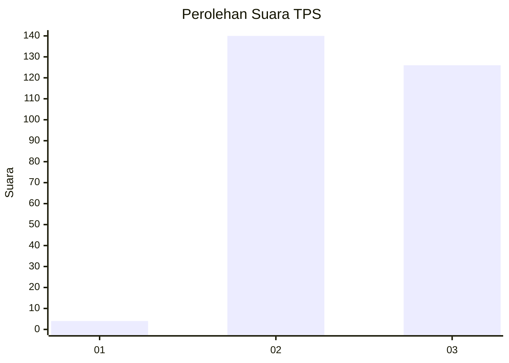
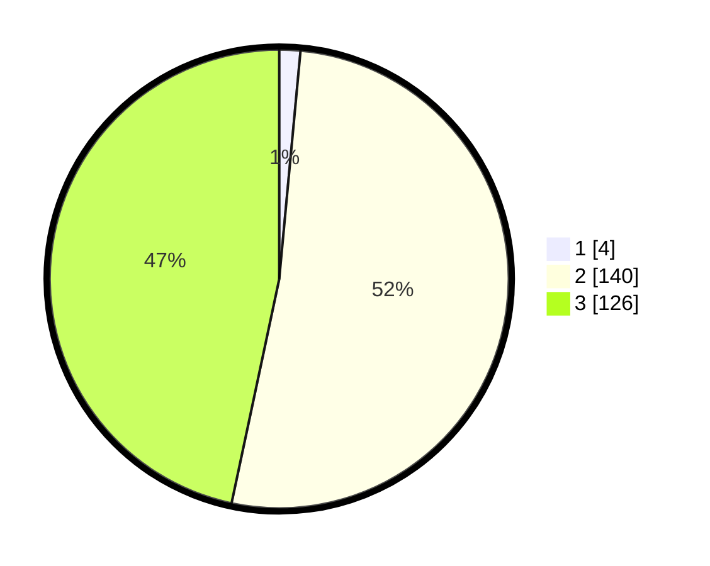

# Hasil

## Grafik

## Tabel

| No. | Nama Paslon    | Suara | Suara (raw) | Persentase |
|:--- |:-------------- | -----:| -----------:| ----------:|
| 1   | ANIES MUHAIMIN | 4     | [4][p-1]    | 1,48       |
| 2   | PRABOWO GIBRAN | 140   | [140][p-2]  | 51,85      |
| 3   | GANJAR MAHFUD  | 126   | [126][p-3]  | 46,67      |

[p-1]: https://github.com/gigit-pemilu/pemilu-2024-51-bali/blob/main/pilpres/hitung-suara/sub/51-bali/sub/03-badung/sub/02-mengwi/sub/2017-cemagi/sub/014-tps/sub/paslon-1.txt
[p-2]: https://github.com/gigit-pemilu/pemilu-2024-51-bali/blob/main/pilpres/hitung-suara/sub/51-bali/sub/03-badung/sub/02-mengwi/sub/2017-cemagi/sub/014-tps/sub/paslon-2.txt
[p-3]: https://github.com/gigit-pemilu/pemilu-2024-51-bali/blob/main/pilpres/hitung-suara/sub/51-bali/sub/03-badung/sub/02-mengwi/sub/2017-cemagi/sub/014-tps/sub/paslon-3.txt

## Foto C Plano

https://sirekap-obj-formc.kpu.go.id/2cb5/pemilu/ppwp/51/03/02/20/17/5103022017014-20240214-191725--4ff094ee-b46a-4ac5-97f7-9d6e477d1f3c.jpg

https://sirekap-obj-formc.kpu.go.id/2cb5/pemilu/ppwp/51/03/02/20/17/5103022017014-20240214-210727--a58298d5-1ba8-424a-8cf1-2802b6dcc5f3.jpg

https://sirekap-obj-formc.kpu.go.id/2cb5/pemilu/ppwp/51/03/02/20/17/5103022017014-20240214-191735--a040090d-c519-4575-979d-940299a40b30.jpg

## Metadata

| Key        | Value               |
| ---------- | ------------------- |
| Time Stamp | 2024-02-15 00:41:44 |

## DATA PEMILIH TETAP

Jumlah pemilih dalam DPT: **295**.
 * L: **143**.
 * P: **152**.

## DATA PENGGUNA HAK PILIH

Jumlah pengguna hak pilih dalam DPT: **270**.
 * L: **131**.
 * P: **139**.

Jumlah pengguna hak pilih dalam DPTb: **5**.
 * L: **3**.
 * P: **2**.

Jumlah pengguna hak pilih dalam DPK: **1**.
 * L: **0**.
 * P: **1**.

Jumlah pengguna hak pilih: **276**.
 * L: **134**.
 * P: **142**.

## JUMLAH SUARA SAH DAN TIDAK SAH

JUMLAH SELURUH SUARA SAH: **270**.

JUMLAH SUARA TIDAK SAH: **6**.

JUMLAH SELURUH SUARA SAH DAN SUARA TIDAK SAH: **276**.

