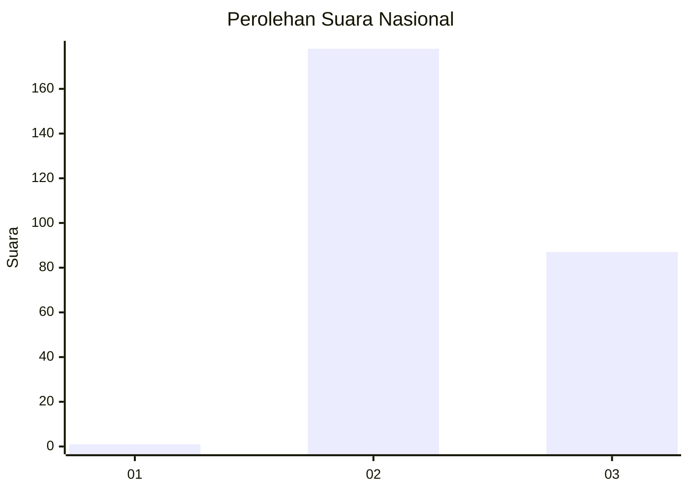
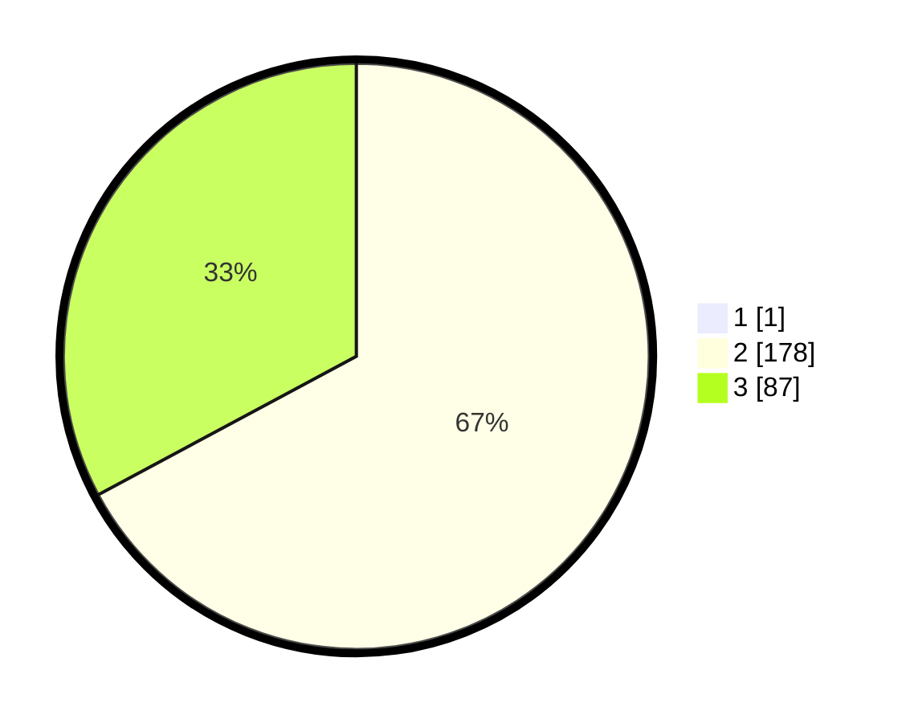

# Hasil

## Grafik

## Tabel

| No. | Nama Paslon    | Suara | Suara (raw) | Persentase |
|:--- |:-------------- | -----:| -----------:| ----------:|
| 1   | ANIES MUHAIMIN | 1     | [1][p-1]    | 0,38       |
| 2   | PRABOWO GIBRAN | 178   | [178][p-2]  | 66,92      |
| 3   | GANJAR MAHFUD  | 87    | [87][p-3]   | 32,71      |

[p-1]: https://github.com/gigit-pemilu/pemilu-2024/blob/main/pilpres/hitung-suara/sub/51-bali/sub/03-badung/sub/02-mengwi/sub/2017-cemagi/sub/015-tps/sub/paslon-1.txt
[p-2]: https://github.com/gigit-pemilu/pemilu-2024/blob/main/pilpres/hitung-suara/sub/51-bali/sub/03-badung/sub/02-mengwi/sub/2017-cemagi/sub/015-tps/sub/paslon-2.txt
[p-3]: https://github.com/gigit-pemilu/pemilu-2024/blob/main/pilpres/hitung-suara/sub/51-bali/sub/03-badung/sub/02-mengwi/sub/2017-cemagi/sub/015-tps/sub/paslon-3.txt

## Foto C Plano

https://sirekap-obj-formc.kpu.go.id/34e1/pemilu/ppwp/51/03/02/20/17/5103022017015-20240215-214745--0b143590-95ae-4503-8a01-27cfbb5f364b.jpg

https://sirekap-obj-formc.kpu.go.id/34e1/pemilu/ppwp/51/03/02/20/17/5103022017015-20240215-214747--f4542fc7-f9c9-4d41-80d1-9a1167237d4a.jpg

https://sirekap-obj-formc.kpu.go.id/34e1/pemilu/ppwp/51/03/02/20/17/5103022017015-20240215-214746--844cde7e-23d9-444b-88be-fe9b49a2ec51.jpg

## Metadata

| Key        | Value               |
| ---------- | ------------------- |
| Time Stamp | 2024-02-25 21:00:00 |

## DATA PEMILIH TETAP

Jumlah pemilih dalam DPT: **281**.
 * L: **134**.
 * P: **147**.

## DATA PENGGUNA HAK PILIH

Jumlah pengguna hak pilih dalam DPT: **267**.
 * L: **126**.
 * P: **141**.

Jumlah pengguna hak pilih dalam DPTb: **1**.
 * L: **1**.
 * P: **0**.

Jumlah pengguna hak pilih dalam DPK: **1**.
 * L: **0**.
 * P: **1**.

Jumlah pengguna hak pilih: **0**.
 * L: **0**.
 * P: **0**.

## JUMLAH SUARA SAH DAN TIDAK SAH

JUMLAH SELURUH SUARA SAH: **266**.

JUMLAH SUARA TIDAK SAH: **3**.

JUMLAH SELURUH SUARA SAH DAN SUARA TIDAK SAH: **269**.

