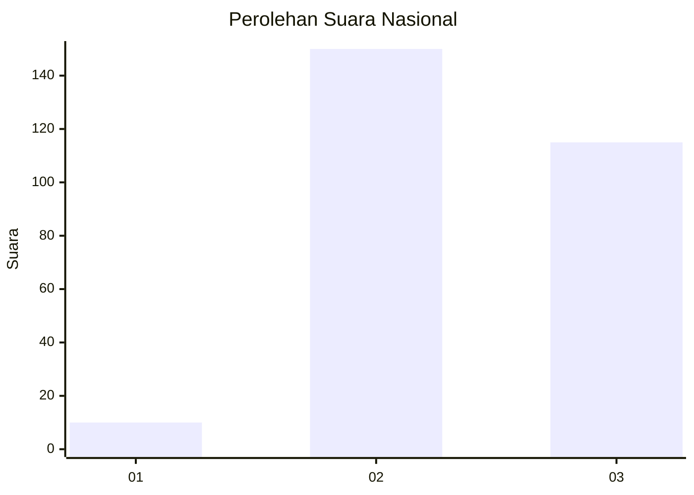
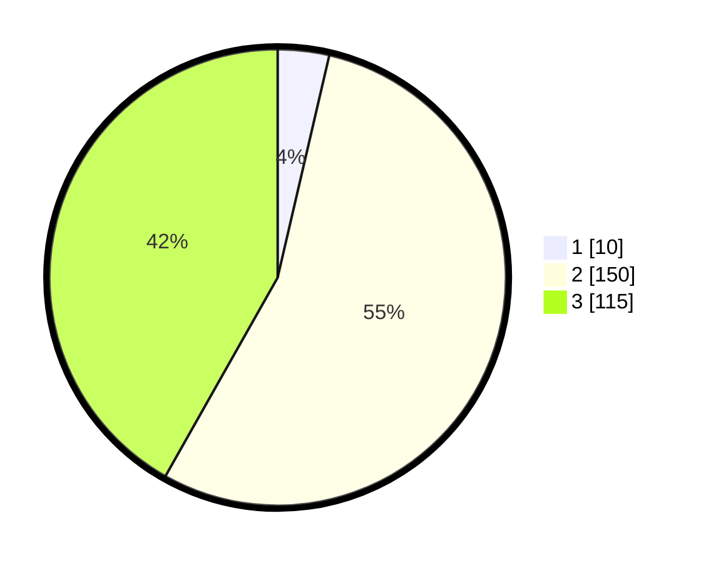

# Hasil

## Grafik

## Tabel

| No. | Nama Paslon    | Suara | Suara (raw) | Persentase |
|:--- |:-------------- | -----:| -----------:| ----------:|
| 1   | ANIES MUHAIMIN | 10    | [10][p-1]   | 3,64       |
| 2   | PRABOWO GIBRAN | 150   | [150][p-2]  | 54,55      |
| 3   | GANJAR MAHFUD  | 115   | [115][p-3]  | 41,82      |

[p-1]: https://github.com/gigit-pemilu/pemilu-2024/blob/main/pilpres/hitung-suara/sub/51-bali/sub/03-badung/sub/02-mengwi/sub/2018-pererenan/sub/001-tps/sub/paslon-1.txt
[p-2]: https://github.com/gigit-pemilu/pemilu-2024/blob/main/pilpres/hitung-suara/sub/51-bali/sub/03-badung/sub/02-mengwi/sub/2018-pererenan/sub/001-tps/sub/paslon-2.txt
[p-3]: https://github.com/gigit-pemilu/pemilu-2024/blob/main/pilpres/hitung-suara/sub/51-bali/sub/03-badung/sub/02-mengwi/sub/2018-pererenan/sub/001-tps/sub/paslon-3.txt

## Foto C Plano

https://sirekap-obj-formc.kpu.go.id/8aca/pemilu/ppwp/51/03/02/20/18/5103022018001-20240214-194525--3360057b-018d-43fa-8ad8-9af9e8dae76c.jpg

https://sirekap-obj-formc.kpu.go.id/8aca/pemilu/ppwp/51/03/02/20/18/5103022018001-20240214-194628--02e97a25-4298-482a-9edb-3ab9ce28af82.jpg

https://sirekap-obj-formc.kpu.go.id/8aca/pemilu/ppwp/51/03/02/20/18/5103022018001-20240214-194718--50eb1e18-82ff-4e81-bf81-6a7c5ad95b46.jpg

## Metadata

| Key        | Value               |
| ---------- | ------------------- |
| Time Stamp | 2024-02-24 22:31:28 |

