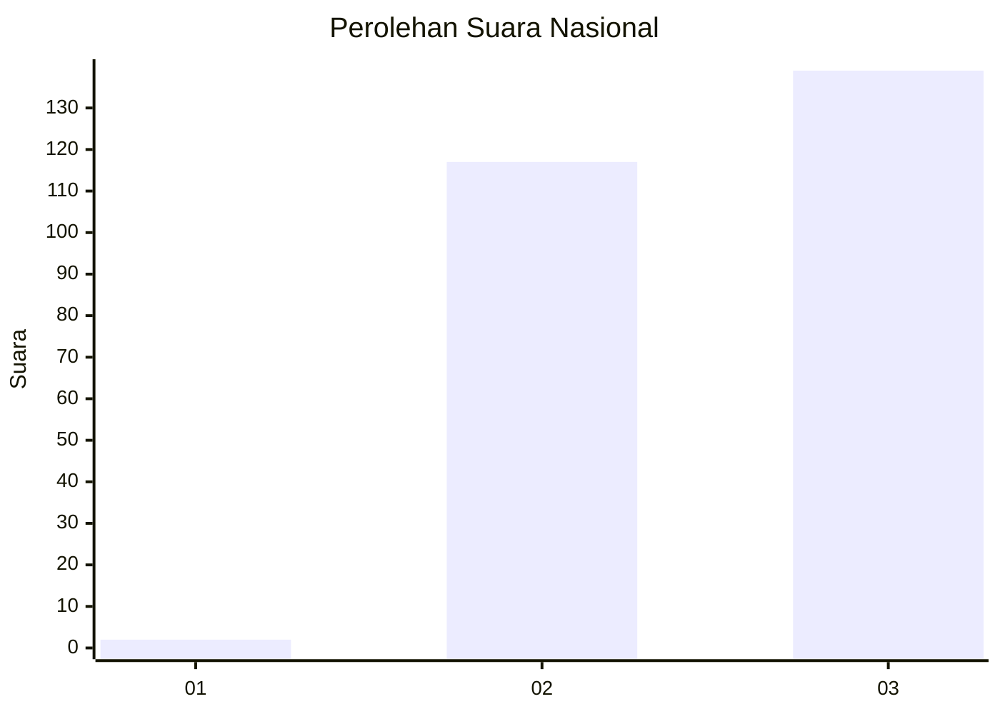
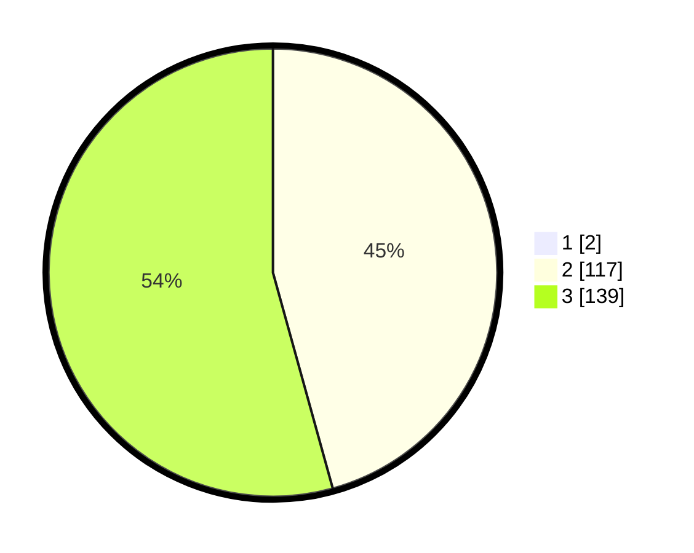

# Hasil

## Grafik

## Tabel

| No. | Nama Paslon    | Suara | Suara (raw) | Persentase |
|:--- |:-------------- | -----:| -----------:| ----------:|
| 1   | ANIES MUHAIMIN | 2     | [2][p-1]    | 0,78       |
| 2   | PRABOWO GIBRAN | 117   | [117][p-2]  | 45,35      |
| 3   | GANJAR MAHFUD  | 139   | [139][p-3]  | 53,88      |

[p-1]: https://github.com/gigit-pemilu/pemilu-2024/blob/main/pilpres/hitung-suara/sub/51-bali/sub/03-badung/sub/02-mengwi/sub/2018-pererenan/sub/002-tps/sub/paslon-1.txt
[p-2]: https://github.com/gigit-pemilu/pemilu-2024/blob/main/pilpres/hitung-suara/sub/51-bali/sub/03-badung/sub/02-mengwi/sub/2018-pererenan/sub/002-tps/sub/paslon-2.txt
[p-3]: https://github.com/gigit-pemilu/pemilu-2024/blob/main/pilpres/hitung-suara/sub/51-bali/sub/03-badung/sub/02-mengwi/sub/2018-pererenan/sub/002-tps/sub/paslon-3.txt

## Foto C Plano

https://sirekap-obj-formc.kpu.go.id/6b7b/pemilu/ppwp/51/03/02/20/18/5103022018002-20240215-012107--15a08f77-5b62-4956-a7c0-bda4cc2a9aeb.jpg

https://sirekap-obj-formc.kpu.go.id/6b7b/pemilu/ppwp/51/03/02/20/18/5103022018002-20240215-012208--d7607824-b193-43f6-a70e-5da8a418e645.jpg

https://sirekap-obj-formc.kpu.go.id/6b7b/pemilu/ppwp/51/03/02/20/18/5103022018002-20240215-012230--ab630b4f-c45f-41d8-9599-11a0eaedefca.jpg

## Metadata

| Key        | Value               |
| ---------- | ------------------- |
| Time Stamp | 2024-02-21 12:00:00 |

## DATA PEMILIH TETAP

Jumlah pemilih dalam DPT: **282**.
 * L: **130**.
 * P: **152**.

## DATA PENGGUNA HAK PILIH

Jumlah pengguna hak pilih dalam DPT: **257**.
 * L: **122**.
 * P: **135**.

Jumlah pengguna hak pilih dalam DPTb: **4**.
 * L: **4**.
 * P: **0**.

Jumlah pengguna hak pilih dalam DPK: **0**.
 * L: **0**.
 * P: **0**.

Jumlah pengguna hak pilih: **261**.
 * L: **126**.
 * P: **135**.

## JUMLAH SUARA SAH DAN TIDAK SAH

JUMLAH SELURUH SUARA SAH: **258**.

JUMLAH SUARA TIDAK SAH: **3**.

JUMLAH SELURUH SUARA SAH DAN SUARA TIDAK SAH: **261**.

