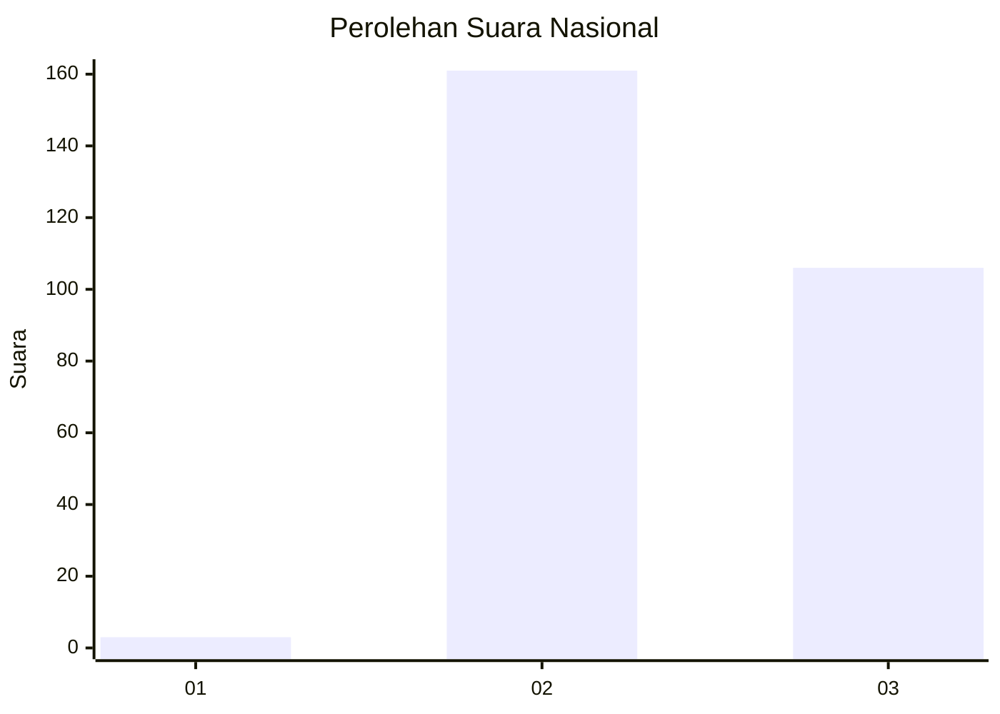
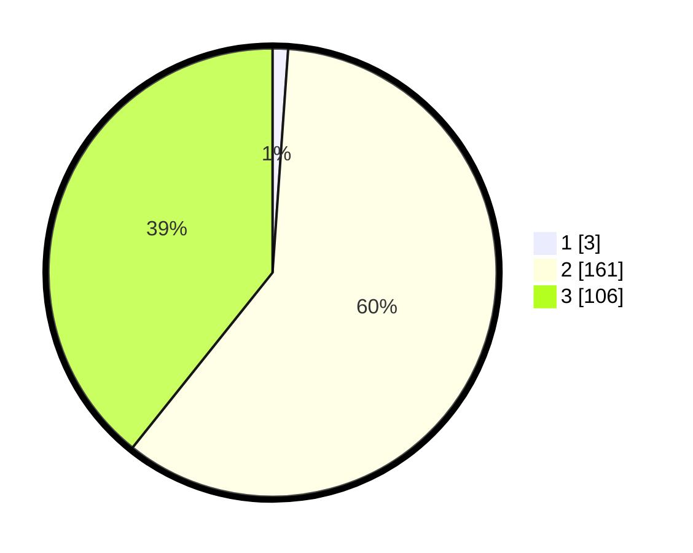

# Hasil

## Grafik

## Tabel

| No. | Nama Paslon    | Suara | Suara (raw) | Persentase |
|:--- |:-------------- | -----:| -----------:| ----------:|
| 1   | ANIES MUHAIMIN | 3     | [3][p-1]    | 1,11       |
| 2   | PRABOWO GIBRAN | 161   | [161][p-2]  | 59,63      |
| 3   | GANJAR MAHFUD  | 106   | [106][p-3]  | 39,26      |

[p-1]: https://github.com/gigit-pemilu/pemilu-2024/blob/main/pilpres/hitung-suara/sub/51-bali/sub/03-badung/sub/02-mengwi/sub/2018-pererenan/sub/003-tps/sub/paslon-1.txt
[p-2]: https://github.com/gigit-pemilu/pemilu-2024/blob/main/pilpres/hitung-suara/sub/51-bali/sub/03-badung/sub/02-mengwi/sub/2018-pererenan/sub/003-tps/sub/paslon-2.txt
[p-3]: https://github.com/gigit-pemilu/pemilu-2024/blob/main/pilpres/hitung-suara/sub/51-bali/sub/03-badung/sub/02-mengwi/sub/2018-pererenan/sub/003-tps/sub/paslon-3.txt

## Foto C Plano

https://sirekap-obj-formc.kpu.go.id/1f47/pemilu/ppwp/51/03/02/20/18/5103022018003-20240214-191753--4cd2fedc-9a04-412f-b318-6c7624cdd47f.jpg

https://sirekap-obj-formc.kpu.go.id/1f47/pemilu/ppwp/51/03/02/20/18/5103022018003-20240214-191810--d9a8d1f7-a4b2-4cd9-9e15-4ca78002a2bb.jpg

https://sirekap-obj-formc.kpu.go.id/1f47/pemilu/ppwp/51/03/02/20/18/5103022018003-20240214-191838--f027038b-96e2-449a-9fae-4af711174c84.jpg

## Metadata

| Key        | Value               |
| ---------- | ------------------- |
| Time Stamp | 2024-02-22 10:00:00 |

## DATA PEMILIH TETAP

Jumlah pemilih dalam DPT: **282**.
 * L: **136**.
 * P: **146**.

## DATA PENGGUNA HAK PILIH

Jumlah pengguna hak pilih dalam DPT: **271**.
 * L: **131**.
 * P: **140**.

Jumlah pengguna hak pilih dalam DPTb: **3**.
 * L: **2**.
 * P: **1**.

Jumlah pengguna hak pilih dalam DPK: **0**.
 * L: **0**.
 * P: **0**.

Jumlah pengguna hak pilih: **274**.
 * L: **133**.
 * P: **141**.

## JUMLAH SUARA SAH DAN TIDAK SAH

JUMLAH SELURUH SUARA SAH: **270**.

JUMLAH SUARA TIDAK SAH: **4**.

JUMLAH SELURUH SUARA SAH DAN SUARA TIDAK SAH: **274**.

