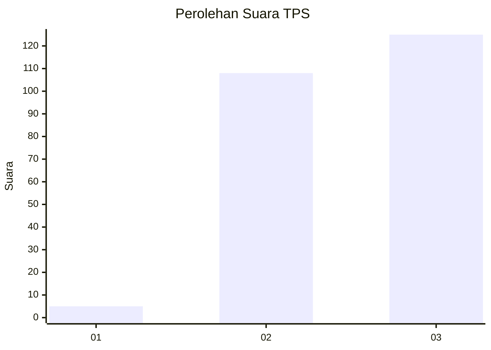
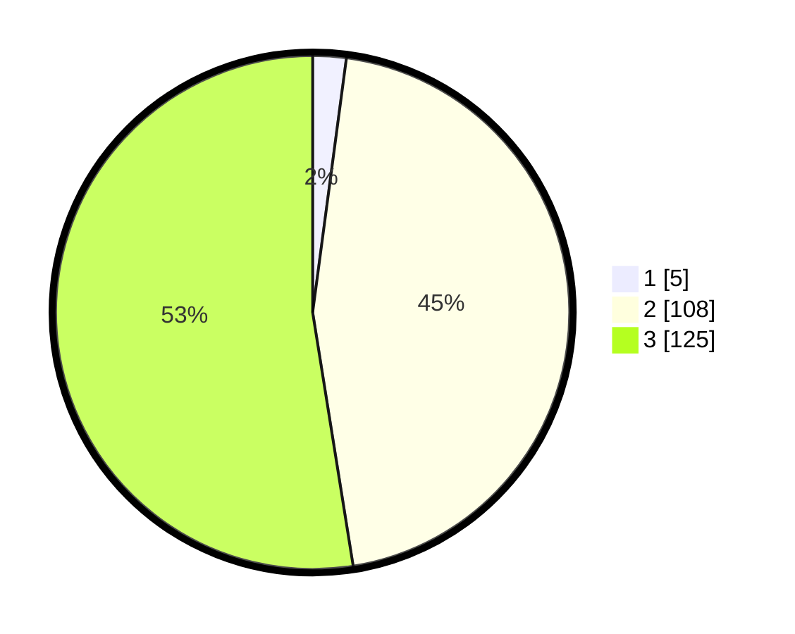

# Hasil

## Grafik

## Tabel

| No. | Nama Paslon    | Suara | Suara (raw) | Persentase |
|:--- |:-------------- | -----:| -----------:| ----------:|
| 1   | ANIES MUHAIMIN | 5     | [5][p-1]    | 2,10       |
| 2   | PRABOWO GIBRAN | 108   | [108][p-2]  | 45,38      |
| 3   | GANJAR MAHFUD  | 125   | [125][p-3]  | 52,52      |

[p-1]: https://github.com/gigit-pemilu/pemilu-2024-51-bali/blob/main/pilpres/hitung-suara/sub/51-bali/sub/03-badung/sub/02-mengwi/sub/2018-pererenan/sub/006-tps/sub/paslon-1.txt
[p-2]: https://github.com/gigit-pemilu/pemilu-2024-51-bali/blob/main/pilpres/hitung-suara/sub/51-bali/sub/03-badung/sub/02-mengwi/sub/2018-pererenan/sub/006-tps/sub/paslon-2.txt
[p-3]: https://github.com/gigit-pemilu/pemilu-2024-51-bali/blob/main/pilpres/hitung-suara/sub/51-bali/sub/03-badung/sub/02-mengwi/sub/2018-pererenan/sub/006-tps/sub/paslon-3.txt

## Foto C Plano

https://sirekap-obj-formc.kpu.go.id/66eb/pemilu/ppwp/51/03/02/20/18/5103022018006-20240215-190215--3181bc99-c572-43c0-9cb0-9d6379f748fc.jpg

https://sirekap-obj-formc.kpu.go.id/66eb/pemilu/ppwp/51/03/02/20/18/5103022018006-20240215-191236--f507831c-b81c-4678-a632-3b700079a25c.jpg

https://sirekap-obj-formc.kpu.go.id/66eb/pemilu/ppwp/51/03/02/20/18/5103022018006-20240215-191506--c62dcd7e-79e6-44be-8399-65578e2468bb.jpg

## Metadata

| Key        | Value               |
| ---------- | ------------------- |
| Time Stamp | 2024-02-24 22:31:28 |

