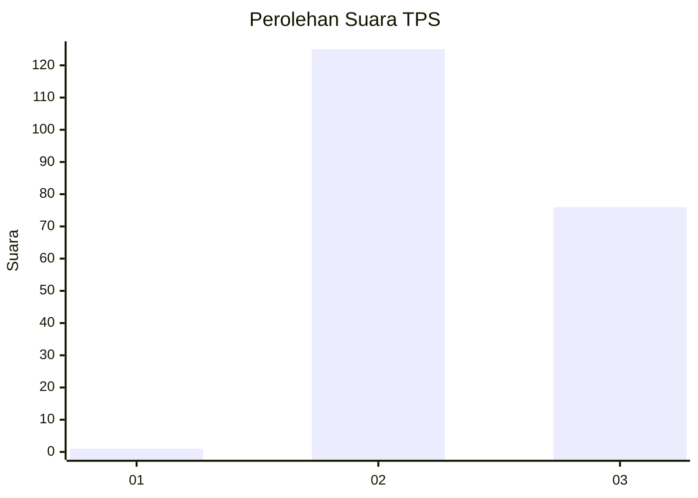
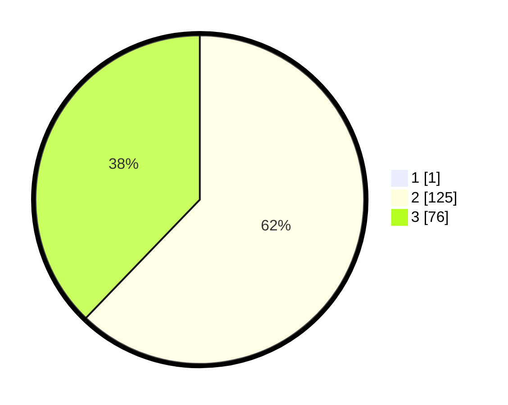

# Hasil

## Grafik

## Tabel

| No. | Nama Paslon    | Suara | Suara (raw) | Persentase |
|:--- |:-------------- | -----:| -----------:| ----------:|
| 1   | ANIES MUHAIMIN | 1     | [1][p-1]    | 0,50       |
| 2   | PRABOWO GIBRAN | 125   | [125][p-2]  | 61,88      |
| 3   | GANJAR MAHFUD  | 76    | [76][p-3]   | 37,62      |

[p-1]: https://github.com/gigit-pemilu/pemilu-2024-51-bali/blob/main/pilpres/hitung-suara/sub/51-bali/sub/03-badung/sub/02-mengwi/sub/2018-pererenan/sub/008-tps/sub/paslon-1.txt
[p-2]: https://github.com/gigit-pemilu/pemilu-2024-51-bali/blob/main/pilpres/hitung-suara/sub/51-bali/sub/03-badung/sub/02-mengwi/sub/2018-pererenan/sub/008-tps/sub/paslon-2.txt
[p-3]: https://github.com/gigit-pemilu/pemilu-2024-51-bali/blob/main/pilpres/hitung-suara/sub/51-bali/sub/03-badung/sub/02-mengwi/sub/2018-pererenan/sub/008-tps/sub/paslon-3.txt

## Foto C Plano

https://sirekap-obj-formc.kpu.go.id/14bc/pemilu/ppwp/51/03/02/20/18/5103022018008-20240216-143553--90fe6fa9-494b-41ac-9740-9d42e15b601e.jpg

https://sirekap-obj-formc.kpu.go.id/14bc/pemilu/ppwp/51/03/02/20/18/5103022018008-20240216-143555--64af1a0c-258c-4423-99b0-fb0128371de5.jpg

https://sirekap-obj-formc.kpu.go.id/14bc/pemilu/ppwp/51/03/02/20/18/5103022018008-20240216-143554--f6c8e4d8-25fb-4db9-bc64-9431e64895dd.jpg

## Metadata

| Key        | Value               |
| ---------- | ------------------- |
| Time Stamp | 2024-02-22 10:00:00 |

## DATA PEMILIH TETAP

Jumlah pemilih dalam DPT: **209**.
 * L: **103**.
 * P: **106**.

## DATA PENGGUNA HAK PILIH

Jumlah pengguna hak pilih dalam DPT: **197**.
 * L: **98**.
 * P: **99**.

Jumlah pengguna hak pilih dalam DPTb: **5**.
 * L: **3**.
 * P: **2**.

Jumlah pengguna hak pilih dalam DPK: **3**.
 * L: **0**.
 * P: **3**.

Jumlah pengguna hak pilih: **205**.
 * L: **101**.
 * P: **104**.

## JUMLAH SUARA SAH DAN TIDAK SAH

JUMLAH SELURUH SUARA SAH: **202**.

JUMLAH SUARA TIDAK SAH: **3**.

JUMLAH SELURUH SUARA SAH DAN SUARA TIDAK SAH: **205**.

