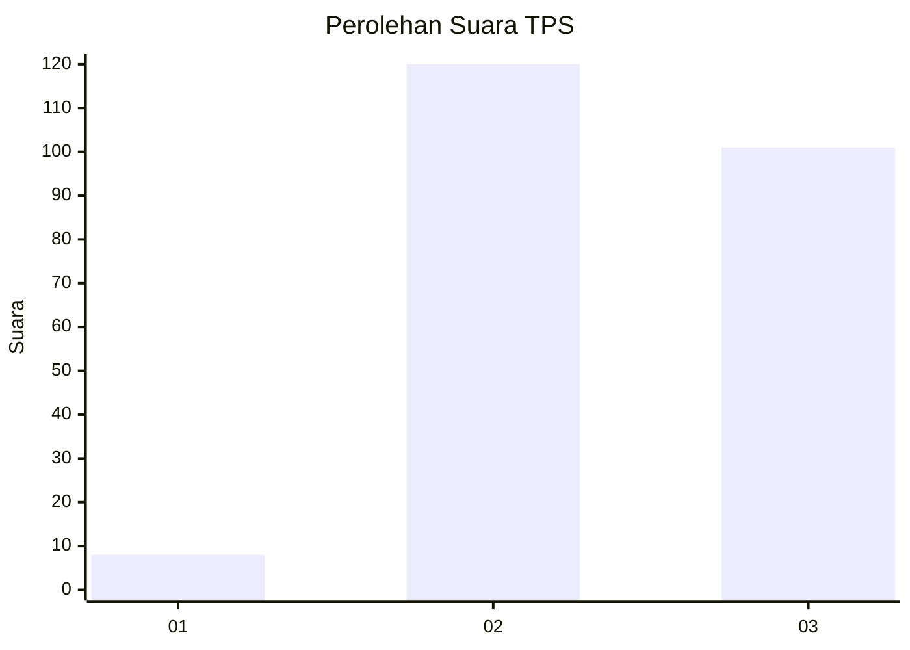
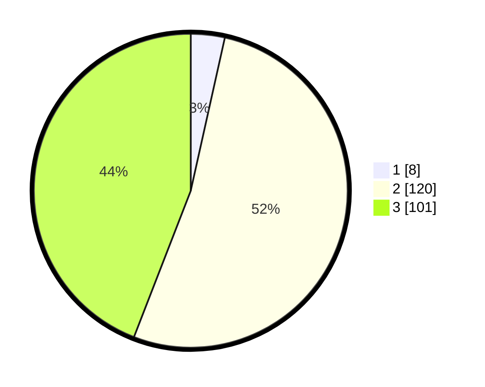

# Hasil

## Grafik

## Tabel

| No. | Nama Paslon    | Suara | Suara (raw) | Persentase |
|:--- |:-------------- | -----:| -----------:| ----------:|
| 1   | ANIES MUHAIMIN | 8     | [8][p-1]    | 3,49       |
| 2   | PRABOWO GIBRAN | 120   | [120][p-2]  | 52,40      |
| 3   | GANJAR MAHFUD  | 101   | [101][p-3]  | 44,10      |

[p-1]: https://github.com/gigit-pemilu/pemilu-2024-51-bali/blob/main/pilpres/hitung-suara/sub/51-bali/sub/03-badung/sub/02-mengwi/sub/2018-pererenan/sub/009-tps/sub/paslon-1.txt
[p-2]: https://github.com/gigit-pemilu/pemilu-2024-51-bali/blob/main/pilpres/hitung-suara/sub/51-bali/sub/03-badung/sub/02-mengwi/sub/2018-pererenan/sub/009-tps/sub/paslon-2.txt
[p-3]: https://github.com/gigit-pemilu/pemilu-2024-51-bali/blob/main/pilpres/hitung-suara/sub/51-bali/sub/03-badung/sub/02-mengwi/sub/2018-pererenan/sub/009-tps/sub/paslon-3.txt

## Foto C Plano

https://sirekap-obj-formc.kpu.go.id/d3b7/pemilu/ppwp/51/03/02/20/18/5103022018009-20240216-140527--72ce5cc4-b8d8-4678-bd8e-845c23bbe7ab.jpg

https://sirekap-obj-formc.kpu.go.id/d3b7/pemilu/ppwp/51/03/02/20/18/5103022018009-20240216-140539--5ff3ce47-8224-4be2-96cf-398f5dae1239.jpg

https://sirekap-obj-formc.kpu.go.id/d3b7/pemilu/ppwp/51/03/02/20/18/5103022018009-20240216-140613--e5ed20a1-538b-4cac-a73d-a40668d75d3c.jpg

## Metadata

| Key        | Value               |
| ---------- | ------------------- |
| Time Stamp | 2024-02-26 23:00:00 |

## DATA PEMILIH TETAP

Jumlah pemilih dalam DPT: **250**.
 * L: **131**.
 * P: **119**.

## DATA PENGGUNA HAK PILIH

Jumlah pengguna hak pilih dalam DPT: **233**.
 * L: **123**.
 * P: **110**.

Jumlah pengguna hak pilih dalam DPTb: **2**.
 * L: **1**.
 * P: **1**.

Jumlah pengguna hak pilih dalam DPK: **1**.
 * L: **0**.
 * P: **1**.

Jumlah pengguna hak pilih: **236**.
 * L: **124**.
 * P: **112**.

## JUMLAH SUARA SAH DAN TIDAK SAH

JUMLAH SELURUH SUARA SAH: **229**.

JUMLAH SUARA TIDAK SAH: **7**.

JUMLAH SELURUH SUARA SAH DAN SUARA TIDAK SAH: **236**.

