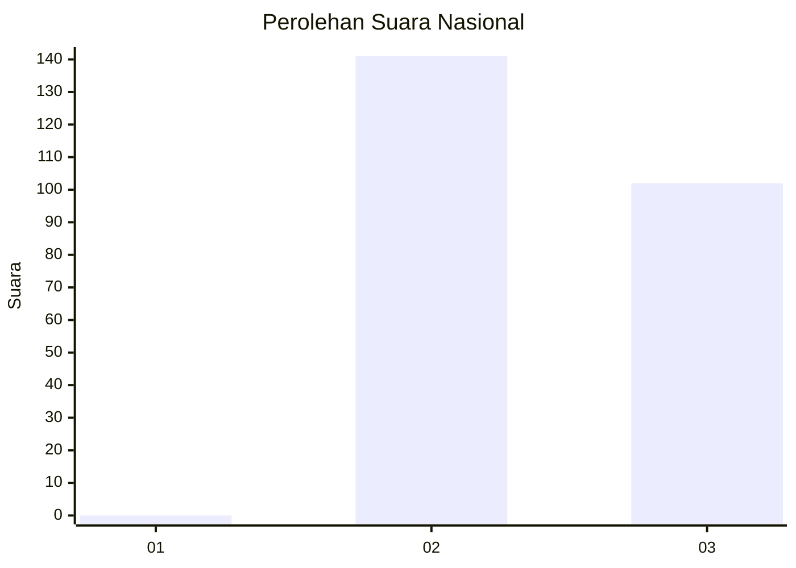
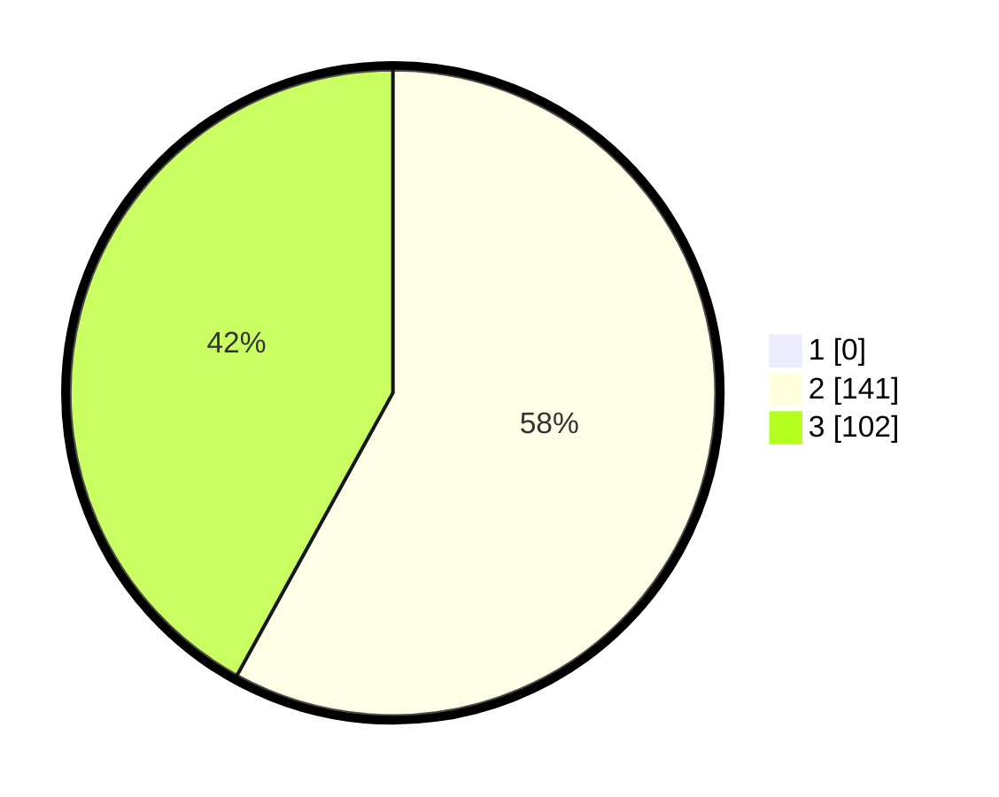

# Hasil

## Grafik

## Tabel

| No. | Nama Paslon    | Suara | Suara (raw) | Persentase |
|:--- |:-------------- | -----:| -----------:| ----------:|
| 1   | ANIES MUHAIMIN | 0     | [0][p-1]    | 0,00       |
| 2   | PRABOWO GIBRAN | 141   | [141][p-2]  | 58,02      |
| 3   | GANJAR MAHFUD  | 102   | [102][p-3]  | 41,98      |

[p-1]: https://github.com/gigit-pemilu/pemilu-2024/blob/main/pilpres/hitung-suara/sub/51-bali/sub/03-badung/sub/02-mengwi/sub/2019-tumbakbayuh/sub/001-tps/sub/paslon-1.txt
[p-2]: https://github.com/gigit-pemilu/pemilu-2024/blob/main/pilpres/hitung-suara/sub/51-bali/sub/03-badung/sub/02-mengwi/sub/2019-tumbakbayuh/sub/001-tps/sub/paslon-2.txt
[p-3]: https://github.com/gigit-pemilu/pemilu-2024/blob/main/pilpres/hitung-suara/sub/51-bali/sub/03-badung/sub/02-mengwi/sub/2019-tumbakbayuh/sub/001-tps/sub/paslon-3.txt

## Foto C Plano

https://sirekap-obj-formc.kpu.go.id/3bd9/pemilu/ppwp/51/03/02/20/19/5103022019001-20240216-103927--bd015bc2-fcd5-4c27-891f-e2e7e0492c50.jpg

https://sirekap-obj-formc.kpu.go.id/3bd9/pemilu/ppwp/51/03/02/20/19/5103022019001-20240216-103930--47c6202d-5731-4199-bb48-eb0a5b6ba589.jpg

https://sirekap-obj-formc.kpu.go.id/3bd9/pemilu/ppwp/51/03/02/20/19/5103022019001-20240216-103929--65bcd562-082e-4e88-9c1d-026455453d31.jpg

## Metadata

| Key        | Value               |
| ---------- | ------------------- |
| Time Stamp | 2024-02-21 11:00:00 |

## DATA PEMILIH TETAP

Jumlah pemilih dalam DPT: **259**.
 * L: **139**.
 * P: **120**.

## DATA PENGGUNA HAK PILIH

Jumlah pengguna hak pilih dalam DPT: **246**.
 * L: **136**.
 * P: **110**.

Jumlah pengguna hak pilih dalam DPTb: **1**.
 * L: **1**.
 * P: **0**.

Jumlah pengguna hak pilih dalam DPK: **247**.
 * L: **137**.
 * P: **110**.

Jumlah pengguna hak pilih: **247**.
 * L: **137**.
 * P: **110**.

## JUMLAH SUARA SAH DAN TIDAK SAH

JUMLAH SELURUH SUARA SAH: **243**.

JUMLAH SUARA TIDAK SAH: **4**.

JUMLAH SELURUH SUARA SAH DAN SUARA TIDAK SAH: **247**.

