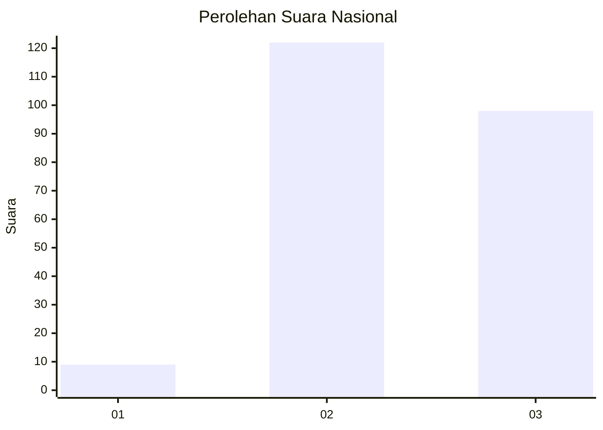
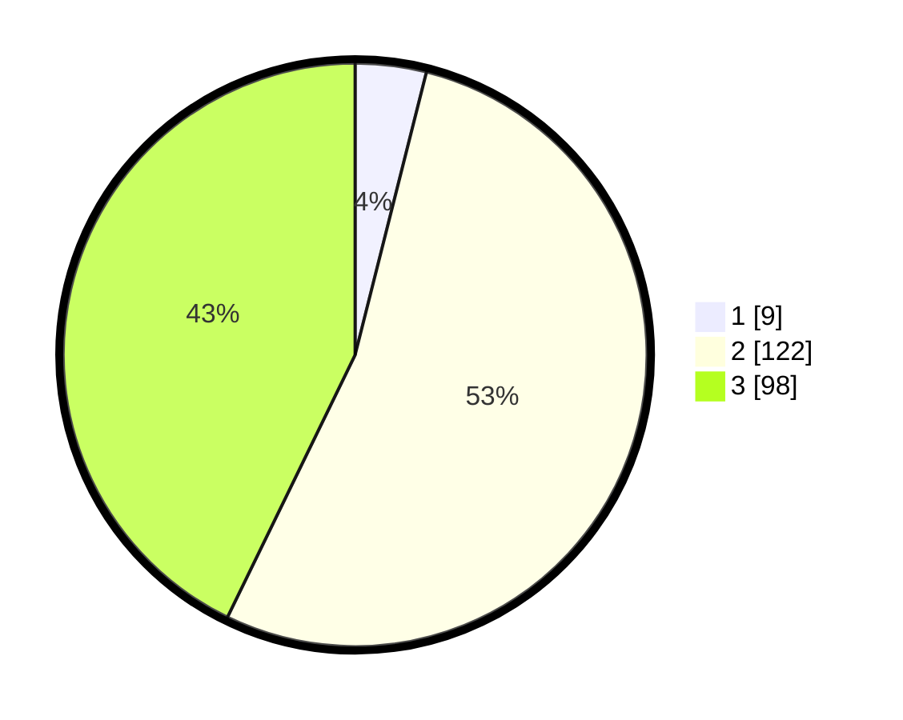

# Hasil

## Grafik

## Tabel

| No. | Nama Paslon    | Suara | Suara (raw) | Persentase |
|:--- |:-------------- | -----:| -----------:| ----------:|
| 1   | ANIES MUHAIMIN | 9     | [9][p-1]    | 3,93       |
| 2   | PRABOWO GIBRAN | 122   | [122][p-2]  | 53,28      |
| 3   | GANJAR MAHFUD  | 98    | [98][p-3]   | 42,79      |

[p-1]: https://github.com/gigit-pemilu/pemilu-2024/blob/main/pilpres/hitung-suara/sub/51-bali/sub/03-badung/sub/02-mengwi/sub/2019-tumbakbayuh/sub/002-tps/sub/paslon-1.txt
[p-2]: https://github.com/gigit-pemilu/pemilu-2024/blob/main/pilpres/hitung-suara/sub/51-bali/sub/03-badung/sub/02-mengwi/sub/2019-tumbakbayuh/sub/002-tps/sub/paslon-2.txt
[p-3]: https://github.com/gigit-pemilu/pemilu-2024/blob/main/pilpres/hitung-suara/sub/51-bali/sub/03-badung/sub/02-mengwi/sub/2019-tumbakbayuh/sub/002-tps/sub/paslon-3.txt

## Foto C Plano

https://sirekap-obj-formc.kpu.go.id/2975/pemilu/ppwp/51/03/02/20/19/5103022019002-20240214-131640--c94b22cc-2307-4803-afb1-b5cede9ada3c.jpg

https://sirekap-obj-formc.kpu.go.id/2975/pemilu/ppwp/51/03/02/20/19/5103022019002-20240214-133400--1400e4f0-b782-4533-a82c-5ee44c189aba.jpg

https://sirekap-obj-formc.kpu.go.id/2975/pemilu/ppwp/51/03/02/20/19/5103022019002-20240214-132755--06a3dc21-2397-4c42-833e-4bf48c763453.jpg

## Metadata

| Key        | Value               |
| ---------- | ------------------- |
| Time Stamp | 2024-02-21 11:00:00 |

## DATA PEMILIH TETAP

Jumlah pemilih dalam DPT: **248**.
 * L: **118**.
 * P: **130**.

## DATA PENGGUNA HAK PILIH

Jumlah pengguna hak pilih dalam DPT: **234**.
 * L: **113**.
 * P: **121**.

Jumlah pengguna hak pilih dalam DPTb: **1**.
 * L: **1**.
 * P: **0**.

Jumlah pengguna hak pilih dalam DPK: **0**.
 * L: **0**.
 * P: **0**.

Jumlah pengguna hak pilih: **235**.
 * L: **114**.
 * P: **121**.

## JUMLAH SUARA SAH DAN TIDAK SAH

JUMLAH SELURUH SUARA SAH: **229**.

JUMLAH SUARA TIDAK SAH: **6**.

JUMLAH SELURUH SUARA SAH DAN SUARA TIDAK SAH: **235**.

