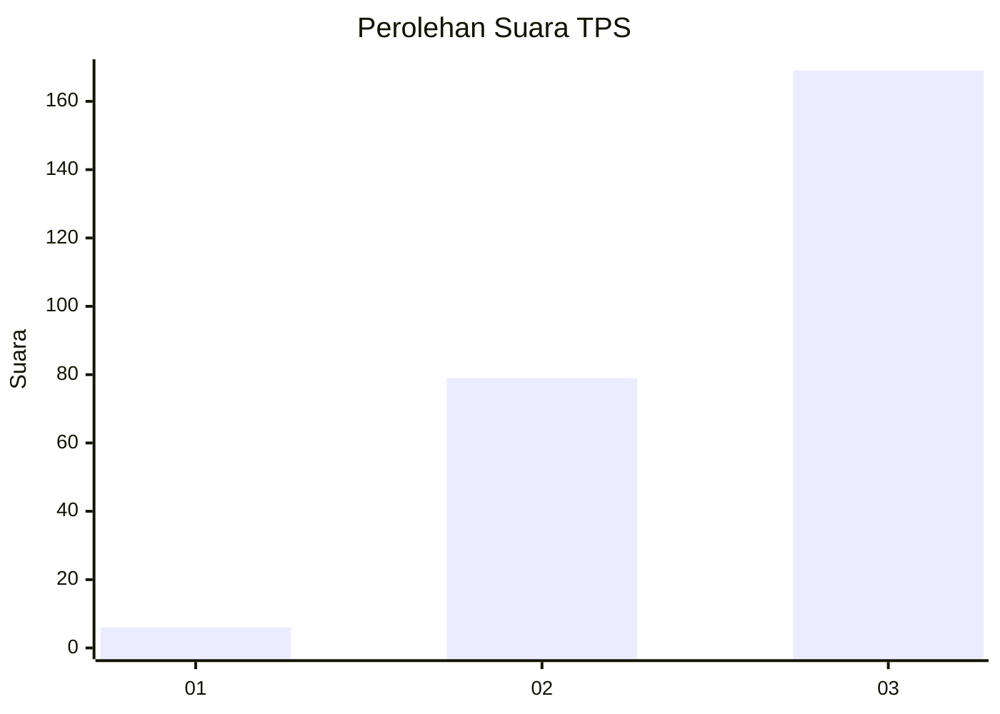
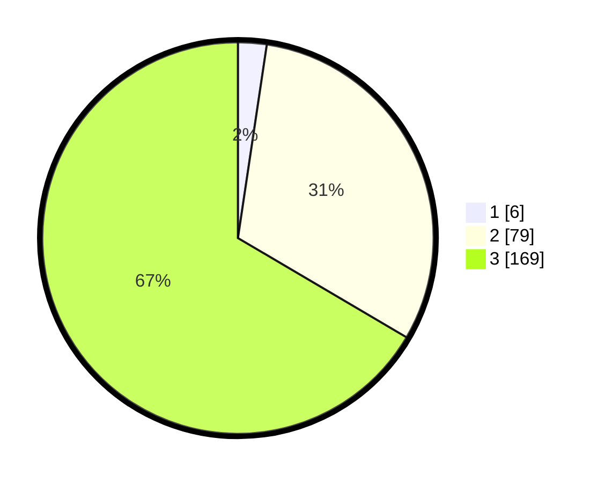

# Hasil

## Grafik

## Tabel

| No. | Nama Paslon    | Suara | Suara (raw) | Persentase |
|:--- |:-------------- | -----:| -----------:| ----------:|
| 1   | ANIES MUHAIMIN | 6     | [6][p-1]    | 2,36       |
| 2   | PRABOWO GIBRAN | 79    | [79][p-2]   | 31,10      |
| 3   | GANJAR MAHFUD  | 169   | [169][p-3]  | 66,54      |

[p-1]: https://github.com/gigit-pemilu/pemilu-2024-51-bali/blob/main/pilpres/hitung-suara/sub/51-bali/sub/03-badung/sub/02-mengwi/sub/2019-tumbakbayuh/sub/003-tps/sub/paslon-1.txt
[p-2]: https://github.com/gigit-pemilu/pemilu-2024-51-bali/blob/main/pilpres/hitung-suara/sub/51-bali/sub/03-badung/sub/02-mengwi/sub/2019-tumbakbayuh/sub/003-tps/sub/paslon-2.txt
[p-3]: https://github.com/gigit-pemilu/pemilu-2024-51-bali/blob/main/pilpres/hitung-suara/sub/51-bali/sub/03-badung/sub/02-mengwi/sub/2019-tumbakbayuh/sub/003-tps/sub/paslon-3.txt

## Foto C Plano

https://sirekap-obj-formc.kpu.go.id/2512/pemilu/ppwp/51/03/02/20/19/5103022019003-20240220-002324--d69dbc41-fda6-445d-bf08-3847e9f5bbd0.jpg

https://sirekap-obj-formc.kpu.go.id/2512/pemilu/ppwp/51/03/02/20/19/5103022019003-20240220-002325--49073f11-c3bc-4b4b-aa76-983d08f3eef4.jpg

https://sirekap-obj-formc.kpu.go.id/2512/pemilu/ppwp/51/03/02/20/19/5103022019003-20240220-002324--860b7558-ee27-4e60-b042-bf071b199e2c.jpg

## Metadata

| Key        | Value               |
| ---------- | ------------------- |
| Time Stamp | 2024-02-21 18:00:00 |

## DATA PEMILIH TETAP

Jumlah pemilih dalam DPT: **261**.
 * L: **136**.
 * P: **125**.

## DATA PENGGUNA HAK PILIH

Jumlah pengguna hak pilih dalam DPT: **253**.
 * L: **130**.
 * P: **123**.

Jumlah pengguna hak pilih dalam DPTb: **1**.
 * L: **1**.
 * P: **0**.

Jumlah pengguna hak pilih dalam DPK: **2**.
 * L: **1**.
 * P: **1**.

Jumlah pengguna hak pilih: **256**.
 * L: **132**.
 * P: **124**.

## JUMLAH SUARA SAH DAN TIDAK SAH

JUMLAH SELURUH SUARA SAH: **254**.

JUMLAH SUARA TIDAK SAH: **2**.

JUMLAH SELURUH SUARA SAH DAN SUARA TIDAK SAH: **256**.

