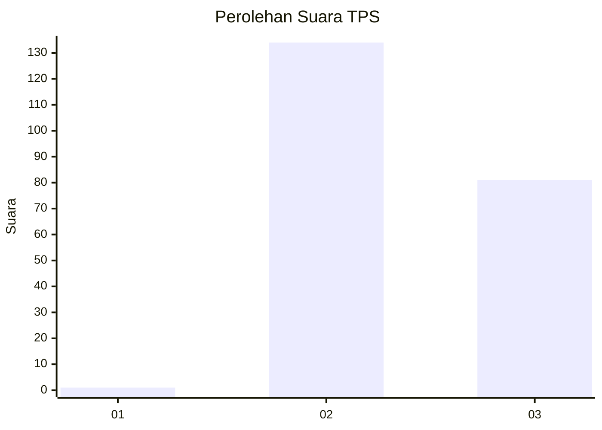
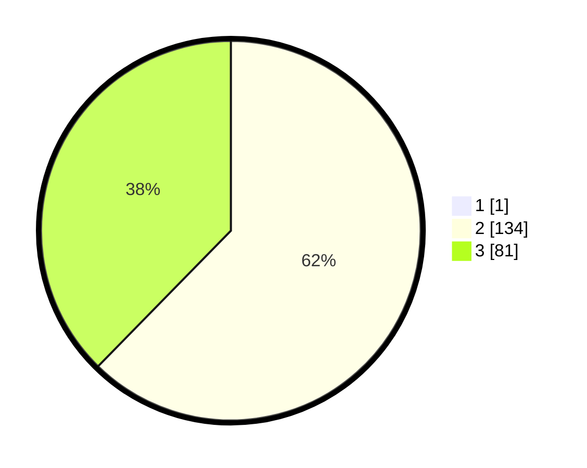

# Hasil

## Grafik

## Tabel

| No. | Nama Paslon    | Suara | Suara (raw) | Persentase |
|:--- |:-------------- | -----:| -----------:| ----------:|
| 1   | ANIES MUHAIMIN | 1     | [1][p-1]    | 0,46       |
| 2   | PRABOWO GIBRAN | 134   | [134][p-2]  | 62,04      |
| 3   | GANJAR MAHFUD  | 81    | [81][p-3]   | 37,50      |

[p-1]: https://github.com/gigit-pemilu/pemilu-2024-51-bali/blob/main/pilpres/hitung-suara/sub/51-bali/sub/03-badung/sub/02-mengwi/sub/2019-tumbakbayuh/sub/006-tps/sub/paslon-1.txt
[p-2]: https://github.com/gigit-pemilu/pemilu-2024-51-bali/blob/main/pilpres/hitung-suara/sub/51-bali/sub/03-badung/sub/02-mengwi/sub/2019-tumbakbayuh/sub/006-tps/sub/paslon-2.txt
[p-3]: https://github.com/gigit-pemilu/pemilu-2024-51-bali/blob/main/pilpres/hitung-suara/sub/51-bali/sub/03-badung/sub/02-mengwi/sub/2019-tumbakbayuh/sub/006-tps/sub/paslon-3.txt

## Foto C Plano

https://sirekap-obj-formc.kpu.go.id/6b90/pemilu/ppwp/51/03/02/20/19/5103022019006-20240214-141214--3ad393e5-c8e8-4a48-8a27-724d00cd6e06.jpg

https://sirekap-obj-formc.kpu.go.id/6b90/pemilu/ppwp/51/03/02/20/19/5103022019006-20240214-141355--4144909a-accf-46f5-9527-7d0d22e631c7.jpg

https://sirekap-obj-formc.kpu.go.id/6b90/pemilu/ppwp/51/03/02/20/19/5103022019006-20240214-141550--b8e708b3-bf7a-4f92-8864-ef56f9581a15.jpg

## Metadata

| Key        | Value               |
| ---------- | ------------------- |
| Time Stamp | 2024-02-15 01:47:43 |

## DATA PEMILIH TETAP

Jumlah pemilih dalam DPT: **236**.
 * L: **108**.
 * P: **128**.

## DATA PENGGUNA HAK PILIH

Jumlah pengguna hak pilih dalam DPT: **215**.
 * L: **101**.
 * P: **114**.

Jumlah pengguna hak pilih dalam DPTb: **3**.
 * L: **0**.
 * P: **3**.

Jumlah pengguna hak pilih dalam DPK: **0**.
 * L: **0**.
 * P: **0**.

Jumlah pengguna hak pilih: **218**.
 * L: **101**.
 * P: **117**.

## JUMLAH SUARA SAH DAN TIDAK SAH

JUMLAH SELURUH SUARA SAH: **216**.

JUMLAH SUARA TIDAK SAH: **2**.

JUMLAH SELURUH SUARA SAH DAN SUARA TIDAK SAH: **218**.

