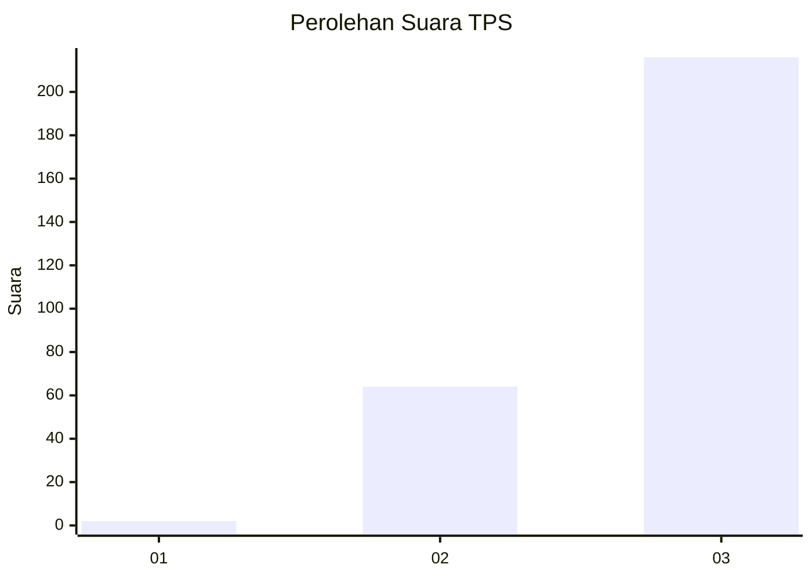
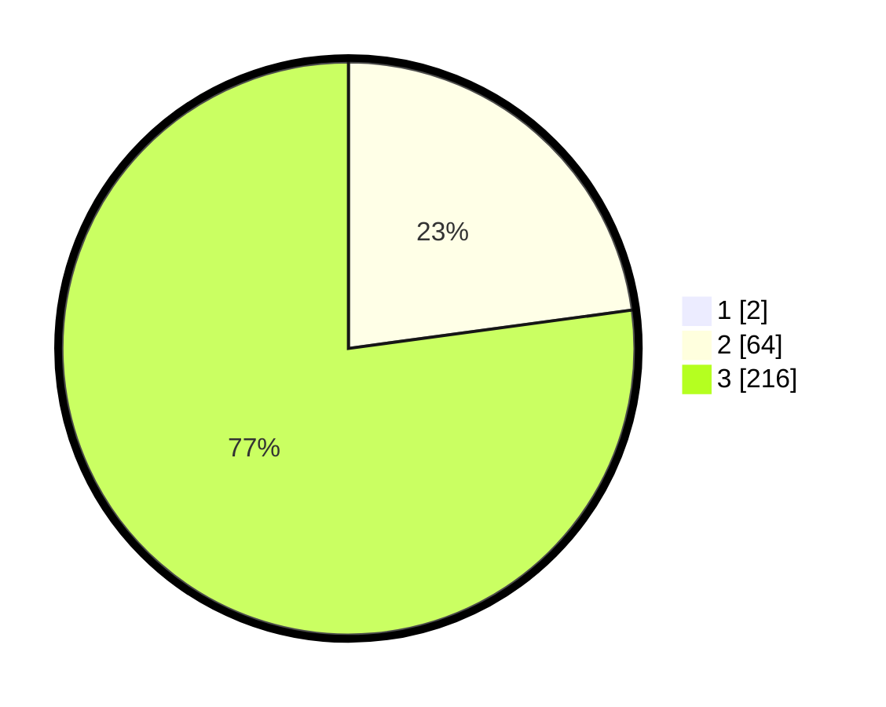

# Hasil

## Grafik

## Tabel

| No. | Nama Paslon    | Suara | Suara (raw) | Persentase |
|:--- |:-------------- | -----:| -----------:| ----------:|
| 1   | ANIES MUHAIMIN | 2     | [2][p-1]    | 0,71       |
| 2   | PRABOWO GIBRAN | 64    | [64][p-2]   | 22,70      |
| 3   | GANJAR MAHFUD  | 216   | [216][p-3]  | 76,60      |

[p-1]: https://github.com/gigit-pemilu/pemilu-2024-51-bali/blob/main/pilpres/hitung-suara/sub/51-bali/sub/03-badung/sub/02-mengwi/sub/2020-kuwum/sub/002-tps/sub/paslon-1.txt
[p-2]: https://github.com/gigit-pemilu/pemilu-2024-51-bali/blob/main/pilpres/hitung-suara/sub/51-bali/sub/03-badung/sub/02-mengwi/sub/2020-kuwum/sub/002-tps/sub/paslon-2.txt
[p-3]: https://github.com/gigit-pemilu/pemilu-2024-51-bali/blob/main/pilpres/hitung-suara/sub/51-bali/sub/03-badung/sub/02-mengwi/sub/2020-kuwum/sub/002-tps/sub/paslon-3.txt

## Foto C Plano

https://sirekap-obj-formc.kpu.go.id/7aa2/pemilu/ppwp/51/03/02/20/20/5103022020002-20240214-190153--3a780561-b17c-414b-814b-2873c6cc7a12.jpg

https://sirekap-obj-formc.kpu.go.id/7aa2/pemilu/ppwp/51/03/02/20/20/5103022020002-20240214-190212--081dd5dd-38e4-4de3-be98-e8a8fd72a2ac.jpg

https://sirekap-obj-formc.kpu.go.id/7aa2/pemilu/ppwp/51/03/02/20/20/5103022020002-20240214-190229--73e5aea1-f7c6-4404-9182-a0c0ee7129cb.jpg

## Metadata

| Key        | Value               |
| ---------- | ------------------- |
| Time Stamp | 2024-02-20 23:00:00 |

## DATA PEMILIH TETAP

Jumlah pemilih dalam DPT: **293**.
 * L: **134**.
 * P: **159**.

## DATA PENGGUNA HAK PILIH

Jumlah pengguna hak pilih dalam DPT: **288**.
 * L: **133**.
 * P: **155**.

Jumlah pengguna hak pilih dalam DPTb: **0**.
 * L: **0**.
 * P: **0**.

Jumlah pengguna hak pilih dalam DPK: **2**.
 * L: **1**.
 * P: **1**.

Jumlah pengguna hak pilih: **290**.
 * L: **134**.
 * P: **156**.

## JUMLAH SUARA SAH DAN TIDAK SAH

JUMLAH SELURUH SUARA SAH: **282**.

JUMLAH SUARA TIDAK SAH: **8**.

JUMLAH SELURUH SUARA SAH DAN SUARA TIDAK SAH: **290**.

