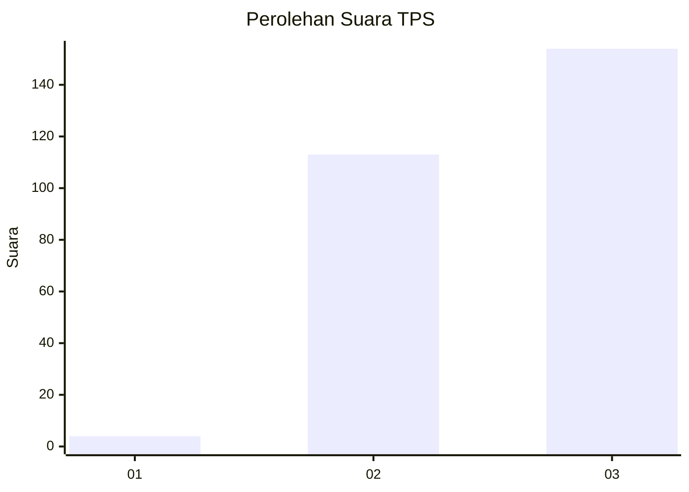
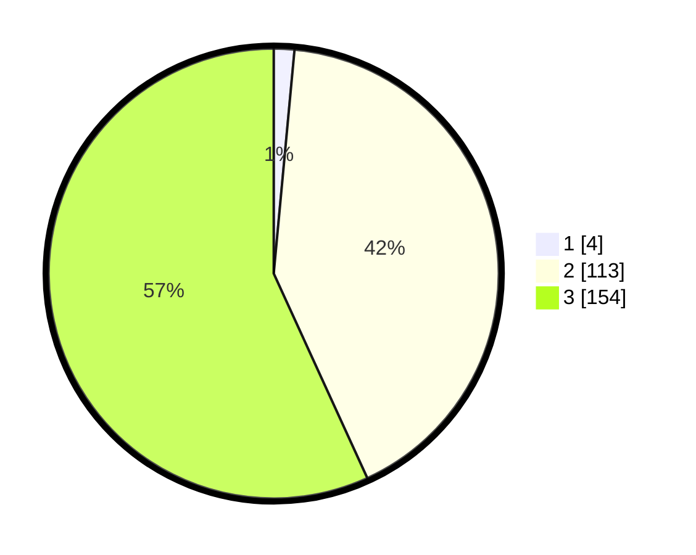

# Hasil

## Grafik

## Tabel

| No. | Nama Paslon    | Suara | Suara (raw) | Persentase |
|:--- |:-------------- | -----:| -----------:| ----------:|
| 1   | ANIES MUHAIMIN | 4     | [4][p-1]    | 1,48       |
| 2   | PRABOWO GIBRAN | 113   | [113][p-2]  | 41,70      |
| 3   | GANJAR MAHFUD  | 154   | [154][p-3]  | 56,83      |

[p-1]: https://github.com/gigit-pemilu/pemilu-2024-51-bali/blob/main/pilpres/hitung-suara/sub/51-bali/sub/03-badung/sub/02-mengwi/sub/2020-kuwum/sub/003-tps/sub/paslon-1.txt
[p-2]: https://github.com/gigit-pemilu/pemilu-2024-51-bali/blob/main/pilpres/hitung-suara/sub/51-bali/sub/03-badung/sub/02-mengwi/sub/2020-kuwum/sub/003-tps/sub/paslon-2.txt
[p-3]: https://github.com/gigit-pemilu/pemilu-2024-51-bali/blob/main/pilpres/hitung-suara/sub/51-bali/sub/03-badung/sub/02-mengwi/sub/2020-kuwum/sub/003-tps/sub/paslon-3.txt

## Foto C Plano

https://sirekap-obj-formc.kpu.go.id/5b80/pemilu/ppwp/51/03/02/20/20/5103022020003-20240218-094119--e8fd169a-2e61-48f6-b88b-7fd8517c1ccd.jpg

https://sirekap-obj-formc.kpu.go.id/5b80/pemilu/ppwp/51/03/02/20/20/5103022020003-20240218-094923--0b2190de-6862-49fd-bce3-6f17ff853035.jpg

https://sirekap-obj-formc.kpu.go.id/5b80/pemilu/ppwp/51/03/02/20/20/5103022020003-20240214-204532--be8d2c0f-7074-4d4c-a6d1-1f0660e16bb5.jpg

## Metadata

| Key        | Value               |
| ---------- | ------------------- |
| Time Stamp | 2024-02-21 10:00:00 |

## DATA PEMILIH TETAP

Jumlah pemilih dalam DPT: **295**.
 * L: **147**.
 * P: **148**.

## DATA PENGGUNA HAK PILIH

Jumlah pengguna hak pilih dalam DPT: **276**.
 * L: **140**.
 * P: **136**.

Jumlah pengguna hak pilih dalam DPTb: **1**.
 * L: **0**.
 * P: **1**.

Jumlah pengguna hak pilih dalam DPK: **2**.
 * L: **2**.
 * P: **0**.

Jumlah pengguna hak pilih: **279**.
 * L: **142**.
 * P: **137**.

## JUMLAH SUARA SAH DAN TIDAK SAH

JUMLAH SELURUH SUARA SAH: **271**.

JUMLAH SUARA TIDAK SAH: **8**.

JUMLAH SELURUH SUARA SAH DAN SUARA TIDAK SAH: **279**.

