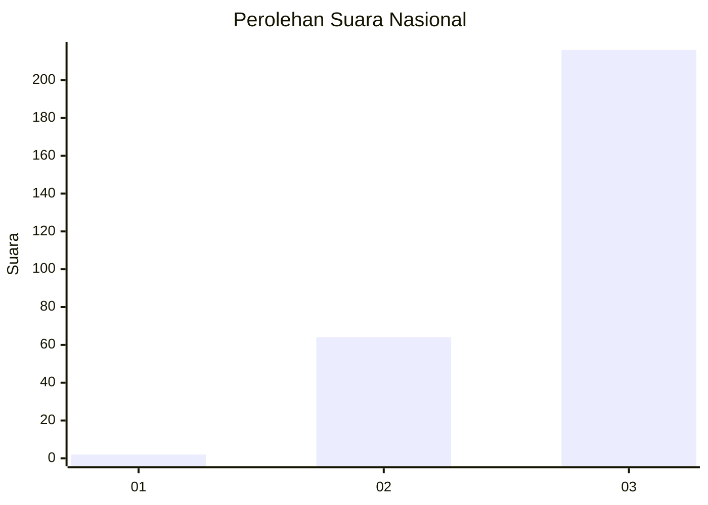
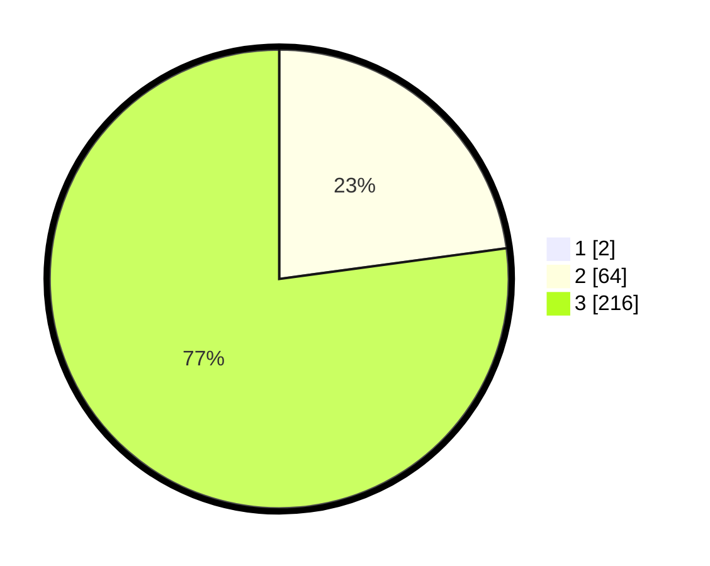

# Hasil

## Grafik

## Tabel

| No. | Nama Paslon    | Suara | Suara (raw) | Persentase |
|:--- |:-------------- | -----:| -----------:| ----------:|
| 1   | ANIES MUHAIMIN | 2     | [2][p-1]    | 0,71       |
| 2   | PRABOWO GIBRAN | 64    | [64][p-2]   | 22,70      |
| 3   | GANJAR MAHFUD  | 216   | [216][p-3]  | 76,60      |

[p-1]: https://github.com/gigit-pemilu/pemilu-2024/blob/main/pilpres/hitung-suara/sub/51-bali/sub/03-badung/sub/02-mengwi/sub/2020-kuwum/sub/004-tps/sub/paslon-1.txt
[p-2]: https://github.com/gigit-pemilu/pemilu-2024/blob/main/pilpres/hitung-suara/sub/51-bali/sub/03-badung/sub/02-mengwi/sub/2020-kuwum/sub/004-tps/sub/paslon-2.txt
[p-3]: https://github.com/gigit-pemilu/pemilu-2024/blob/main/pilpres/hitung-suara/sub/51-bali/sub/03-badung/sub/02-mengwi/sub/2020-kuwum/sub/004-tps/sub/paslon-3.txt

## Foto C Plano

https://sirekap-obj-formc.kpu.go.id/fed2/pemilu/ppwp/51/03/02/20/20/5103022020004-20240221-090552--8dcc8aaa-8939-4d95-a35b-ac129d99672b.jpg

https://sirekap-obj-formc.kpu.go.id/fed2/pemilu/ppwp/51/03/02/20/20/5103022020004-20240221-085837--58af636e-751e-4f94-8c58-7a77b57b089b.jpg

https://sirekap-obj-formc.kpu.go.id/fed2/pemilu/ppwp/51/03/02/20/20/5103022020004-20240221-090758--2a1a456c-bd56-4176-a708-3496101a7edd.jpg

## Metadata

| Key        | Value               |
| ---------- | ------------------- |
| Time Stamp | 2024-02-24 22:31:28 |

