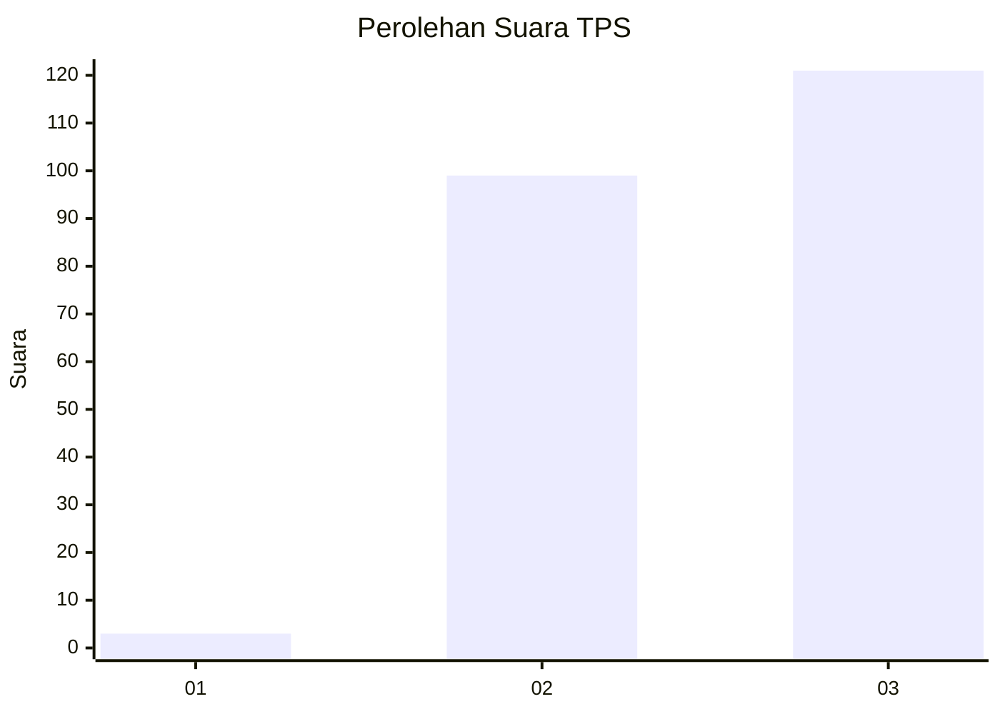
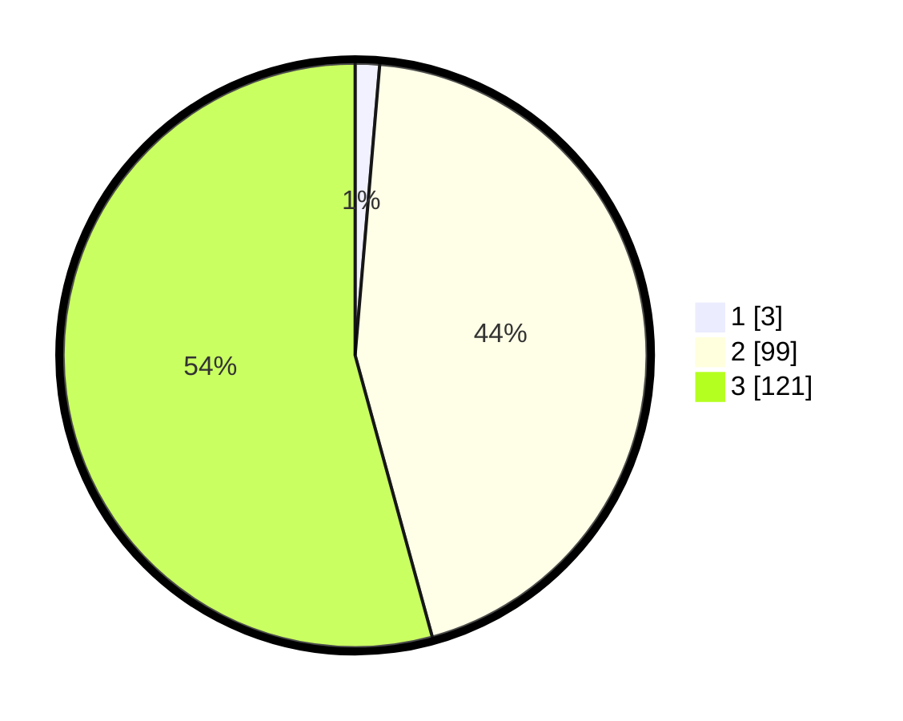

# Hasil

## Grafik

## Tabel

| No. | Nama Paslon    | Suara | Suara (raw) | Persentase |
|:--- |:-------------- | -----:| -----------:| ----------:|
| 1   | ANIES MUHAIMIN | 3     | [3][p-1]    | 1,35       |
| 2   | PRABOWO GIBRAN | 99    | [99][p-2]   | 44,39      |
| 3   | GANJAR MAHFUD  | 121   | [121][p-3]  | 54,26      |

[p-1]: https://github.com/gigit-pemilu/pemilu-2024-51-bali/blob/main/pilpres/hitung-suara/sub/51-bali/sub/03-badung/sub/02-mengwi/sub/2020-kuwum/sub/008-tps/sub/paslon-1.txt
[p-2]: https://github.com/gigit-pemilu/pemilu-2024-51-bali/blob/main/pilpres/hitung-suara/sub/51-bali/sub/03-badung/sub/02-mengwi/sub/2020-kuwum/sub/008-tps/sub/paslon-2.txt
[p-3]: https://github.com/gigit-pemilu/pemilu-2024-51-bali/blob/main/pilpres/hitung-suara/sub/51-bali/sub/03-badung/sub/02-mengwi/sub/2020-kuwum/sub/008-tps/sub/paslon-3.txt

## Foto C Plano

https://sirekap-obj-formc.kpu.go.id/047c/pemilu/ppwp/51/03/02/20/20/5103022020008-20240216-104734--e0325a69-d9ca-4657-bbd3-3ed090cf4d51.jpg

https://sirekap-obj-formc.kpu.go.id/047c/pemilu/ppwp/51/03/02/20/20/5103022020008-20240216-203410--3ff68793-bda8-4228-957b-8a48fec3072f.jpg

https://sirekap-obj-formc.kpu.go.id/047c/pemilu/ppwp/51/03/02/20/20/5103022020008-20240216-151137--65adafa7-5d01-400e-aa80-f5864c6fd8e3.jpg

## Metadata

| Key        | Value               |
| ---------- | ------------------- |
| Time Stamp | 2024-02-20 23:00:00 |

## DATA PEMILIH TETAP

Jumlah pemilih dalam DPT: **230**.
 * L: **119**.
 * P: **111**.

## DATA PENGGUNA HAK PILIH

Jumlah pengguna hak pilih dalam DPT: **215**.
 * L: **113**.
 * P: **102**.

Jumlah pengguna hak pilih dalam DPTb: **10**.
 * L: **5**.
 * P: **5**.

Jumlah pengguna hak pilih dalam DPK: **1**.
 * L: **1**.
 * P: **0**.

Jumlah pengguna hak pilih: **226**.
 * L: **119**.
 * P: **107**.

## JUMLAH SUARA SAH DAN TIDAK SAH

JUMLAH SELURUH SUARA SAH: **223**.

JUMLAH SUARA TIDAK SAH: **3**.

JUMLAH SELURUH SUARA SAH DAN SUARA TIDAK SAH: **226**.

