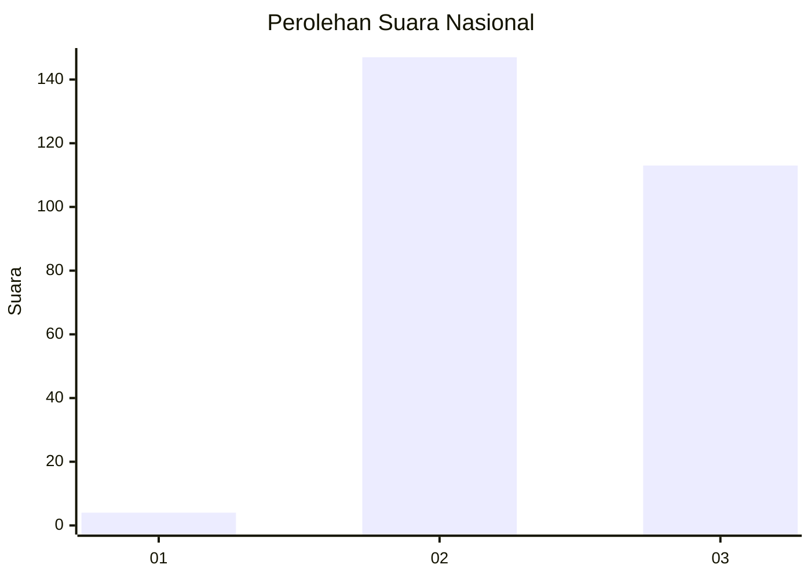
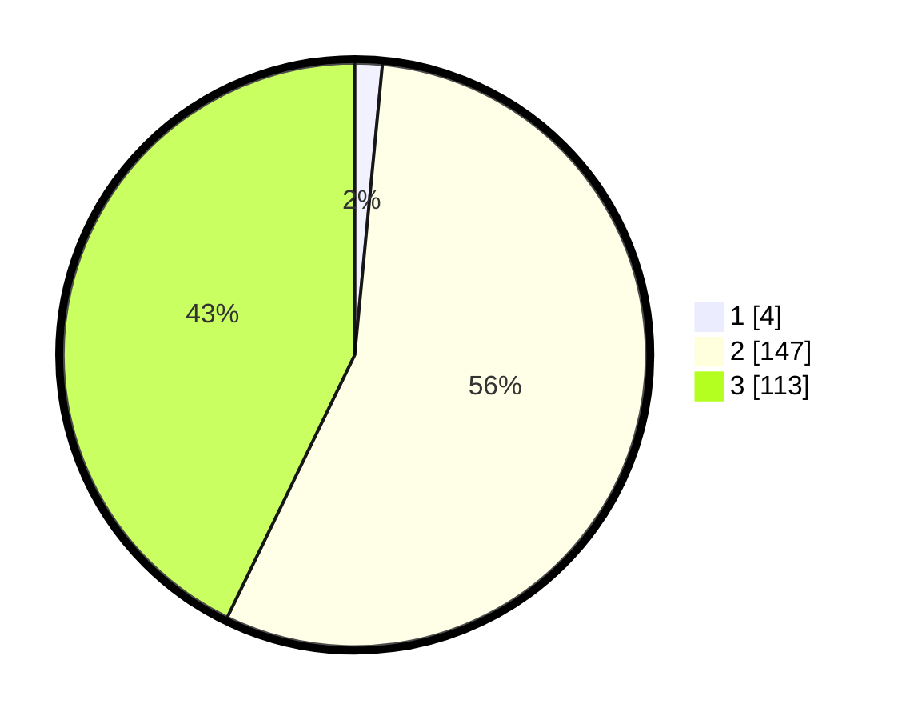

# Hasil

## Grafik

## Tabel

| No. | Nama Paslon    | Suara | Suara (raw) | Persentase |
|:--- |:-------------- | -----:| -----------:| ----------:|
| 1   | ANIES MUHAIMIN | 4     | [4][p-1]    | 1,52       |
| 2   | PRABOWO GIBRAN | 147   | [147][p-2]  | 55,68      |
| 3   | GANJAR MAHFUD  | 113   | [113][p-3]  | 42,80      |

[p-1]: https://github.com/gigit-pemilu/pemilu-2024/blob/main/pilpres/hitung-suara/sub/51-bali/sub/03-badung/sub/03-abiansemal/sub/2001-darmasaba/sub/001-tps/sub/paslon-1.txt
[p-2]: https://github.com/gigit-pemilu/pemilu-2024/blob/main/pilpres/hitung-suara/sub/51-bali/sub/03-badung/sub/03-abiansemal/sub/2001-darmasaba/sub/001-tps/sub/paslon-2.txt
[p-3]: https://github.com/gigit-pemilu/pemilu-2024/blob/main/pilpres/hitung-suara/sub/51-bali/sub/03-badung/sub/03-abiansemal/sub/2001-darmasaba/sub/001-tps/sub/paslon-3.txt

## Foto C Plano

https://sirekap-obj-formc.kpu.go.id/966e/pemilu/ppwp/51/03/03/20/01/5103032001001-20240214-205952--48b07643-ed2c-4278-9c2f-d22a61fdedd3.jpg

https://sirekap-obj-formc.kpu.go.id/966e/pemilu/ppwp/51/03/03/20/01/5103032001001-20240214-210213--0f50b0b0-888f-4de0-8714-4d3935891dd8.jpg

https://sirekap-obj-formc.kpu.go.id/966e/pemilu/ppwp/51/03/03/20/01/5103032001001-20240214-210334--a78d5069-e56c-4206-874f-056b82828c18.jpg

## Metadata

| Key        | Value               |
| ---------- | ------------------- |
| Time Stamp | 2024-02-15 00:41:44 |

## DATA PEMILIH TETAP

Jumlah pemilih dalam DPT: **280**.
 * L: **140**.
 * P: **140**.

## DATA PENGGUNA HAK PILIH

Jumlah pengguna hak pilih dalam DPT: **264**.
 * L: **131**.
 * P: **133**.

Jumlah pengguna hak pilih dalam DPTb: **2**.
 * L: **1**.
 * P: **1**.

Jumlah pengguna hak pilih dalam DPK: **0**.
 * L: **0**.
 * P: **0**.

Jumlah pengguna hak pilih: **266**.
 * L: **132**.
 * P: **134**.

## JUMLAH SUARA SAH DAN TIDAK SAH

JUMLAH SELURUH SUARA SAH: **264**.

JUMLAH SUARA TIDAK SAH: **2**.

JUMLAH SELURUH SUARA SAH DAN SUARA TIDAK SAH: **266**.

