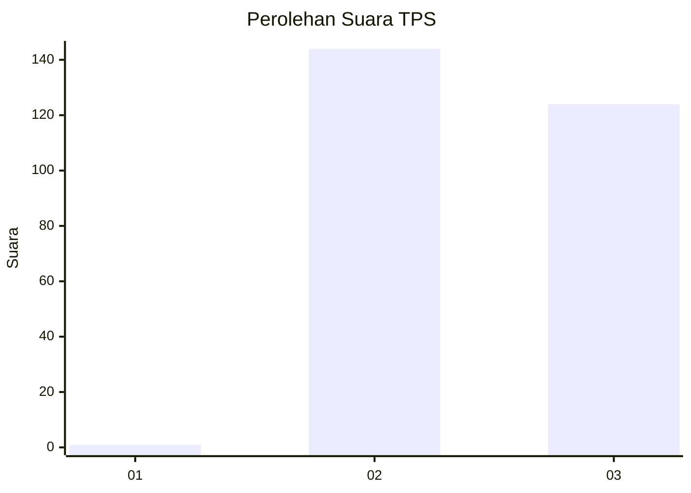
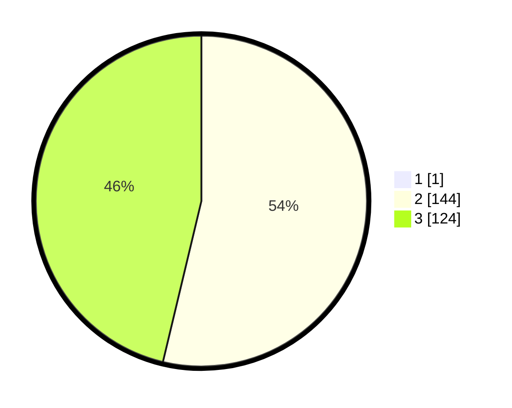

# Hasil

## Grafik

## Tabel

| No. | Nama Paslon    | Suara | Suara (raw) | Persentase |
|:--- |:-------------- | -----:| -----------:| ----------:|
| 1   | ANIES MUHAIMIN | 1     | [1][p-1]    | 0,37       |
| 2   | PRABOWO GIBRAN | 144   | [144][p-2]  | 53,53      |
| 3   | GANJAR MAHFUD  | 124   | [124][p-3]  | 46,10      |

[p-1]: https://github.com/gigit-pemilu/pemilu-2024-51-bali/blob/main/pilpres/hitung-suara/sub/51-bali/sub/03-badung/sub/03-abiansemal/sub/2001-darmasaba/sub/002-tps/sub/paslon-1.txt
[p-2]: https://github.com/gigit-pemilu/pemilu-2024-51-bali/blob/main/pilpres/hitung-suara/sub/51-bali/sub/03-badung/sub/03-abiansemal/sub/2001-darmasaba/sub/002-tps/sub/paslon-2.txt
[p-3]: https://github.com/gigit-pemilu/pemilu-2024-51-bali/blob/main/pilpres/hitung-suara/sub/51-bali/sub/03-badung/sub/03-abiansemal/sub/2001-darmasaba/sub/002-tps/sub/paslon-3.txt

## Foto C Plano

https://sirekap-obj-formc.kpu.go.id/401c/pemilu/ppwp/51/03/03/20/01/5103032001002-20240214-204515--b1595db8-2f10-48f6-9917-8b86a1c233a2.jpg

https://sirekap-obj-formc.kpu.go.id/401c/pemilu/ppwp/51/03/03/20/01/5103032001002-20240214-204652--a0635e3c-e394-406b-b125-c0d2078318d2.jpg

https://sirekap-obj-formc.kpu.go.id/401c/pemilu/ppwp/51/03/03/20/01/5103032001002-20240214-204829--4acf24bd-beb5-4848-a8eb-f318244e886d.jpg

## Metadata

| Key        | Value               |
| ---------- | ------------------- |
| Time Stamp | 2024-02-15 00:41:44 |

## DATA PEMILIH TETAP

Jumlah pemilih dalam DPT: **279**.
 * L: **132**.
 * P: **147**.

## DATA PENGGUNA HAK PILIH

Jumlah pengguna hak pilih dalam DPT: **266**.
 * L: **127**.
 * P: **139**.

Jumlah pengguna hak pilih dalam DPTb: **0**.
 * L: **0**.
 * P: **0**.

Jumlah pengguna hak pilih dalam DPK: **3**.
 * L: **0**.
 * P: **3**.

Jumlah pengguna hak pilih: **269**.
 * L: **127**.
 * P: **142**.

## JUMLAH SUARA SAH DAN TIDAK SAH

JUMLAH SELURUH SUARA SAH: **269**.

JUMLAH SUARA TIDAK SAH: **0**.

JUMLAH SELURUH SUARA SAH DAN SUARA TIDAK SAH: **269**.

