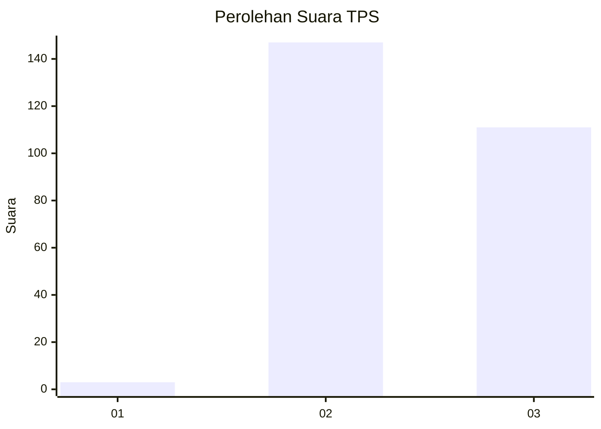
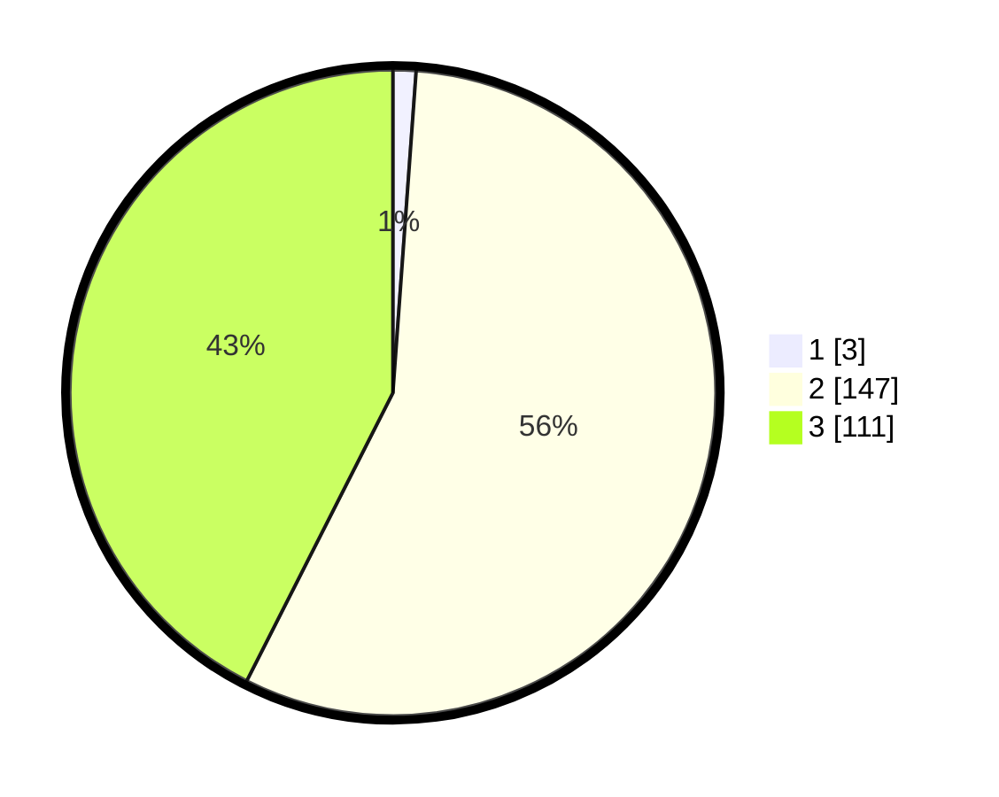

# Hasil

## Grafik

## Tabel

| No. | Nama Paslon    | Suara | Suara (raw) | Persentase |
|:--- |:-------------- | -----:| -----------:| ----------:|
| 1   | ANIES MUHAIMIN | 3     | [3][p-1]    | 1,15       |
| 2   | PRABOWO GIBRAN | 147   | [147][p-2]  | 56,32      |
| 3   | GANJAR MAHFUD  | 111   | [111][p-3]  | 42,53      |

[p-1]: https://github.com/gigit-pemilu/pemilu-2024-51-bali/blob/main/pilpres/hitung-suara/sub/51-bali/sub/03-badung/sub/03-abiansemal/sub/2001-darmasaba/sub/003-tps/sub/paslon-1.txt
[p-2]: https://github.com/gigit-pemilu/pemilu-2024-51-bali/blob/main/pilpres/hitung-suara/sub/51-bali/sub/03-badung/sub/03-abiansemal/sub/2001-darmasaba/sub/003-tps/sub/paslon-2.txt
[p-3]: https://github.com/gigit-pemilu/pemilu-2024-51-bali/blob/main/pilpres/hitung-suara/sub/51-bali/sub/03-badung/sub/03-abiansemal/sub/2001-darmasaba/sub/003-tps/sub/paslon-3.txt

## Foto C Plano

https://sirekap-obj-formc.kpu.go.id/71f0/pemilu/ppwp/51/03/03/20/01/5103032001003-20240216-160123--41b1f774-cb20-4609-bd63-2aad1990cfe2.jpg

https://sirekap-obj-formc.kpu.go.id/71f0/pemilu/ppwp/51/03/03/20/01/5103032001003-20240216-160124--67a522bb-1d69-4517-a82a-135cfe0302a5.jpg

https://sirekap-obj-formc.kpu.go.id/71f0/pemilu/ppwp/51/03/03/20/01/5103032001003-20240216-160124--3bd06cdb-1739-4a6b-a881-a7d7ea5dad0a.jpg

## Metadata

| Key        | Value               |
| ---------- | ------------------- |
| Time Stamp | 2024-02-20 23:00:00 |

## DATA PEMILIH TETAP

Jumlah pemilih dalam DPT: **282**.
 * L: **136**.
 * P: **146**.

## DATA PENGGUNA HAK PILIH

Jumlah pengguna hak pilih dalam DPT: **266**.
 * L: **128**.
 * P: **138**.

Jumlah pengguna hak pilih dalam DPTb: **0**.
 * L: **0**.
 * P: **0**.

Jumlah pengguna hak pilih dalam DPK: **0**.
 * L: **0**.
 * P: **0**.

Jumlah pengguna hak pilih: **266**.
 * L: **128**.
 * P: **138**.

## JUMLAH SUARA SAH DAN TIDAK SAH

JUMLAH SELURUH SUARA SAH: **263**.

JUMLAH SUARA TIDAK SAH: **3**.

JUMLAH SELURUH SUARA SAH DAN SUARA TIDAK SAH: **266**.

