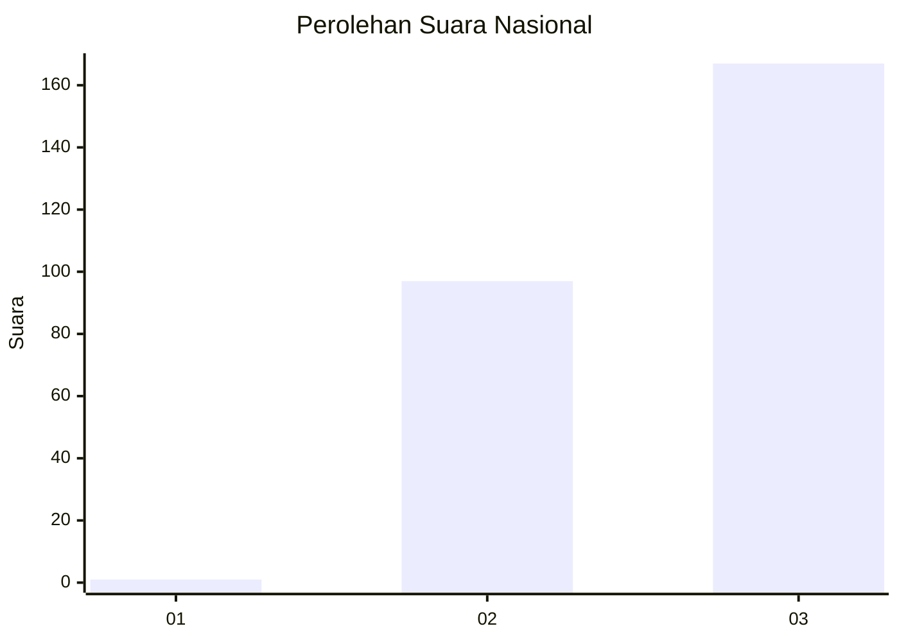
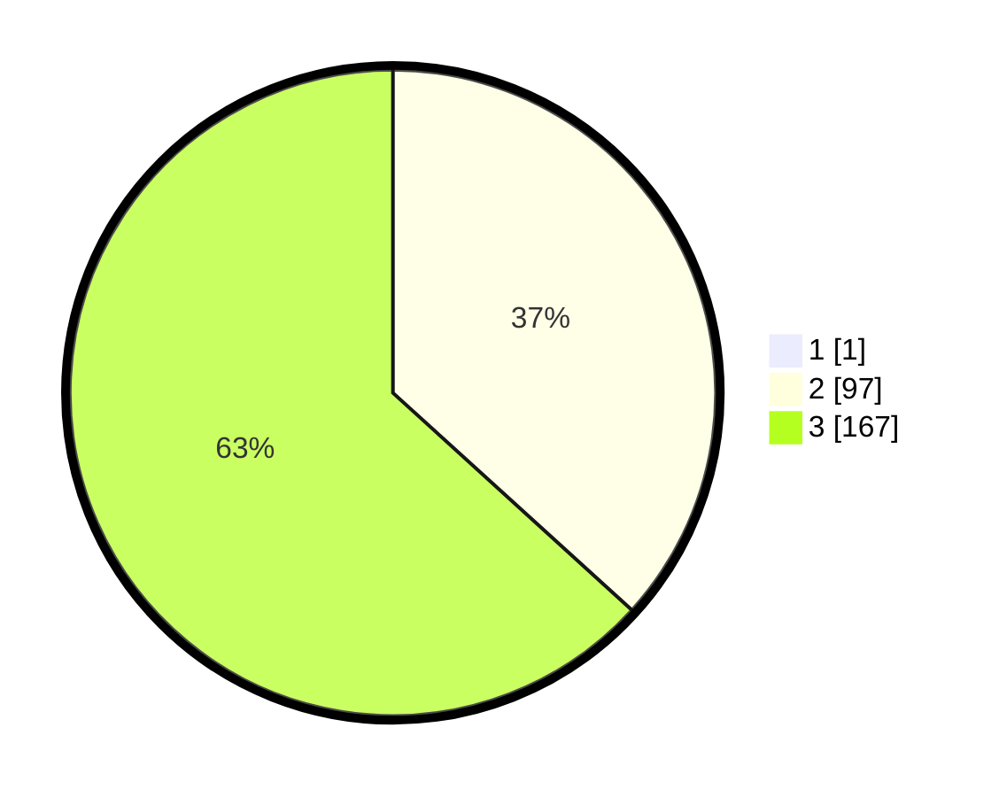

# Hasil

## Grafik

## Tabel

| No. | Nama Paslon    | Suara | Suara (raw) | Persentase |
|:--- |:-------------- | -----:| -----------:| ----------:|
| 1   | ANIES MUHAIMIN | 1     | [1][p-1]    | 0,38       |
| 2   | PRABOWO GIBRAN | 97    | [97][p-2]   | 36,60      |
| 3   | GANJAR MAHFUD  | 167   | [167][p-3]  | 63,02      |

[p-1]: https://github.com/gigit-pemilu/pemilu-2024/blob/main/pilpres/hitung-suara/sub/51-bali/sub/03-badung/sub/03-abiansemal/sub/2001-darmasaba/sub/004-tps/sub/paslon-1.txt
[p-2]: https://github.com/gigit-pemilu/pemilu-2024/blob/main/pilpres/hitung-suara/sub/51-bali/sub/03-badung/sub/03-abiansemal/sub/2001-darmasaba/sub/004-tps/sub/paslon-2.txt
[p-3]: https://github.com/gigit-pemilu/pemilu-2024/blob/main/pilpres/hitung-suara/sub/51-bali/sub/03-badung/sub/03-abiansemal/sub/2001-darmasaba/sub/004-tps/sub/paslon-3.txt

## Foto C Plano

https://sirekap-obj-formc.kpu.go.id/0d89/pemilu/ppwp/51/03/03/20/01/5103032001004-20240214-202441--dceeed63-a879-4caa-b988-36d711cbee19.jpg

https://sirekap-obj-formc.kpu.go.id/0d89/pemilu/ppwp/51/03/03/20/01/5103032001004-20240214-200129--d675e773-93c0-4aa9-8c52-954a5122adc2.jpg

https://sirekap-obj-formc.kpu.go.id/0d89/pemilu/ppwp/51/03/03/20/01/5103032001004-20240214-200236--064ca495-c0b3-436c-af03-b9546bedc066.jpg

## Metadata

| Key        | Value               |
| ---------- | ------------------- |
| Time Stamp | 2024-02-25 12:00:00 |

