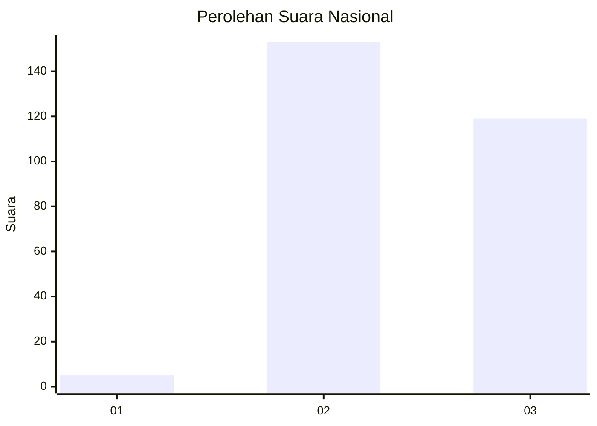
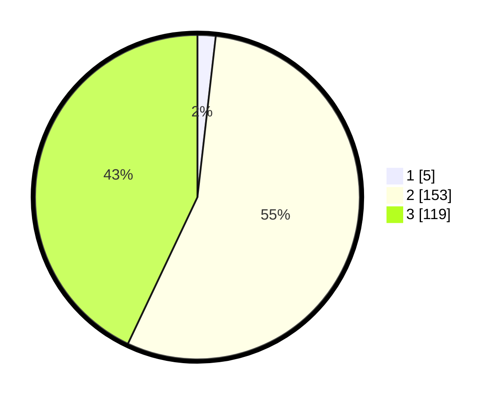

# Hasil

## Grafik

## Tabel

| No. | Nama Paslon    | Suara | Suara (raw) | Persentase |
|:--- |:-------------- | -----:| -----------:| ----------:|
| 1   | ANIES MUHAIMIN | 5     | [5][p-1]    | 1,81       |
| 2   | PRABOWO GIBRAN | 153   | [153][p-2]  | 55,23      |
| 3   | GANJAR MAHFUD  | 119   | [119][p-3]  | 42,96      |

[p-1]: https://github.com/gigit-pemilu/pemilu-2024/blob/main/pilpres/hitung-suara/sub/51-bali/sub/03-badung/sub/03-abiansemal/sub/2001-darmasaba/sub/005-tps/sub/paslon-1.txt
[p-2]: https://github.com/gigit-pemilu/pemilu-2024/blob/main/pilpres/hitung-suara/sub/51-bali/sub/03-badung/sub/03-abiansemal/sub/2001-darmasaba/sub/005-tps/sub/paslon-2.txt
[p-3]: https://github.com/gigit-pemilu/pemilu-2024/blob/main/pilpres/hitung-suara/sub/51-bali/sub/03-badung/sub/03-abiansemal/sub/2001-darmasaba/sub/005-tps/sub/paslon-3.txt

## Foto C Plano

https://sirekap-obj-formc.kpu.go.id/58f0/pemilu/ppwp/51/03/03/20/01/5103032001005-20240214-190630--7376f70d-407d-4e94-8c0a-b6ffb92b31ae.jpg

## Metadata

| Key        | Value               |
| ---------- | ------------------- |
| Time Stamp | 2024-02-15 21:01:18 |

