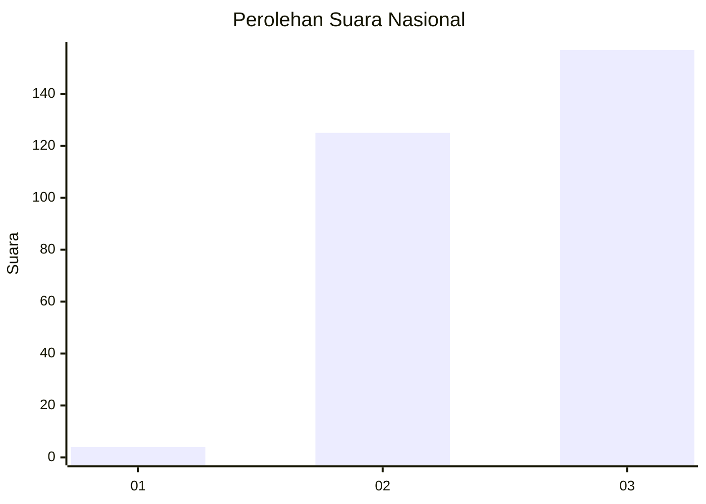
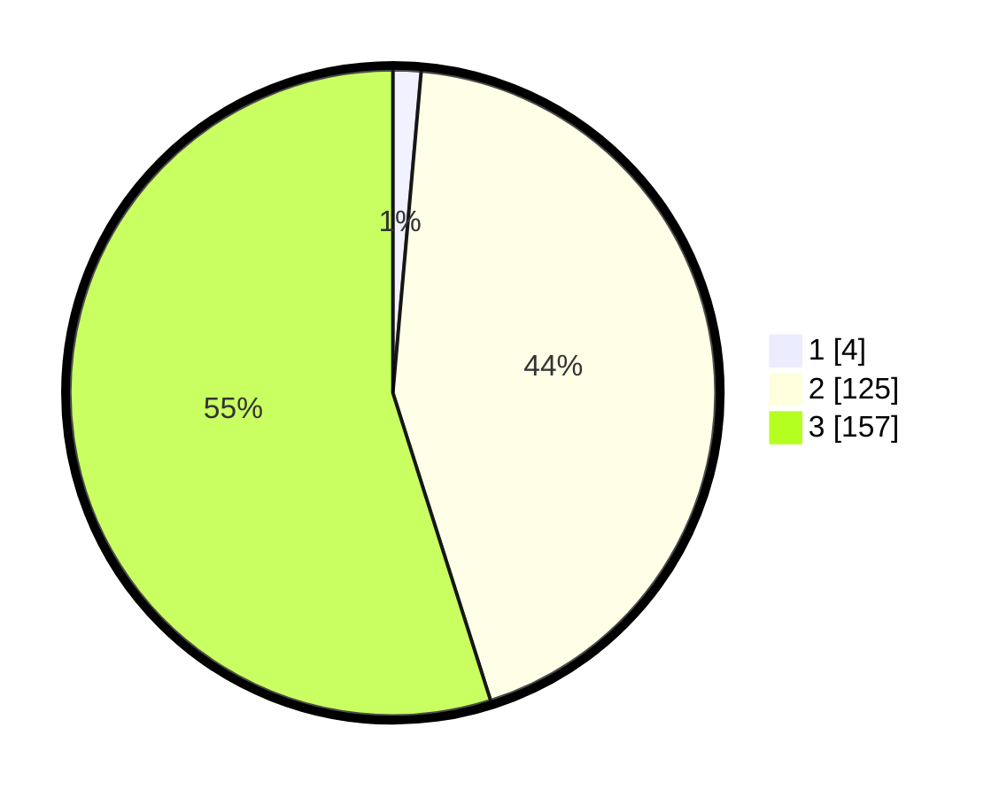

# Hasil

## Grafik

## Tabel

| No. | Nama Paslon    | Suara | Suara (raw) | Persentase |
|:--- |:-------------- | -----:| -----------:| ----------:|
| 1   | ANIES MUHAIMIN | 4     | [4][p-1]    | 1,40       |
| 2   | PRABOWO GIBRAN | 125   | [125][p-2]  | 43,71      |
| 3   | GANJAR MAHFUD  | 157   | [157][p-3]  | 54,90      |

[p-1]: https://github.com/gigit-pemilu/pemilu-2024/blob/main/pilpres/hitung-suara/sub/51-bali/sub/03-badung/sub/03-abiansemal/sub/2001-darmasaba/sub/007-tps/sub/paslon-1.txt
[p-2]: https://github.com/gigit-pemilu/pemilu-2024/blob/main/pilpres/hitung-suara/sub/51-bali/sub/03-badung/sub/03-abiansemal/sub/2001-darmasaba/sub/007-tps/sub/paslon-2.txt
[p-3]: https://github.com/gigit-pemilu/pemilu-2024/blob/main/pilpres/hitung-suara/sub/51-bali/sub/03-badung/sub/03-abiansemal/sub/2001-darmasaba/sub/007-tps/sub/paslon-3.txt

## Foto C Plano

https://sirekap-obj-formc.kpu.go.id/4dfd/pemilu/ppwp/51/03/03/20/01/5103032001007-20240216-034619--da9f4987-c6d6-4146-a695-f5a98d26cc54.jpg

https://sirekap-obj-formc.kpu.go.id/4dfd/pemilu/ppwp/51/03/03/20/01/5103032001007-20240216-034621--65dfabcb-279c-4285-9b67-b6befe699bf8.jpg

https://sirekap-obj-formc.kpu.go.id/4dfd/pemilu/ppwp/51/03/03/20/01/5103032001007-20240216-034620--9c3bf1b6-f94a-4984-a6d7-6edfee6bfaa3.jpg

## Metadata

| Key        | Value               |
| ---------- | ------------------- |
| Time Stamp | 2024-02-22 11:00:00 |

## DATA PEMILIH TETAP

Jumlah pemilih dalam DPT: **284**.
 * L: **143**.
 * P: **141**.

## DATA PENGGUNA HAK PILIH

Jumlah pengguna hak pilih dalam DPT: **284**.
 * L: **143**.
 * P: **141**.

Jumlah pengguna hak pilih dalam DPTb: **1**.
 * L: **0**.
 * P: **1**.

Jumlah pengguna hak pilih dalam DPK: **3**.
 * L: **3**.
 * P: **0**.

Jumlah pengguna hak pilih: **288**.
 * L: **146**.
 * P: **142**.

## JUMLAH SUARA SAH DAN TIDAK SAH

JUMLAH SELURUH SUARA SAH: **286**.

JUMLAH SUARA TIDAK SAH: **2**.

JUMLAH SELURUH SUARA SAH DAN SUARA TIDAK SAH: **288**.

