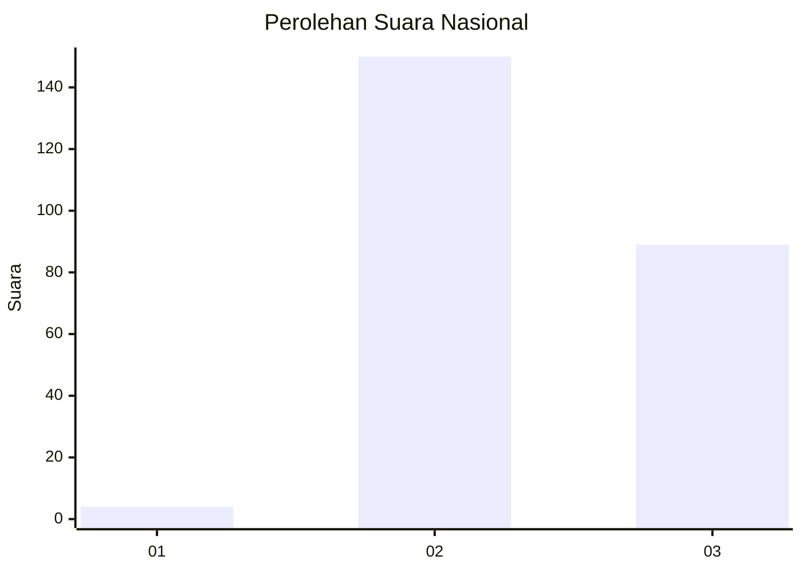
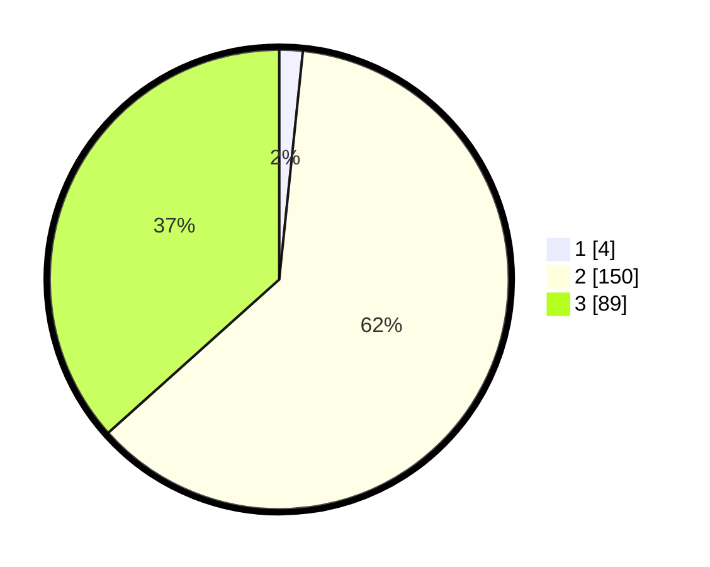

# Hasil

## Grafik

## Tabel

| No. | Nama Paslon    | Suara | Suara (raw) | Persentase |
|:--- |:-------------- | -----:| -----------:| ----------:|
| 1   | ANIES MUHAIMIN | 4     | [4][p-1]    | 1,65       |
| 2   | PRABOWO GIBRAN | 150   | [150][p-2]  | 61,73      |
| 3   | GANJAR MAHFUD  | 89    | [89][p-3]   | 36,63      |

[p-1]: https://github.com/gigit-pemilu/pemilu-2024/blob/main/pilpres/hitung-suara/sub/51-bali/sub/03-badung/sub/03-abiansemal/sub/2001-darmasaba/sub/009-tps/sub/paslon-1.txt
[p-2]: https://github.com/gigit-pemilu/pemilu-2024/blob/main/pilpres/hitung-suara/sub/51-bali/sub/03-badung/sub/03-abiansemal/sub/2001-darmasaba/sub/009-tps/sub/paslon-2.txt
[p-3]: https://github.com/gigit-pemilu/pemilu-2024/blob/main/pilpres/hitung-suara/sub/51-bali/sub/03-badung/sub/03-abiansemal/sub/2001-darmasaba/sub/009-tps/sub/paslon-3.txt

## Foto C Plano

https://sirekap-obj-formc.kpu.go.id/9931/pemilu/ppwp/51/03/03/20/01/5103032001009-20240214-223148--1fb9b3eb-98a2-4b2c-92ac-7efee5a72bd5.jpg

https://sirekap-obj-formc.kpu.go.id/9931/pemilu/ppwp/51/03/03/20/01/5103032001009-20240214-223253--c71cf4f2-4de2-4aca-93ea-0a6113fa9ac9.jpg

https://sirekap-obj-formc.kpu.go.id/9931/pemilu/ppwp/51/03/03/20/01/5103032001009-20240214-223337--cffa8479-3d11-4d01-8890-99929cbca557.jpg

## Metadata

| Key        | Value               |
| ---------- | ------------------- |
| Time Stamp | 2024-02-24 22:31:28 |

