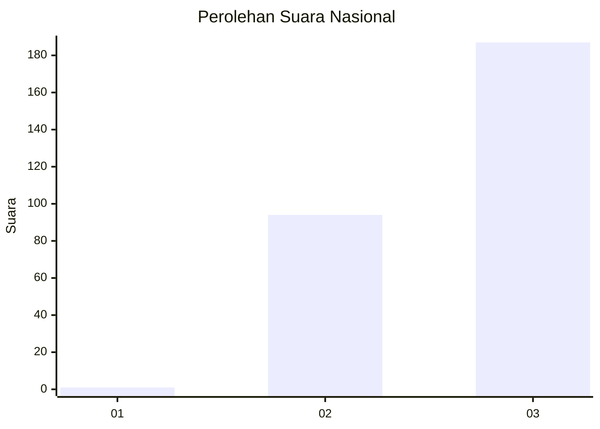
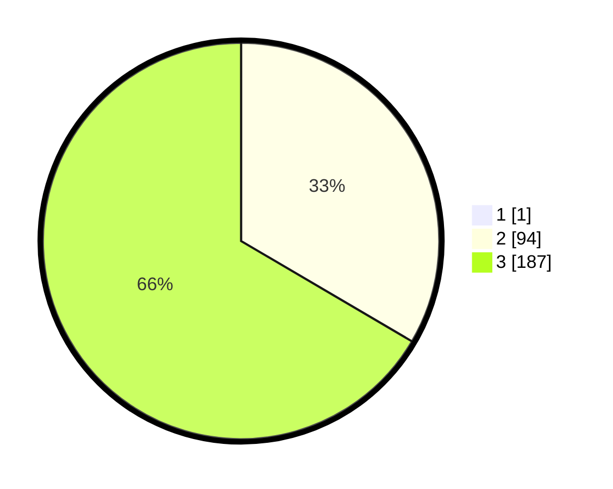

# Hasil

## Grafik

## Tabel

| No. | Nama Paslon    | Suara | Suara (raw) | Persentase |
|:--- |:-------------- | -----:| -----------:| ----------:|
| 1   | ANIES MUHAIMIN | 1     | [1][p-1]    | 0,35       |
| 2   | PRABOWO GIBRAN | 94    | [94][p-2]   | 33,33      |
| 3   | GANJAR MAHFUD  | 187   | [187][p-3]  | 66,31      |

[p-1]: https://github.com/gigit-pemilu/pemilu-2024/blob/main/pilpres/hitung-suara/sub/51-bali/sub/03-badung/sub/03-abiansemal/sub/2001-darmasaba/sub/013-tps/sub/paslon-1.txt
[p-2]: https://github.com/gigit-pemilu/pemilu-2024/blob/main/pilpres/hitung-suara/sub/51-bali/sub/03-badung/sub/03-abiansemal/sub/2001-darmasaba/sub/013-tps/sub/paslon-2.txt
[p-3]: https://github.com/gigit-pemilu/pemilu-2024/blob/main/pilpres/hitung-suara/sub/51-bali/sub/03-badung/sub/03-abiansemal/sub/2001-darmasaba/sub/013-tps/sub/paslon-3.txt

## Foto C Plano

https://sirekap-obj-formc.kpu.go.id/42c4/pemilu/ppwp/51/03/03/20/01/5103032001013-20240216-093224--cc036659-e78e-46f4-9a2c-6c162b39283d.jpg

https://sirekap-obj-formc.kpu.go.id/42c4/pemilu/ppwp/51/03/03/20/01/5103032001013-20240216-093228--1dfd1a32-c5f3-4c6a-84a2-1eac5591fc62.jpg

https://sirekap-obj-formc.kpu.go.id/42c4/pemilu/ppwp/51/03/03/20/01/5103032001013-20240216-093225--61775a7a-f37f-4e62-b520-935c021c9a41.jpg

## Metadata

| Key        | Value               |
| ---------- | ------------------- |
| Time Stamp | 2024-02-21 13:00:00 |

## DATA PEMILIH TETAP

Jumlah pemilih dalam DPT: **289**.
 * L: **137**.
 * P: **152**.

## DATA PENGGUNA HAK PILIH

Jumlah pengguna hak pilih dalam DPT: **285**.
 * L: **135**.
 * P: **150**.

Jumlah pengguna hak pilih dalam DPTb: **0**.
 * L: **0**.
 * P: **0**.

Jumlah pengguna hak pilih dalam DPK: **1**.
 * L: **0**.
 * P: **1**.

Jumlah pengguna hak pilih: **286**.
 * L: **135**.
 * P: **151**.

## JUMLAH SUARA SAH DAN TIDAK SAH

JUMLAH SELURUH SUARA SAH: **282**.

JUMLAH SUARA TIDAK SAH: **4**.

JUMLAH SELURUH SUARA SAH DAN SUARA TIDAK SAH: **286**.

