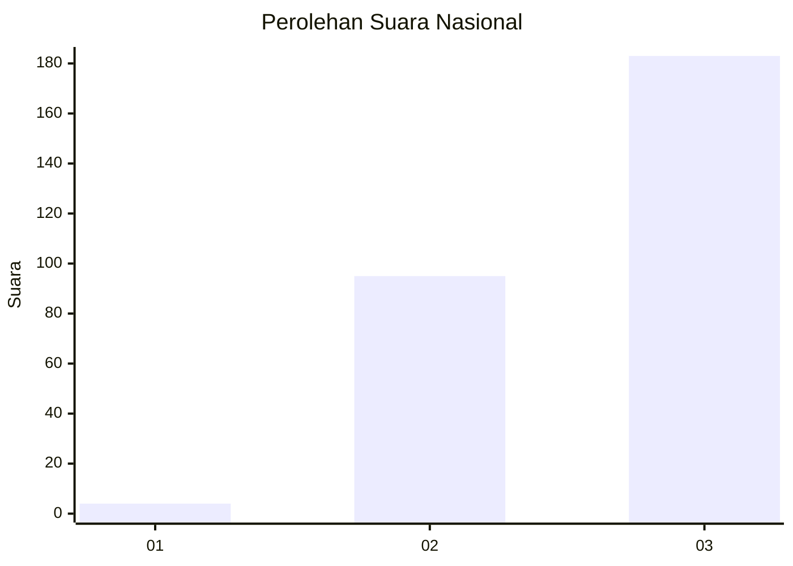
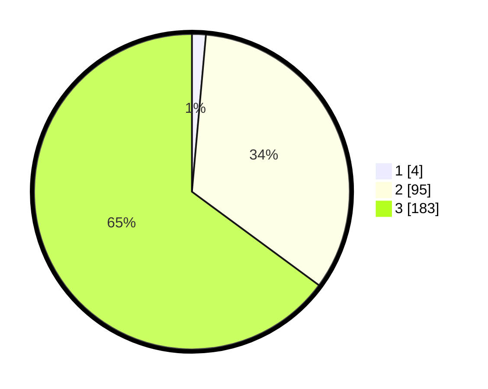

# Hasil

## Grafik

## Tabel

| No. | Nama Paslon    | Suara | Suara (raw) | Persentase |
|:--- |:-------------- | -----:| -----------:| ----------:|
| 1   | ANIES MUHAIMIN | 4     | [4][p-1]    | 1,42       |
| 2   | PRABOWO GIBRAN | 95    | [95][p-2]   | 33,69      |
| 3   | GANJAR MAHFUD  | 183   | [183][p-3]  | 64,89      |

[p-1]: https://github.com/gigit-pemilu/pemilu-2024/blob/main/pilpres/hitung-suara/sub/51-bali/sub/03-badung/sub/03-abiansemal/sub/2001-darmasaba/sub/014-tps/sub/paslon-1.txt
[p-2]: https://github.com/gigit-pemilu/pemilu-2024/blob/main/pilpres/hitung-suara/sub/51-bali/sub/03-badung/sub/03-abiansemal/sub/2001-darmasaba/sub/014-tps/sub/paslon-2.txt
[p-3]: https://github.com/gigit-pemilu/pemilu-2024/blob/main/pilpres/hitung-suara/sub/51-bali/sub/03-badung/sub/03-abiansemal/sub/2001-darmasaba/sub/014-tps/sub/paslon-3.txt

## Foto C Plano

https://sirekap-obj-formc.kpu.go.id/220c/pemilu/ppwp/51/03/03/20/01/5103032001014-20240215-040727--5434234f-a9b7-4be1-93e2-7217293dcb0c.jpg

https://sirekap-obj-formc.kpu.go.id/220c/pemilu/ppwp/51/03/03/20/01/5103032001014-20240215-025410--8e6cd03f-5f12-4e00-8cd4-58af11906ecb.jpg

https://sirekap-obj-formc.kpu.go.id/220c/pemilu/ppwp/51/03/03/20/01/5103032001014-20240215-041105--aacace00-3471-47f7-aa1f-9f74a9aa956b.jpg

## Metadata

| Key        | Value               |
| ---------- | ------------------- |
| Time Stamp | 2024-02-24 22:31:28 |

