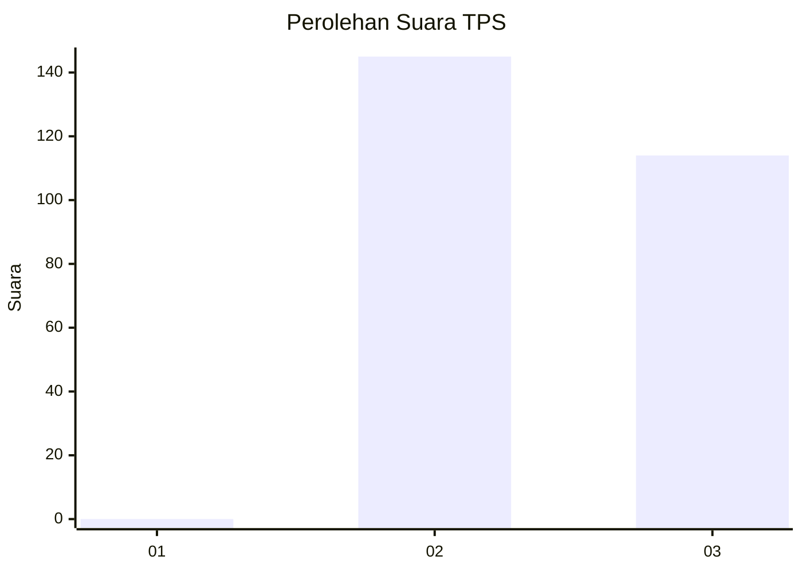
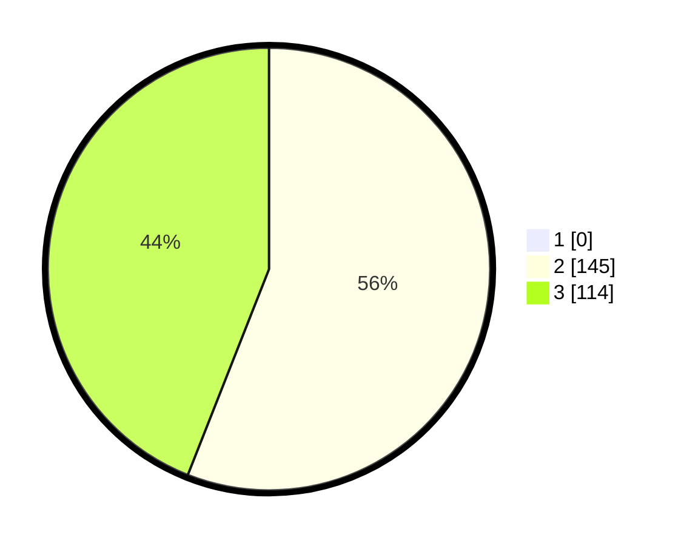

# Hasil

## Grafik

## Tabel

| No. | Nama Paslon    | Suara | Suara (raw) | Persentase |
|:--- |:-------------- | -----:| -----------:| ----------:|
| 1   | ANIES MUHAIMIN | 0     | [0][p-1]    | 0,00       |
| 2   | PRABOWO GIBRAN | 145   | [145][p-2]  | 55,98      |
| 3   | GANJAR MAHFUD  | 114   | [114][p-3]  | 44,02      |

[p-1]: https://github.com/gigit-pemilu/pemilu-2024-51-bali/blob/main/pilpres/hitung-suara/sub/51-bali/sub/03-badung/sub/03-abiansemal/sub/2001-darmasaba/sub/023-tps/sub/paslon-1.txt
[p-2]: https://github.com/gigit-pemilu/pemilu-2024-51-bali/blob/main/pilpres/hitung-suara/sub/51-bali/sub/03-badung/sub/03-abiansemal/sub/2001-darmasaba/sub/023-tps/sub/paslon-2.txt
[p-3]: https://github.com/gigit-pemilu/pemilu-2024-51-bali/blob/main/pilpres/hitung-suara/sub/51-bali/sub/03-badung/sub/03-abiansemal/sub/2001-darmasaba/sub/023-tps/sub/paslon-3.txt

## Foto C Plano

https://sirekap-obj-formc.kpu.go.id/c3e2/pemilu/ppwp/51/03/03/20/01/5103032001023-20240216-090500--146a4871-2325-4d36-b64f-30a62cfc23fe.jpg

https://sirekap-obj-formc.kpu.go.id/c3e2/pemilu/ppwp/51/03/03/20/01/5103032001023-20240216-090507--69e1c62c-066b-4628-a86e-467c8a3272eb.jpg

https://sirekap-obj-formc.kpu.go.id/c3e2/pemilu/ppwp/51/03/03/20/01/5103032001023-20240216-090513--7a5f1f18-30f8-4d07-814f-45dce365cc4f.jpg

## Metadata

| Key        | Value               |
| ---------- | ------------------- |
| Time Stamp | 2024-02-24 22:31:28 |

