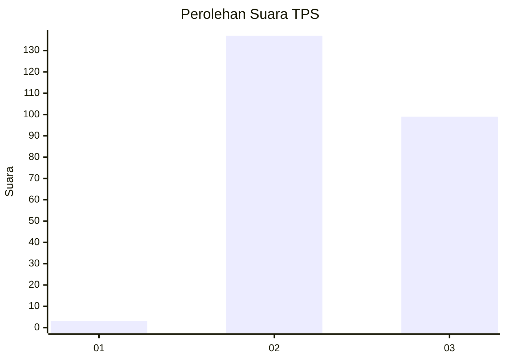
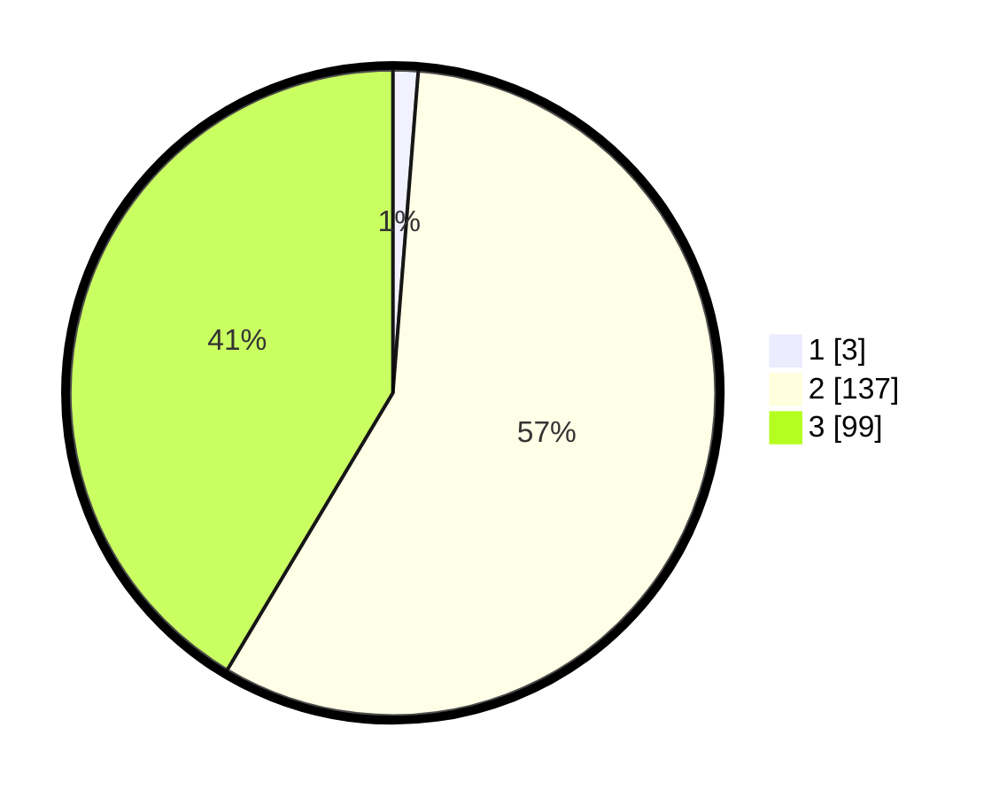

# Hasil

## Grafik

## Tabel

| No. | Nama Paslon    | Suara | Suara (raw) | Persentase |
|:--- |:-------------- | -----:| -----------:| ----------:|
| 1   | ANIES MUHAIMIN | 3     | [3][p-1]    | 1,26       |
| 2   | PRABOWO GIBRAN | 137   | [137][p-2]  | 57,32      |
| 3   | GANJAR MAHFUD  | 99    | [99][p-3]   | 41,42      |

[p-1]: https://github.com/gigit-pemilu/pemilu-2024-51-bali/blob/main/pilpres/hitung-suara/sub/51-bali/sub/03-badung/sub/03-abiansemal/sub/2001-darmasaba/sub/026-tps/sub/paslon-1.txt
[p-2]: https://github.com/gigit-pemilu/pemilu-2024-51-bali/blob/main/pilpres/hitung-suara/sub/51-bali/sub/03-badung/sub/03-abiansemal/sub/2001-darmasaba/sub/026-tps/sub/paslon-2.txt
[p-3]: https://github.com/gigit-pemilu/pemilu-2024-51-bali/blob/main/pilpres/hitung-suara/sub/51-bali/sub/03-badung/sub/03-abiansemal/sub/2001-darmasaba/sub/026-tps/sub/paslon-3.txt

## Foto C Plano

https://sirekap-obj-formc.kpu.go.id/2b6f/pemilu/ppwp/51/03/03/20/01/5103032001026-20240214-225458--55c6a63a-6759-4419-9987-53627c35955e.jpg

https://sirekap-obj-formc.kpu.go.id/2b6f/pemilu/ppwp/51/03/03/20/01/5103032001026-20240214-225547--5b8dd60d-8bd7-49f1-a56c-0f29486ae4be.jpg

https://sirekap-obj-formc.kpu.go.id/2b6f/pemilu/ppwp/51/03/03/20/01/5103032001026-20240214-225635--e991d27b-3931-46ef-a07c-73effd61b78f.jpg

## Metadata

| Key        | Value               |
| ---------- | ------------------- |
| Time Stamp | 2024-02-24 22:31:28 |

