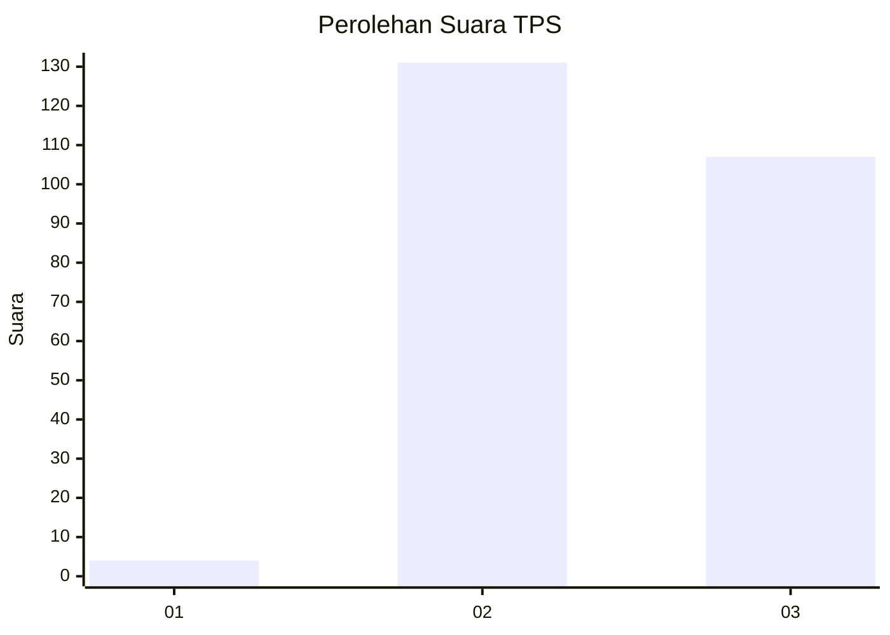
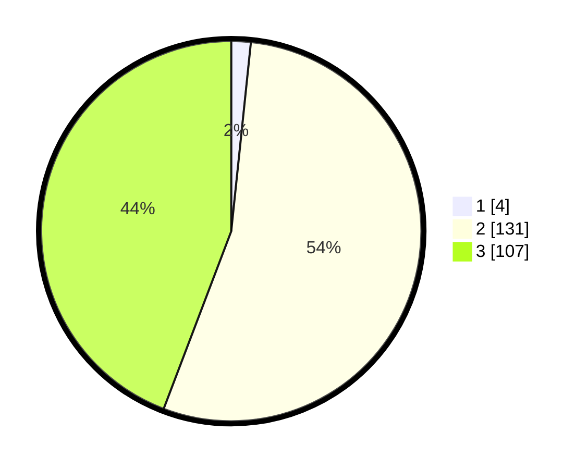

# Hasil

## Grafik

## Tabel

| No. | Nama Paslon    | Suara | Suara (raw) | Persentase |
|:--- |:-------------- | -----:| -----------:| ----------:|
| 1   | ANIES MUHAIMIN | 4     | [4][p-1]    | 1,65       |
| 2   | PRABOWO GIBRAN | 131   | [131][p-2]  | 54,13      |
| 3   | GANJAR MAHFUD  | 107   | [107][p-3]  | 44,21      |

[p-1]: https://github.com/gigit-pemilu/pemilu-2024-51-bali/blob/main/pilpres/hitung-suara/sub/51-bali/sub/03-badung/sub/03-abiansemal/sub/2001-darmasaba/sub/028-tps/sub/paslon-1.txt
[p-2]: https://github.com/gigit-pemilu/pemilu-2024-51-bali/blob/main/pilpres/hitung-suara/sub/51-bali/sub/03-badung/sub/03-abiansemal/sub/2001-darmasaba/sub/028-tps/sub/paslon-2.txt
[p-3]: https://github.com/gigit-pemilu/pemilu-2024-51-bali/blob/main/pilpres/hitung-suara/sub/51-bali/sub/03-badung/sub/03-abiansemal/sub/2001-darmasaba/sub/028-tps/sub/paslon-3.txt

## Foto C Plano

https://sirekap-obj-formc.kpu.go.id/0c4b/pemilu/ppwp/51/03/03/20/01/5103032001028-20240214-225526--2087c210-f5f6-4ad5-ba54-224ce5e15611.jpg

https://sirekap-obj-formc.kpu.go.id/0c4b/pemilu/ppwp/51/03/03/20/01/5103032001028-20240214-230108--43e19b25-4118-4a10-8d6f-1269611782c2.jpg

https://sirekap-obj-formc.kpu.go.id/0c4b/pemilu/ppwp/51/03/03/20/01/5103032001028-20240214-230246--32e57ae8-ad5a-4eb6-b1d1-38bdcbb95e61.jpg

## Metadata

| Key        | Value               |
| ---------- | ------------------- |
| Time Stamp | 2024-02-24 22:31:28 |

