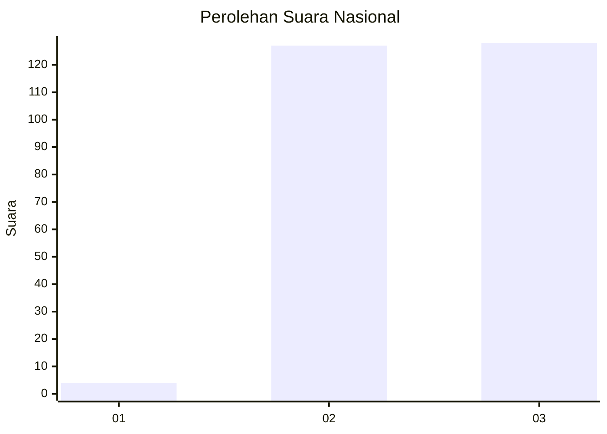
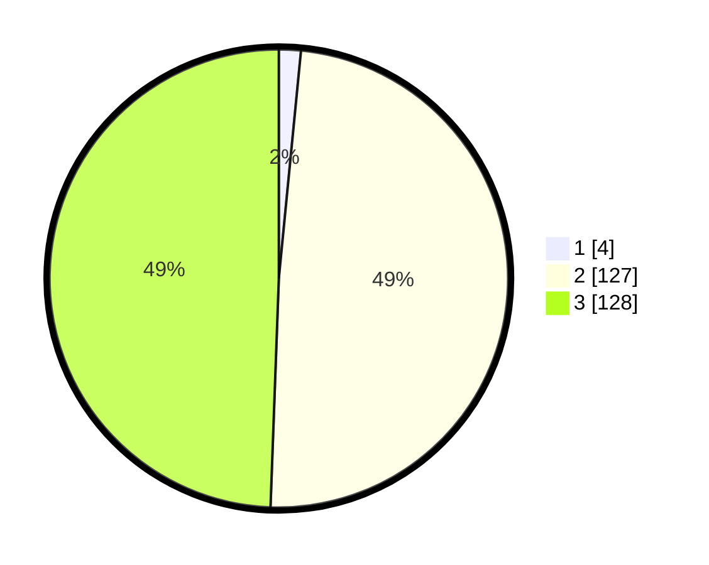

# Hasil

## Grafik

## Tabel

| No. | Nama Paslon    | Suara | Suara (raw) | Persentase |
|:--- |:-------------- | -----:| -----------:| ----------:|
| 1   | ANIES MUHAIMIN | 4     | [4][p-1]    | 1,54       |
| 2   | PRABOWO GIBRAN | 127   | [127][p-2]  | 49,03      |
| 3   | GANJAR MAHFUD  | 128   | [128][p-3]  | 49,42      |

[p-1]: https://github.com/gigit-pemilu/pemilu-2024/blob/main/pilpres/hitung-suara/sub/51-bali/sub/03-badung/sub/03-abiansemal/sub/2002-sibangkaja/sub/006-tps/sub/paslon-1.txt
[p-2]: https://github.com/gigit-pemilu/pemilu-2024/blob/main/pilpres/hitung-suara/sub/51-bali/sub/03-badung/sub/03-abiansemal/sub/2002-sibangkaja/sub/006-tps/sub/paslon-2.txt
[p-3]: https://github.com/gigit-pemilu/pemilu-2024/blob/main/pilpres/hitung-suara/sub/51-bali/sub/03-badung/sub/03-abiansemal/sub/2002-sibangkaja/sub/006-tps/sub/paslon-3.txt

## Foto C Plano

https://sirekap-obj-formc.kpu.go.id/c27c/pemilu/ppwp/51/03/03/20/02/5103032002006-20240214-132538--9ac5c684-b819-430e-930e-beaefa3ee118.jpg

https://sirekap-obj-formc.kpu.go.id/c27c/pemilu/ppwp/51/03/03/20/02/5103032002006-20240214-132716--3fff3ac7-617d-4eb6-8e63-54e806ff42a0.jpg

https://sirekap-obj-formc.kpu.go.id/c27c/pemilu/ppwp/51/03/03/20/02/5103032002006-20240214-132851--74491484-387c-4fd6-a858-6345ef9c7e45.jpg

## Metadata

| Key        | Value               |
| ---------- | ------------------- |
| Time Stamp | 2024-02-14 21:46:01 |

## DATA PEMILIH TETAP

Jumlah pemilih dalam DPT: **282**.
 * L: **141**.
 * P: **141**.

## DATA PENGGUNA HAK PILIH

Jumlah pengguna hak pilih dalam DPT: **259**.
 * L: **127**.
 * P: **132**.

Jumlah pengguna hak pilih dalam DPTb: **0**.
 * L: **0**.
 * P: **0**.

Jumlah pengguna hak pilih dalam DPK: **3**.
 * L: **0**.
 * P: **3**.

Jumlah pengguna hak pilih: **262**.
 * L: **127**.
 * P: **135**.

## JUMLAH SUARA SAH DAN TIDAK SAH

JUMLAH SELURUH SUARA SAH: **259**.

JUMLAH SUARA TIDAK SAH: **3**.

JUMLAH SELURUH SUARA SAH DAN SUARA TIDAK SAH: **262**.

