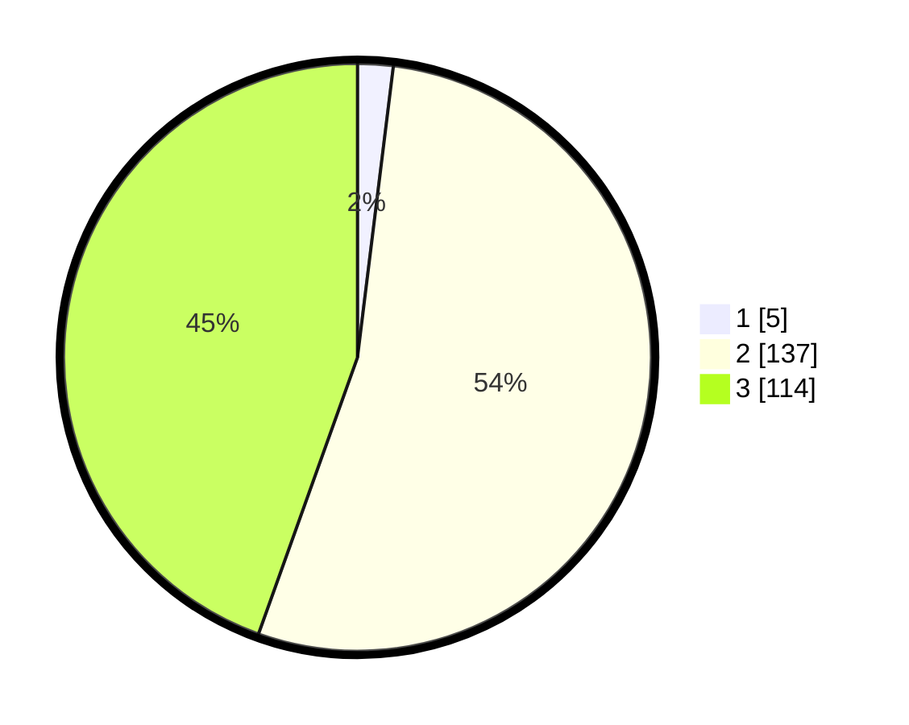

# Hasil

## Grafik

## Tabel

| No. | Nama Paslon    | Suara | Suara (raw) | Persentase |
|:--- |:-------------- | -----:| -----------:| ----------:|
| 1   | ANIES MUHAIMIN | 5     | [5][p-1]    | 1,95       |
| 2   | PRABOWO GIBRAN | 137   | [137][p-2]  | 53,52      |
| 3   | GANJAR MAHFUD  | 114   | [114][p-3]  | 44,53      |

[p-1]: https://github.com/gigit-pemilu/pemilu-2024/blob/main/pilpres/hitung-suara/sub/51-bali/sub/03-badung/sub/03-abiansemal/sub/2002-sibangkaja/sub/012-tps/sub/paslon-1.txt
[p-2]: https://github.com/gigit-pemilu/pemilu-2024/blob/main/pilpres/hitung-suara/sub/51-bali/sub/03-badung/sub/03-abiansemal/sub/2002-sibangkaja/sub/012-tps/sub/paslon-2.txt
[p-3]: https://github.com/gigit-pemilu/pemilu-2024/blob/main/pilpres/hitung-suara/sub/51-bali/sub/03-badung/sub/03-abiansemal/sub/2002-sibangkaja/sub/012-tps/sub/paslon-3.txt

## Foto C Plano

https://sirekap-obj-formc.kpu.go.id/3949/pemilu/ppwp/51/03/03/20/02/5103032002012-20240214-141520--d17022c9-7120-4d12-89f3-1b63e35ed2ae.jpg

https://sirekap-obj-formc.kpu.go.id/3949/pemilu/ppwp/51/03/03/20/02/5103032002012-20240214-141757--0613a6eb-0a97-4e1c-b445-f610b7b8fb2b.jpg

https://sirekap-obj-formc.kpu.go.id/3949/pemilu/ppwp/51/03/03/20/02/5103032002012-20240214-141922--9927741c-6c09-47b0-a9ff-1083f695a4d6.jpg

## Metadata

| Key        | Value               |
| ---------- | ------------------- |
| Time Stamp | 2024-02-14 21:46:01 |

