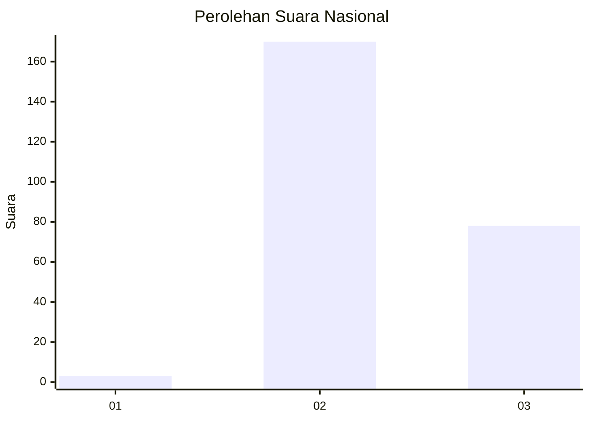
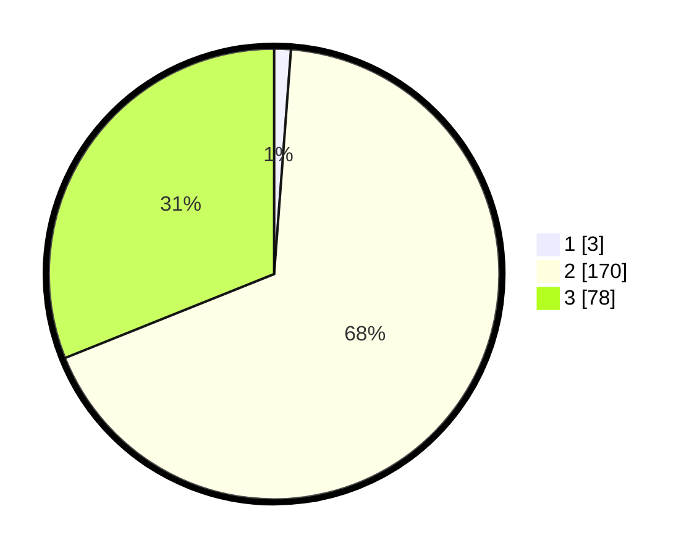

# Hasil

## Grafik

## Tabel

| No. | Nama Paslon    | Suara | Suara (raw) | Persentase |
|:--- |:-------------- | -----:| -----------:| ----------:|
| 1   | ANIES MUHAIMIN | 3     | [3][p-1]    | 1,20       |
| 2   | PRABOWO GIBRAN | 170   | [170][p-2]  | 67,73      |
| 3   | GANJAR MAHFUD  | 78    | [78][p-3]   | 31,08      |

[p-1]: https://github.com/gigit-pemilu/pemilu-2024/blob/main/pilpres/hitung-suara/sub/51-bali/sub/03-badung/sub/03-abiansemal/sub/2002-sibangkaja/sub/018-tps/sub/paslon-1.txt
[p-2]: https://github.com/gigit-pemilu/pemilu-2024/blob/main/pilpres/hitung-suara/sub/51-bali/sub/03-badung/sub/03-abiansemal/sub/2002-sibangkaja/sub/018-tps/sub/paslon-2.txt
[p-3]: https://github.com/gigit-pemilu/pemilu-2024/blob/main/pilpres/hitung-suara/sub/51-bali/sub/03-badung/sub/03-abiansemal/sub/2002-sibangkaja/sub/018-tps/sub/paslon-3.txt

## Foto C Plano

https://sirekap-obj-formc.kpu.go.id/6f1e/pemilu/ppwp/51/03/03/20/02/5103032002018-20240214-201548--6bc8b30e-d06c-40f0-b465-86ed103facf6.jpg

https://sirekap-obj-formc.kpu.go.id/6f1e/pemilu/ppwp/51/03/03/20/02/5103032002018-20240214-201645--7ed43ce2-e943-4d36-ac10-8d7d7ae29f1f.jpg

https://sirekap-obj-formc.kpu.go.id/6f1e/pemilu/ppwp/51/03/03/20/02/5103032002018-20240214-201822--c88f998a-bce7-4bfb-bb04-4036203edc25.jpg

## Metadata

| Key        | Value               |
| ---------- | ------------------- |
| Time Stamp | 2024-02-24 22:31:28 |

