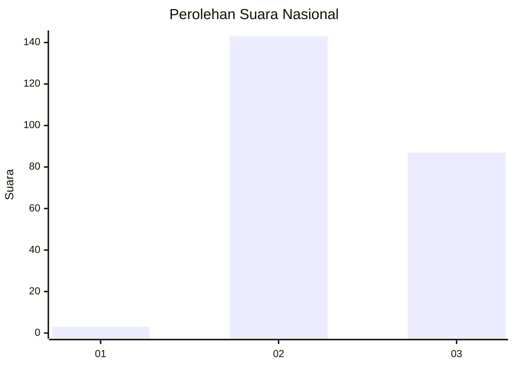
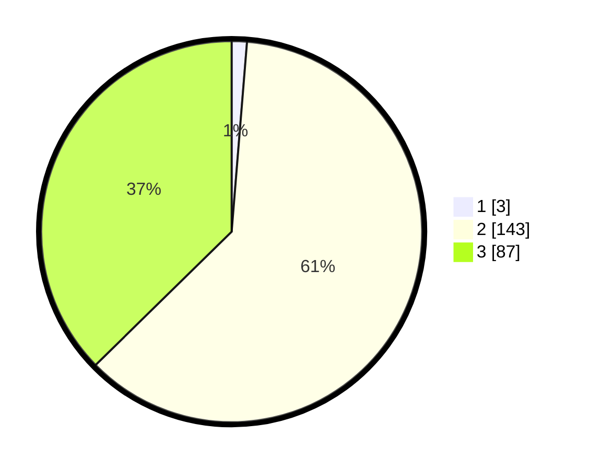

# Hasil

## Grafik

## Tabel

| No. | Nama Paslon    | Suara | Suara (raw) | Persentase |
|:--- |:-------------- | -----:| -----------:| ----------:|
| 1   | ANIES MUHAIMIN | 3     | [3][p-1]    | 1,29       |
| 2   | PRABOWO GIBRAN | 143   | [143][p-2]  | 61,37      |
| 3   | GANJAR MAHFUD  | 87    | [87][p-3]   | 37,34      |

[p-1]: https://github.com/gigit-pemilu/pemilu-2024/blob/main/pilpres/hitung-suara/sub/51-bali/sub/03-badung/sub/03-abiansemal/sub/2002-sibangkaja/sub/019-tps/sub/paslon-1.txt
[p-2]: https://github.com/gigit-pemilu/pemilu-2024/blob/main/pilpres/hitung-suara/sub/51-bali/sub/03-badung/sub/03-abiansemal/sub/2002-sibangkaja/sub/019-tps/sub/paslon-2.txt
[p-3]: https://github.com/gigit-pemilu/pemilu-2024/blob/main/pilpres/hitung-suara/sub/51-bali/sub/03-badung/sub/03-abiansemal/sub/2002-sibangkaja/sub/019-tps/sub/paslon-3.txt

## Foto C Plano

https://sirekap-obj-formc.kpu.go.id/2d82/pemilu/ppwp/51/03/03/20/02/5103032002019-20240216-040621--fa73925b-d695-446a-abb4-6fdd8edc2047.jpg

https://sirekap-obj-formc.kpu.go.id/2d82/pemilu/ppwp/51/03/03/20/02/5103032002019-20240216-040640--3233306e-29e3-4072-a328-e9277c84c2de.jpg

https://sirekap-obj-formc.kpu.go.id/2d82/pemilu/ppwp/51/03/03/20/02/5103032002019-20240216-040632--92d2ad78-52a5-4417-a224-52e60f5dee55.jpg

## Metadata

| Key        | Value               |
| ---------- | ------------------- |
| Time Stamp | 2024-02-21 12:00:00 |

## DATA PEMILIH TETAP

Jumlah pemilih dalam DPT: **275**.
 * L: **128**.
 * P: **147**.

## DATA PENGGUNA HAK PILIH

Jumlah pengguna hak pilih dalam DPT: **275**.
 * L: **128**.
 * P: **147**.

Jumlah pengguna hak pilih dalam DPTb: **0**.
 * L: **0**.
 * P: **0**.

Jumlah pengguna hak pilih dalam DPK: **0**.
 * L: **0**.
 * P: **0**.

Jumlah pengguna hak pilih: **275**.
 * L: **128**.
 * P: **147**.

## JUMLAH SUARA SAH DAN TIDAK SAH

JUMLAH SELURUH SUARA SAH: **233**.

JUMLAH SUARA TIDAK SAH: **4**.

JUMLAH SELURUH SUARA SAH DAN SUARA TIDAK SAH: **237**.

