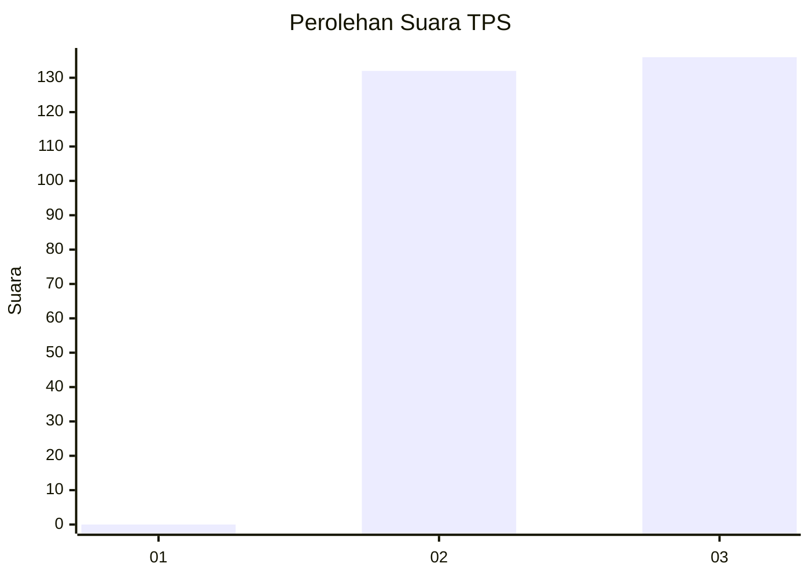
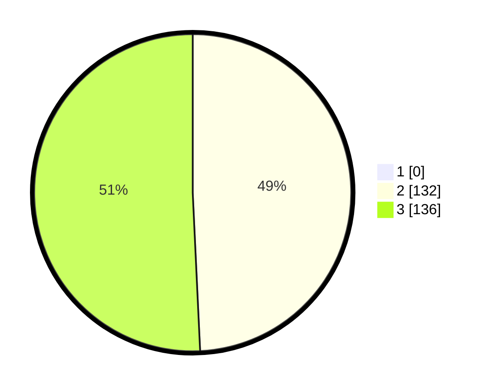

# Hasil

## Grafik

## Tabel

| No. | Nama Paslon    | Suara | Suara (raw) | Persentase |
|:--- |:-------------- | -----:| -----------:| ----------:|
| 1   | ANIES MUHAIMIN | 0     | [0][p-1]    | 0,00       |
| 2   | PRABOWO GIBRAN | 132   | [132][p-2]  | 49,25      |
| 3   | GANJAR MAHFUD  | 136   | [136][p-3]  | 50,75      |

[p-1]: https://github.com/gigit-pemilu/pemilu-2024-51-bali/blob/main/pilpres/hitung-suara/sub/51-bali/sub/03-badung/sub/03-abiansemal/sub/2003-sibanggede/sub/002-tps/sub/paslon-1.txt
[p-2]: https://github.com/gigit-pemilu/pemilu-2024-51-bali/blob/main/pilpres/hitung-suara/sub/51-bali/sub/03-badung/sub/03-abiansemal/sub/2003-sibanggede/sub/002-tps/sub/paslon-2.txt
[p-3]: https://github.com/gigit-pemilu/pemilu-2024-51-bali/blob/main/pilpres/hitung-suara/sub/51-bali/sub/03-badung/sub/03-abiansemal/sub/2003-sibanggede/sub/002-tps/sub/paslon-3.txt

## Foto C Plano

https://sirekap-obj-formc.kpu.go.id/f853/pemilu/ppwp/51/03/03/20/03/5103032003002-20240214-235909--78fee76e-0a8c-4584-9a9d-4d165dbf1b26.jpg

https://sirekap-obj-formc.kpu.go.id/f853/pemilu/ppwp/51/03/03/20/03/5103032003002-20240215-000756--f1f7b487-3281-4a68-8849-58e20a0f7f48.jpg

https://sirekap-obj-formc.kpu.go.id/f853/pemilu/ppwp/51/03/03/20/03/5103032003002-20240215-000355--53e3ee47-cd10-4af9-9121-4dda132867dc.jpg

## Metadata

| Key        | Value               |
| ---------- | ------------------- |
| Time Stamp | 2024-02-25 12:00:00 |

