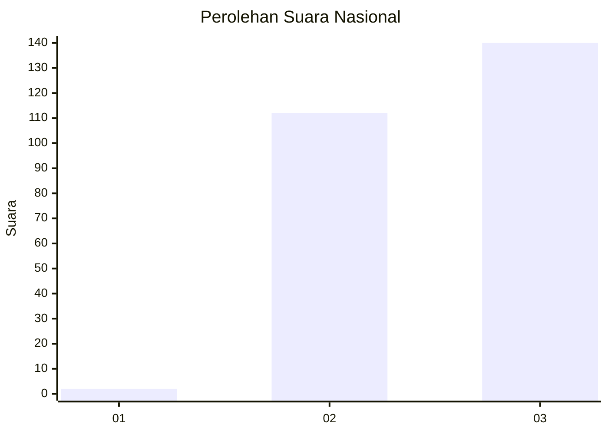
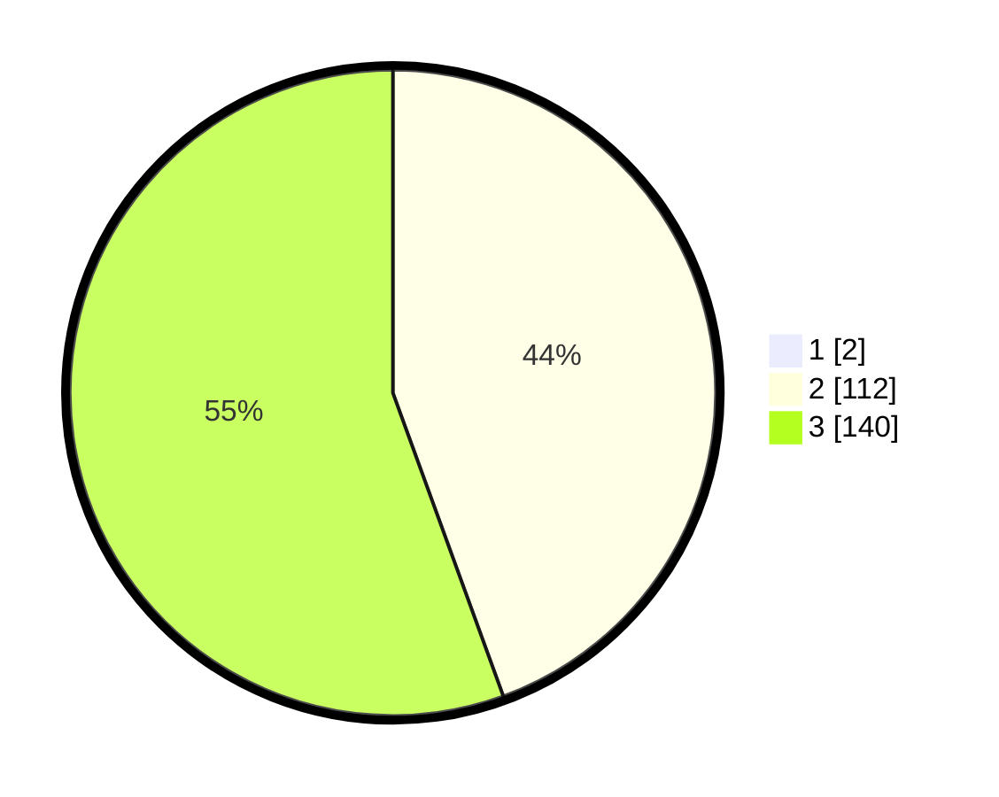

# Hasil

## Grafik

## Tabel

| No. | Nama Paslon    | Suara | Suara (raw) | Persentase |
|:--- |:-------------- | -----:| -----------:| ----------:|
| 1   | ANIES MUHAIMIN | 2     | [2][p-1]    | 0,79       |
| 2   | PRABOWO GIBRAN | 112   | [112][p-2]  | 44,09      |
| 3   | GANJAR MAHFUD  | 140   | [140][p-3]  | 55,12      |

[p-1]: https://github.com/gigit-pemilu/pemilu-2024/blob/main/pilpres/hitung-suara/sub/51-bali/sub/03-badung/sub/03-abiansemal/sub/2003-sibanggede/sub/003-tps/sub/paslon-1.txt
[p-2]: https://github.com/gigit-pemilu/pemilu-2024/blob/main/pilpres/hitung-suara/sub/51-bali/sub/03-badung/sub/03-abiansemal/sub/2003-sibanggede/sub/003-tps/sub/paslon-2.txt
[p-3]: https://github.com/gigit-pemilu/pemilu-2024/blob/main/pilpres/hitung-suara/sub/51-bali/sub/03-badung/sub/03-abiansemal/sub/2003-sibanggede/sub/003-tps/sub/paslon-3.txt

## Foto C Plano

https://sirekap-obj-formc.kpu.go.id/8c5f/pemilu/ppwp/51/03/03/20/03/5103032003003-20240215-002224--d1aa1a7f-a4c1-46d6-83f1-8a358c9b9376.jpg

https://sirekap-obj-formc.kpu.go.id/8c5f/pemilu/ppwp/51/03/03/20/03/5103032003003-20240215-002051--b89de955-2099-4b7a-b514-a814042337c1.jpg

https://sirekap-obj-formc.kpu.go.id/8c5f/pemilu/ppwp/51/03/03/20/03/5103032003003-20240215-002317--a5c75999-e2db-4aae-83f7-5a7a20a3fac4.jpg

## Metadata

| Key        | Value               |
| ---------- | ------------------- |
| Time Stamp | 2024-02-24 22:31:28 |

