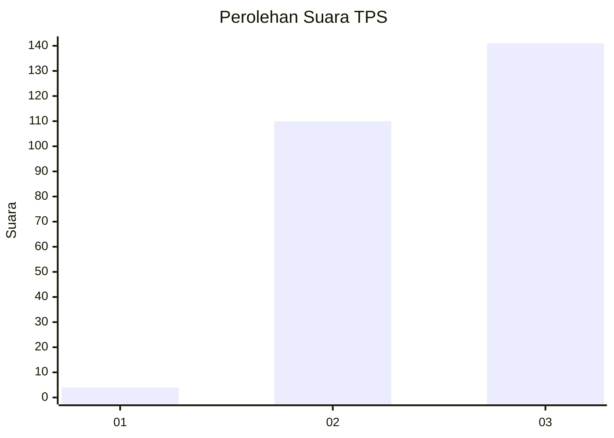
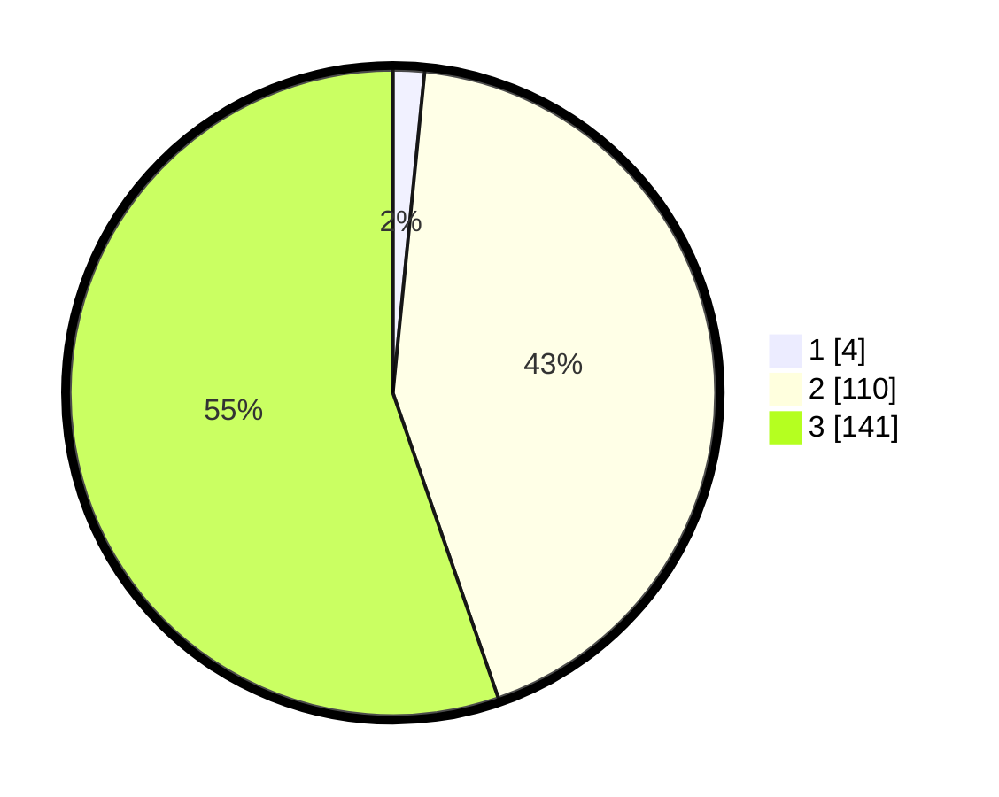

# Hasil

## Grafik

## Tabel

| No. | Nama Paslon    | Suara | Suara (raw) | Persentase |
|:--- |:-------------- | -----:| -----------:| ----------:|
| 1   | ANIES MUHAIMIN | 4     | [4][p-1]    | 1,57       |
| 2   | PRABOWO GIBRAN | 110   | [110][p-2]  | 43,14      |
| 3   | GANJAR MAHFUD  | 141   | [141][p-3]  | 55,29      |

[p-1]: https://github.com/gigit-pemilu/pemilu-2024-51-bali/blob/main/pilpres/hitung-suara/sub/51-bali/sub/03-badung/sub/03-abiansemal/sub/2003-sibanggede/sub/004-tps/sub/paslon-1.txt
[p-2]: https://github.com/gigit-pemilu/pemilu-2024-51-bali/blob/main/pilpres/hitung-suara/sub/51-bali/sub/03-badung/sub/03-abiansemal/sub/2003-sibanggede/sub/004-tps/sub/paslon-2.txt
[p-3]: https://github.com/gigit-pemilu/pemilu-2024-51-bali/blob/main/pilpres/hitung-suara/sub/51-bali/sub/03-badung/sub/03-abiansemal/sub/2003-sibanggede/sub/004-tps/sub/paslon-3.txt

## Foto C Plano

https://sirekap-obj-formc.kpu.go.id/b58b/pemilu/ppwp/51/03/03/20/03/5103032003004-20240214-141015--da8949f3-5f6e-48a3-8d4d-66ac9f355211.jpg

https://sirekap-obj-formc.kpu.go.id/b58b/pemilu/ppwp/51/03/03/20/03/5103032003004-20240214-141245--7b5cf5fa-d600-4a96-8a2b-2fe599e84456.jpg

https://sirekap-obj-formc.kpu.go.id/b58b/pemilu/ppwp/51/03/03/20/03/5103032003004-20240214-141441--4f3f0965-92c9-4ce0-8a4d-e2cf6ccf9655.jpg

## Metadata

| Key        | Value               |
| ---------- | ------------------- |
| Time Stamp | 2024-02-24 22:31:28 |

## DATA PEMILIH TETAP

Jumlah pemilih dalam DPT: **270**.
 * L: **135**.
 * P: **135**.

## DATA PENGGUNA HAK PILIH

Jumlah pengguna hak pilih dalam DPT: **264**.
 * L: **129**.
 * P: **135**.

Jumlah pengguna hak pilih dalam DPTb: **1**.
 * L: **0**.
 * P: **1**.

Jumlah pengguna hak pilih dalam DPK: **0**.
 * L: **0**.
 * P: **0**.

Jumlah pengguna hak pilih: **265**.
 * L: **129**.
 * P: **136**.

## JUMLAH SUARA SAH DAN TIDAK SAH

JUMLAH SELURUH SUARA SAH: **255**.

JUMLAH SUARA TIDAK SAH: **10**.

JUMLAH SELURUH SUARA SAH DAN SUARA TIDAK SAH: **265**.

