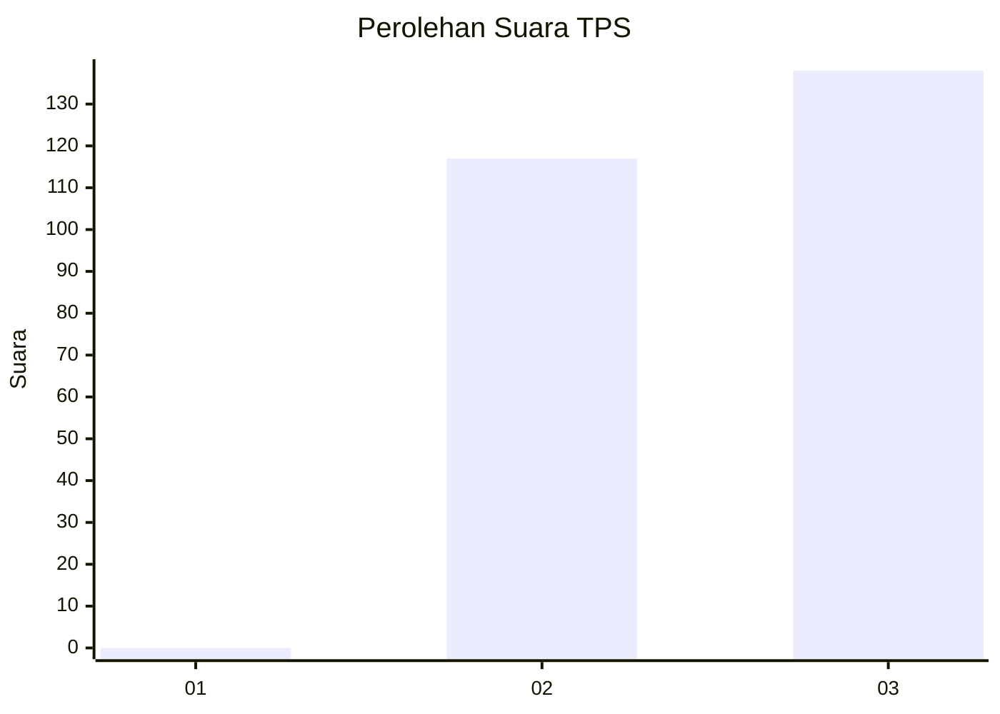
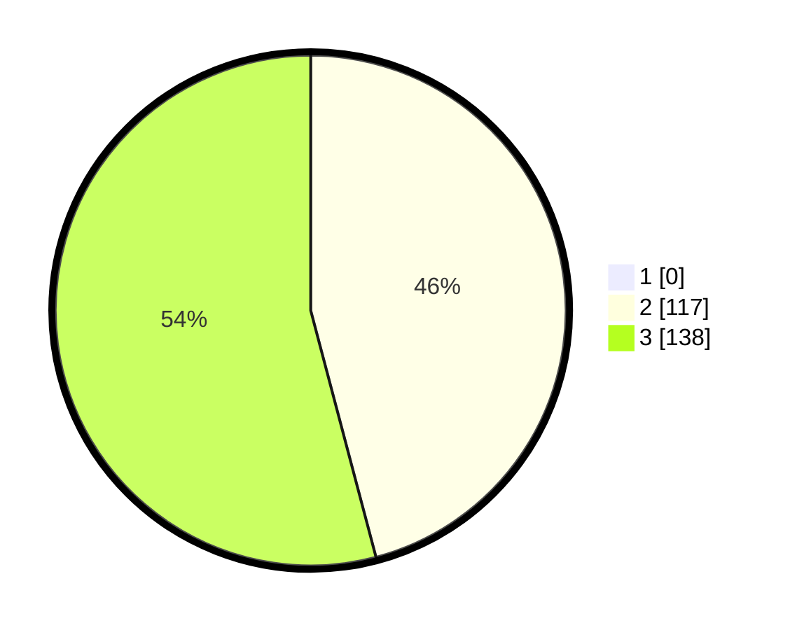

# Hasil

## Grafik

## Tabel

| No. | Nama Paslon    | Suara | Suara (raw) | Persentase |
|:--- |:-------------- | -----:| -----------:| ----------:|
| 1   | ANIES MUHAIMIN | 0     | [0][p-1]    | 0,00       |
| 2   | PRABOWO GIBRAN | 117   | [117][p-2]  | 45,88      |
| 3   | GANJAR MAHFUD  | 138   | [138][p-3]  | 54,12      |

[p-1]: https://github.com/gigit-pemilu/pemilu-2024-51-bali/blob/main/pilpres/hitung-suara/sub/51-bali/sub/03-badung/sub/03-abiansemal/sub/2003-sibanggede/sub/007-tps/sub/paslon-1.txt
[p-2]: https://github.com/gigit-pemilu/pemilu-2024-51-bali/blob/main/pilpres/hitung-suara/sub/51-bali/sub/03-badung/sub/03-abiansemal/sub/2003-sibanggede/sub/007-tps/sub/paslon-2.txt
[p-3]: https://github.com/gigit-pemilu/pemilu-2024-51-bali/blob/main/pilpres/hitung-suara/sub/51-bali/sub/03-badung/sub/03-abiansemal/sub/2003-sibanggede/sub/007-tps/sub/paslon-3.txt

## Foto C Plano

https://sirekap-obj-formc.kpu.go.id/5889/pemilu/ppwp/51/03/03/20/03/5103032003007-20240214-224922--df94bff1-47d2-4e0d-b7ee-bfeb3a3ead94.jpg

https://sirekap-obj-formc.kpu.go.id/5889/pemilu/ppwp/51/03/03/20/03/5103032003007-20240214-225029--96d4b548-dd79-4198-8c8d-3824ce714e78.jpg

https://sirekap-obj-formc.kpu.go.id/5889/pemilu/ppwp/51/03/03/20/03/5103032003007-20240214-225200--90ab7845-1a07-4425-9fb9-7e45500eb781.jpg

## Metadata

| Key        | Value               |
| ---------- | ------------------- |
| Time Stamp | 2024-02-24 22:31:28 |

