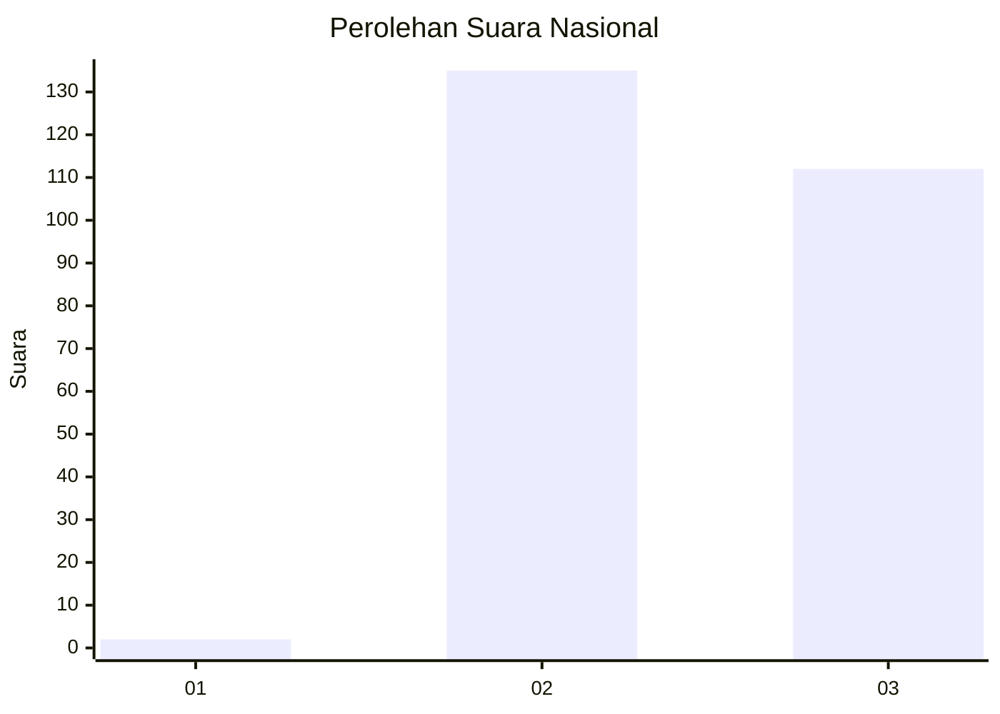
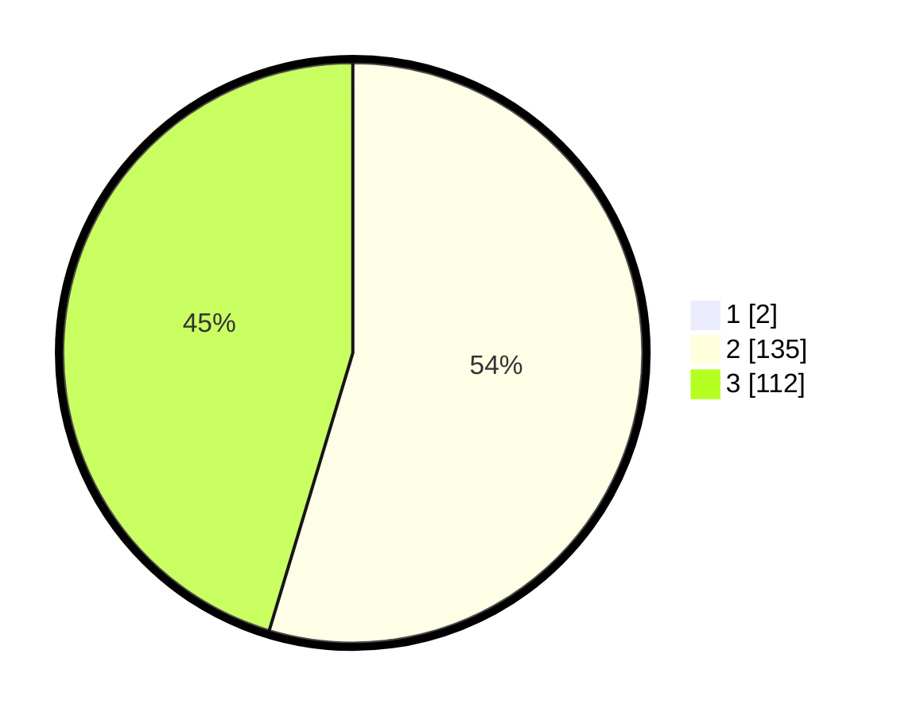

# Hasil

## Grafik

## Tabel

| No. | Nama Paslon    | Suara | Suara (raw) | Persentase |
|:--- |:-------------- | -----:| -----------:| ----------:|
| 1   | ANIES MUHAIMIN | 2     | [2][p-1]    | 0,80       |
| 2   | PRABOWO GIBRAN | 135   | [135][p-2]  | 54,22      |
| 3   | GANJAR MAHFUD  | 112   | [112][p-3]  | 44,98      |

[p-1]: https://github.com/gigit-pemilu/pemilu-2024/blob/main/pilpres/hitung-suara/sub/51-bali/sub/03-badung/sub/03-abiansemal/sub/2003-sibanggede/sub/008-tps/sub/paslon-1.txt
[p-2]: https://github.com/gigit-pemilu/pemilu-2024/blob/main/pilpres/hitung-suara/sub/51-bali/sub/03-badung/sub/03-abiansemal/sub/2003-sibanggede/sub/008-tps/sub/paslon-2.txt
[p-3]: https://github.com/gigit-pemilu/pemilu-2024/blob/main/pilpres/hitung-suara/sub/51-bali/sub/03-badung/sub/03-abiansemal/sub/2003-sibanggede/sub/008-tps/sub/paslon-3.txt

## Foto C Plano

https://sirekap-obj-formc.kpu.go.id/8efc/pemilu/ppwp/51/03/03/20/03/5103032003008-20240214-230254--a5344061-129e-4e69-92ff-44d1e468d122.jpg

https://sirekap-obj-formc.kpu.go.id/8efc/pemilu/ppwp/51/03/03/20/03/5103032003008-20240214-230421--7165548c-e911-4da9-94f3-6971553d13e1.jpg

https://sirekap-obj-formc.kpu.go.id/8efc/pemilu/ppwp/51/03/03/20/03/5103032003008-20240214-230525--79dc5741-86fe-444b-b7b9-672032c22a87.jpg

## Metadata

| Key        | Value               |
| ---------- | ------------------- |
| Time Stamp | 2024-02-16 08:30:27 |

