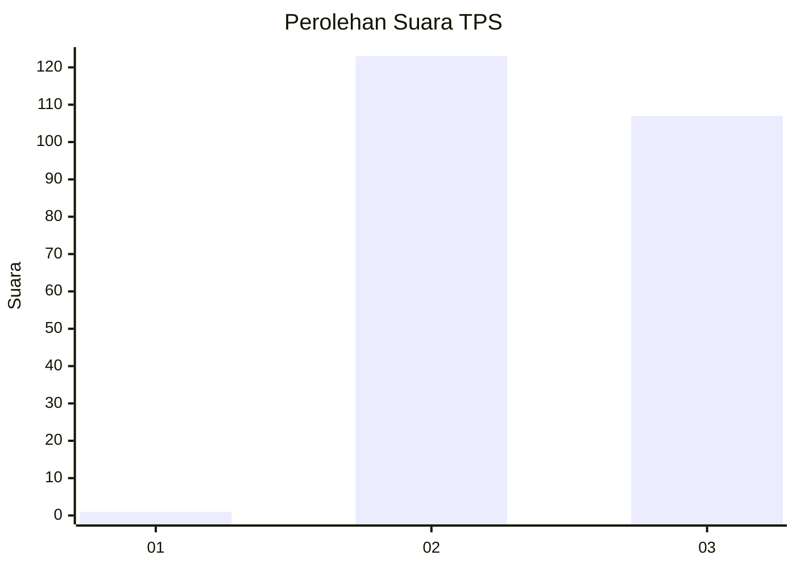
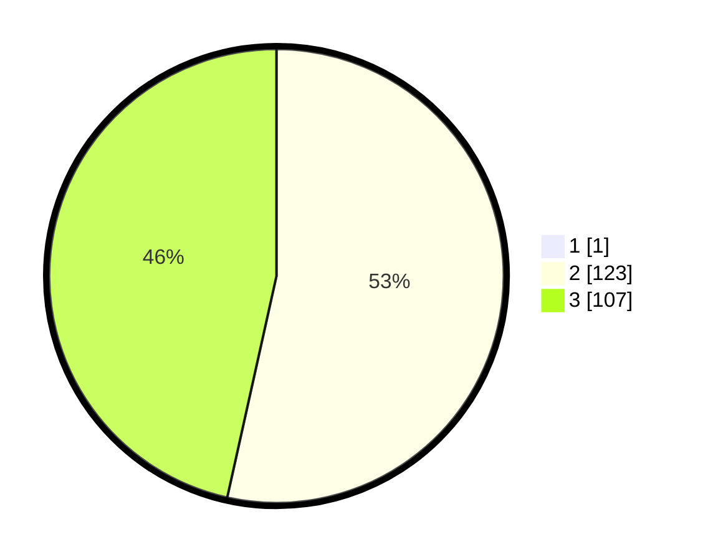

# Hasil

## Grafik

## Tabel

| No. | Nama Paslon    | Suara | Suara (raw) | Persentase |
|:--- |:-------------- | -----:| -----------:| ----------:|
| 1   | ANIES MUHAIMIN | 1     | [1][p-1]    | 0,43       |
| 2   | PRABOWO GIBRAN | 123   | [123][p-2]  | 53,25      |
| 3   | GANJAR MAHFUD  | 107   | [107][p-3]  | 46,32      |

[p-1]: https://github.com/gigit-pemilu/pemilu-2024-51-bali/blob/main/pilpres/hitung-suara/sub/51-bali/sub/03-badung/sub/03-abiansemal/sub/2003-sibanggede/sub/009-tps/sub/paslon-1.txt
[p-2]: https://github.com/gigit-pemilu/pemilu-2024-51-bali/blob/main/pilpres/hitung-suara/sub/51-bali/sub/03-badung/sub/03-abiansemal/sub/2003-sibanggede/sub/009-tps/sub/paslon-2.txt
[p-3]: https://github.com/gigit-pemilu/pemilu-2024-51-bali/blob/main/pilpres/hitung-suara/sub/51-bali/sub/03-badung/sub/03-abiansemal/sub/2003-sibanggede/sub/009-tps/sub/paslon-3.txt

## Foto C Plano

https://sirekap-obj-formc.kpu.go.id/a9ae/pemilu/ppwp/51/03/03/20/03/5103032003009-20240214-232613--20e43627-ab12-46e6-86fe-f429de44639e.jpg

https://sirekap-obj-formc.kpu.go.id/a9ae/pemilu/ppwp/51/03/03/20/03/5103032003009-20240214-232625--d22589db-ba68-4f30-9909-8895461de6a7.jpg

https://sirekap-obj-formc.kpu.go.id/a9ae/pemilu/ppwp/51/03/03/20/03/5103032003009-20240214-232636--bf8ba7b8-5f25-4c68-a75d-9e85b7d6d72c.jpg

## Metadata

| Key        | Value               |
| ---------- | ------------------- |
| Time Stamp | 2024-02-24 22:31:28 |

