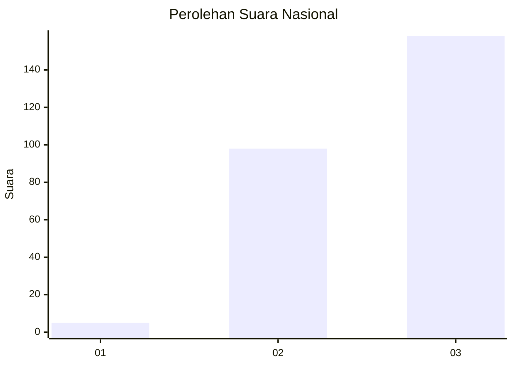
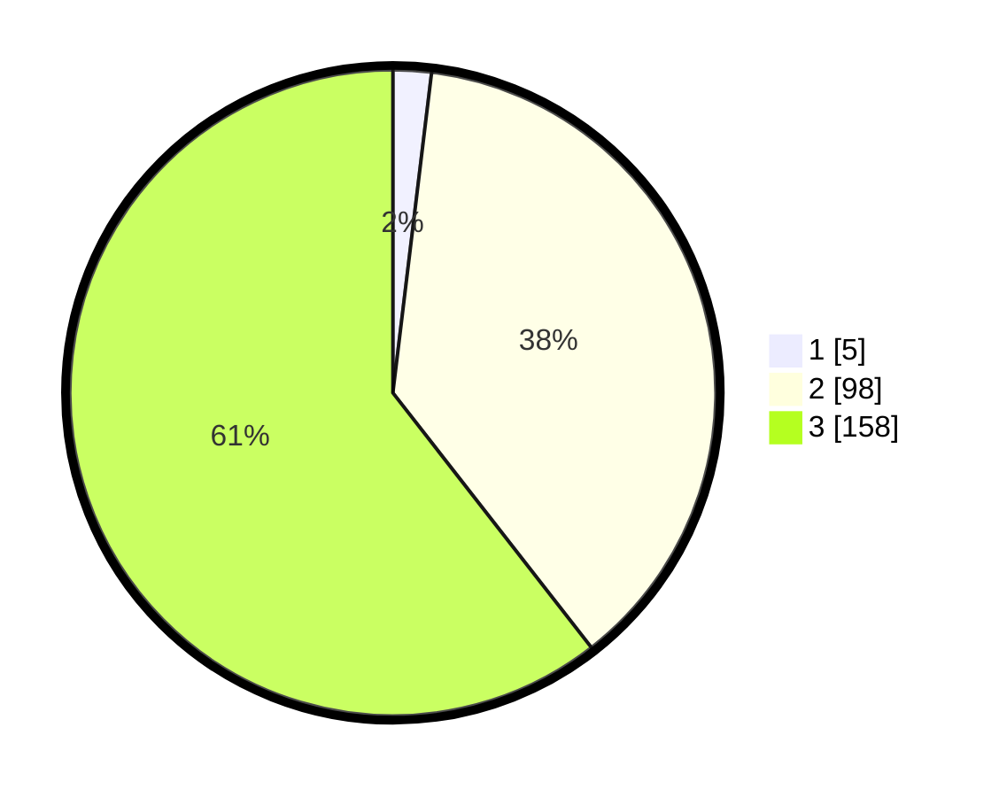

# Hasil

## Grafik

## Tabel

| No. | Nama Paslon    | Suara | Suara (raw) | Persentase |
|:--- |:-------------- | -----:| -----------:| ----------:|
| 1   | ANIES MUHAIMIN | 5     | [5][p-1]    | 1,92       |
| 2   | PRABOWO GIBRAN | 98    | [98][p-2]   | 37,55      |
| 3   | GANJAR MAHFUD  | 158   | [158][p-3]  | 60,54      |

[p-1]: https://github.com/gigit-pemilu/pemilu-2024/blob/main/pilpres/hitung-suara/sub/51-bali/sub/03-badung/sub/03-abiansemal/sub/2003-sibanggede/sub/012-tps/sub/paslon-1.txt
[p-2]: https://github.com/gigit-pemilu/pemilu-2024/blob/main/pilpres/hitung-suara/sub/51-bali/sub/03-badung/sub/03-abiansemal/sub/2003-sibanggede/sub/012-tps/sub/paslon-2.txt
[p-3]: https://github.com/gigit-pemilu/pemilu-2024/blob/main/pilpres/hitung-suara/sub/51-bali/sub/03-badung/sub/03-abiansemal/sub/2003-sibanggede/sub/012-tps/sub/paslon-3.txt

## Foto C Plano

https://sirekap-obj-formc.kpu.go.id/00a0/pemilu/ppwp/51/03/03/20/03/5103032003012-20240215-134658--a13515ad-4b0a-40af-bc33-11c4c14fd45e.jpg

https://sirekap-obj-formc.kpu.go.id/00a0/pemilu/ppwp/51/03/03/20/03/5103032003012-20240215-134702--8ef08c30-d2c1-444b-a1a0-99d3d9162d8c.jpg

https://sirekap-obj-formc.kpu.go.id/00a0/pemilu/ppwp/51/03/03/20/03/5103032003012-20240215-134708--e643939c-2408-45de-89f6-aff1da84f58b.jpg

## Metadata

| Key        | Value               |
| ---------- | ------------------- |
| Time Stamp | 2024-02-24 22:31:28 |

