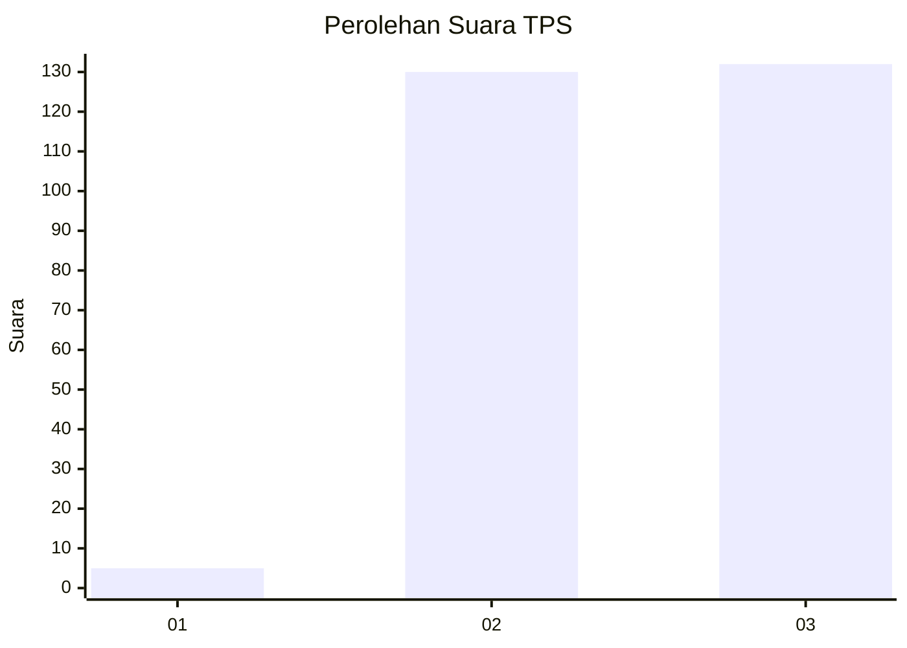
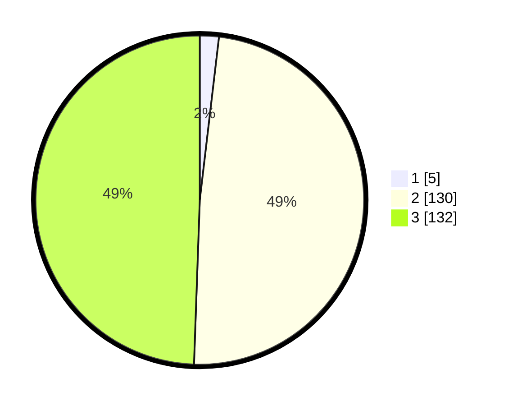

# Hasil

## Grafik

## Tabel

| No. | Nama Paslon    | Suara | Suara (raw) | Persentase |
|:--- |:-------------- | -----:| -----------:| ----------:|
| 1   | ANIES MUHAIMIN | 5     | [5][p-1]    | 1,87       |
| 2   | PRABOWO GIBRAN | 130   | [130][p-2]  | 48,69      |
| 3   | GANJAR MAHFUD  | 132   | [132][p-3]  | 49,44      |

[p-1]: https://github.com/gigit-pemilu/pemilu-2024-51-bali/blob/main/pilpres/hitung-suara/sub/51-bali/sub/03-badung/sub/03-abiansemal/sub/2003-sibanggede/sub/013-tps/sub/paslon-1.txt
[p-2]: https://github.com/gigit-pemilu/pemilu-2024-51-bali/blob/main/pilpres/hitung-suara/sub/51-bali/sub/03-badung/sub/03-abiansemal/sub/2003-sibanggede/sub/013-tps/sub/paslon-2.txt
[p-3]: https://github.com/gigit-pemilu/pemilu-2024-51-bali/blob/main/pilpres/hitung-suara/sub/51-bali/sub/03-badung/sub/03-abiansemal/sub/2003-sibanggede/sub/013-tps/sub/paslon-3.txt

## Foto C Plano

https://sirekap-obj-formc.kpu.go.id/2905/pemilu/ppwp/51/03/03/20/03/5103032003013-20240215-010320--2161c504-b694-4ac3-a6b3-cf76f99eea02.jpg

https://sirekap-obj-formc.kpu.go.id/2905/pemilu/ppwp/51/03/03/20/03/5103032003013-20240215-010411--d231b32f-83bd-4fbe-9541-7288513f2930.jpg

https://sirekap-obj-formc.kpu.go.id/2905/pemilu/ppwp/51/03/03/20/03/5103032003013-20240215-010509--7354cf9c-db25-4ad9-9efa-a9b90899137c.jpg

## Metadata

| Key        | Value               |
| ---------- | ------------------- |
| Time Stamp | 2024-02-24 22:31:28 |

