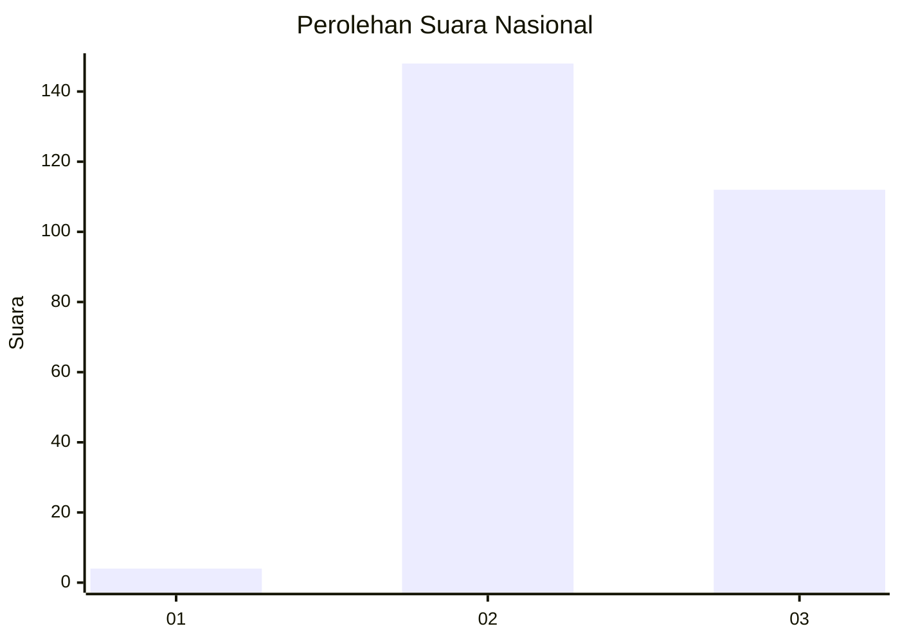
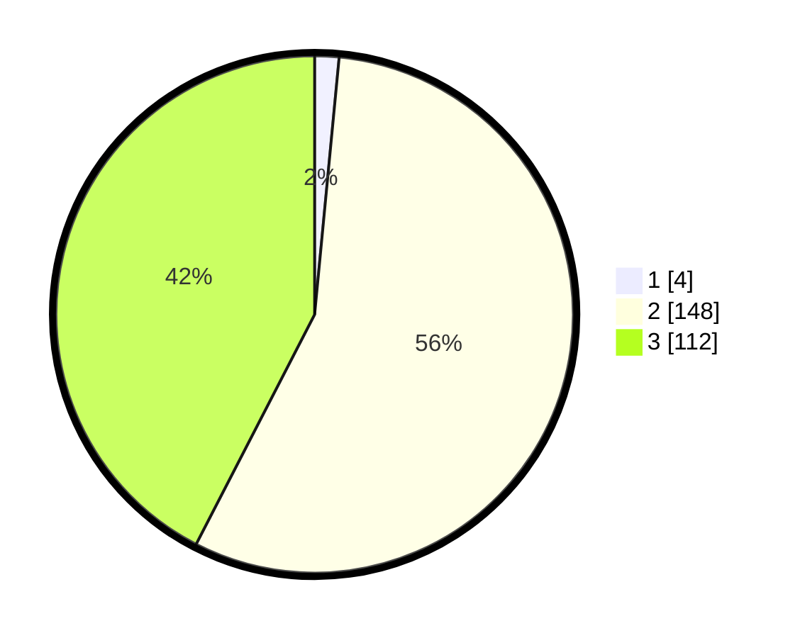

# Hasil

## Grafik

## Tabel

| No. | Nama Paslon    | Suara | Suara (raw) | Persentase |
|:--- |:-------------- | -----:| -----------:| ----------:|
| 1   | ANIES MUHAIMIN | 4     | [4][p-1]    | 1,52       |
| 2   | PRABOWO GIBRAN | 148   | [148][p-2]  | 56,06      |
| 3   | GANJAR MAHFUD  | 112   | [112][p-3]  | 42,42      |

[p-1]: https://github.com/gigit-pemilu/pemilu-2024/blob/main/pilpres/hitung-suara/sub/51-bali/sub/03-badung/sub/03-abiansemal/sub/2004-jagapati/sub/001-tps/sub/paslon-1.txt
[p-2]: https://github.com/gigit-pemilu/pemilu-2024/blob/main/pilpres/hitung-suara/sub/51-bali/sub/03-badung/sub/03-abiansemal/sub/2004-jagapati/sub/001-tps/sub/paslon-2.txt
[p-3]: https://github.com/gigit-pemilu/pemilu-2024/blob/main/pilpres/hitung-suara/sub/51-bali/sub/03-badung/sub/03-abiansemal/sub/2004-jagapati/sub/001-tps/sub/paslon-3.txt

## Foto C Plano

https://sirekap-obj-formc.kpu.go.id/f3e0/pemilu/ppwp/51/03/03/20/04/5103032004001-20240216-132804--f0da9b8d-e8a5-411a-90af-ee1c2073d51e.jpg

https://sirekap-obj-formc.kpu.go.id/f3e0/pemilu/ppwp/51/03/03/20/04/5103032004001-20240216-132805--165e580e-f076-4142-8fb0-555c4af19a07.jpg

https://sirekap-obj-formc.kpu.go.id/f3e0/pemilu/ppwp/51/03/03/20/04/5103032004001-20240216-132804--f2134cf0-de23-4318-a0f3-061488b2f23d.jpg

## Metadata

| Key        | Value               |
| ---------- | ------------------- |
| Time Stamp | 2024-02-21 17:00:00 |

## DATA PEMILIH TETAP

Jumlah pemilih dalam DPT: **287**.
 * L: **136**.
 * P: **151**.

## DATA PENGGUNA HAK PILIH

Jumlah pengguna hak pilih dalam DPT: **266**.
 * L: **127**.
 * P: **139**.

Jumlah pengguna hak pilih dalam DPTb: **0**.
 * L: **0**.
 * P: **0**.

Jumlah pengguna hak pilih dalam DPK: **3**.
 * L: **2**.
 * P: **1**.

Jumlah pengguna hak pilih: **269**.
 * L: **129**.
 * P: **140**.

## JUMLAH SUARA SAH DAN TIDAK SAH

JUMLAH SELURUH SUARA SAH: **264**.

JUMLAH SUARA TIDAK SAH: **5**.

JUMLAH SELURUH SUARA SAH DAN SUARA TIDAK SAH: **269**.

