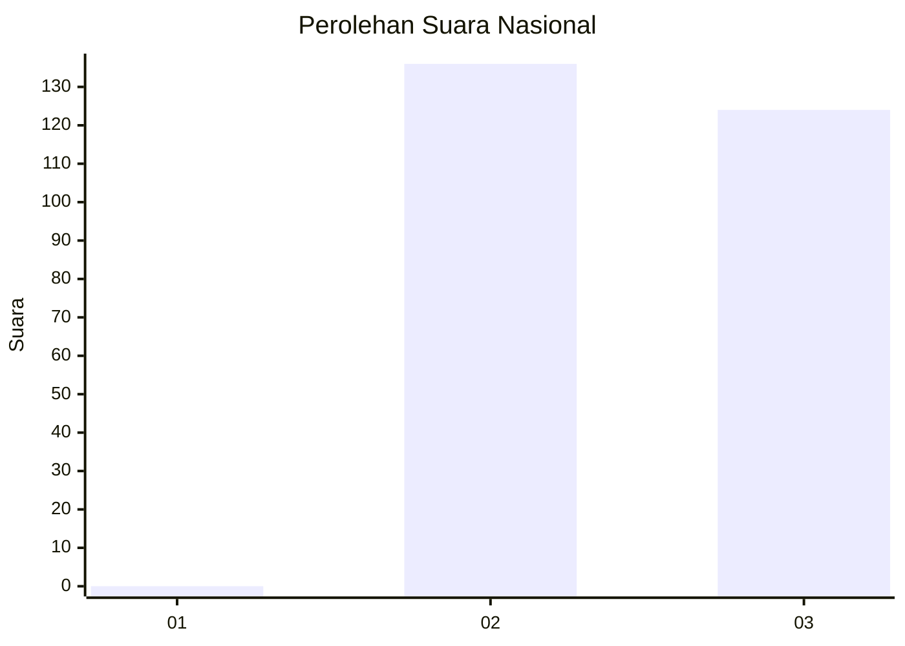
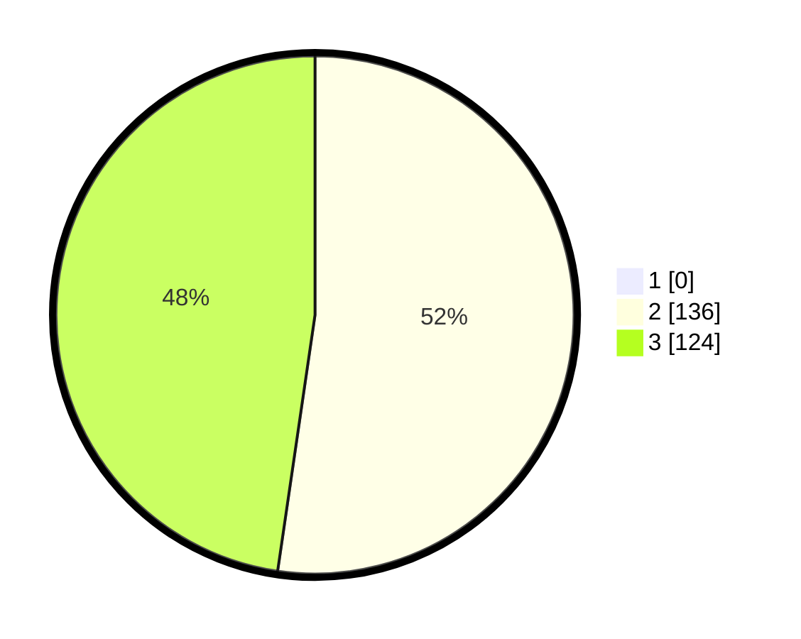

# Hasil

## Grafik

## Tabel

| No. | Nama Paslon    | Suara | Suara (raw) | Persentase |
|:--- |:-------------- | -----:| -----------:| ----------:|
| 1   | ANIES MUHAIMIN | 0     | [0][p-1]    | 0,00       |
| 2   | PRABOWO GIBRAN | 136   | [136][p-2]  | 52,31      |
| 3   | GANJAR MAHFUD  | 124   | [124][p-3]  | 47,69      |

[p-1]: https://github.com/gigit-pemilu/pemilu-2024/blob/main/pilpres/hitung-suara/sub/51-bali/sub/03-badung/sub/03-abiansemal/sub/2004-jagapati/sub/002-tps/sub/paslon-1.txt
[p-2]: https://github.com/gigit-pemilu/pemilu-2024/blob/main/pilpres/hitung-suara/sub/51-bali/sub/03-badung/sub/03-abiansemal/sub/2004-jagapati/sub/002-tps/sub/paslon-2.txt
[p-3]: https://github.com/gigit-pemilu/pemilu-2024/blob/main/pilpres/hitung-suara/sub/51-bali/sub/03-badung/sub/03-abiansemal/sub/2004-jagapati/sub/002-tps/sub/paslon-3.txt

## Foto C Plano

https://sirekap-obj-formc.kpu.go.id/2cf6/pemilu/ppwp/51/03/03/20/04/5103032004002-20240214-132243--01db0391-b0af-4753-a851-f5e83096a709.jpg

https://sirekap-obj-formc.kpu.go.id/2cf6/pemilu/ppwp/51/03/03/20/04/5103032004002-20240214-132350--39c298b4-0929-45a5-89fd-d5ae7ed2f254.jpg

https://sirekap-obj-formc.kpu.go.id/2cf6/pemilu/ppwp/51/03/03/20/04/5103032004002-20240214-132424--c9ea43ae-63ed-4d48-b013-9f15ea3ebe5e.jpg

## Metadata

| Key        | Value               |
| ---------- | ------------------- |
| Time Stamp | 2024-02-14 21:46:01 |

## DATA PEMILIH TETAP

Jumlah pemilih dalam DPT: **279**.
 * L: **129**.
 * P: **150**.

## DATA PENGGUNA HAK PILIH

Jumlah pengguna hak pilih dalam DPT: **261**.
 * L: **121**.
 * P: **140**.

Jumlah pengguna hak pilih dalam DPTb: **0**.
 * L: **0**.
 * P: **0**.

Jumlah pengguna hak pilih dalam DPK: **4**.
 * L: **0**.
 * P: **4**.

Jumlah pengguna hak pilih: **265**.
 * L: **121**.
 * P: **144**.

## JUMLAH SUARA SAH DAN TIDAK SAH

JUMLAH SELURUH SUARA SAH: **260**.

JUMLAH SUARA TIDAK SAH: **5**.

JUMLAH SELURUH SUARA SAH DAN SUARA TIDAK SAH: **265**.

