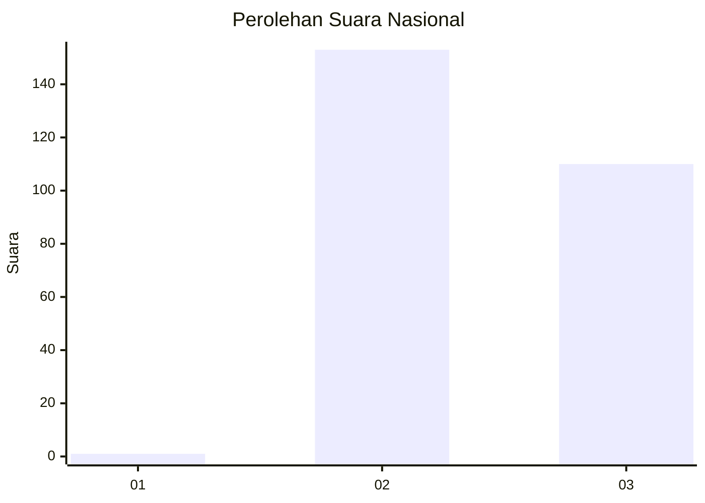
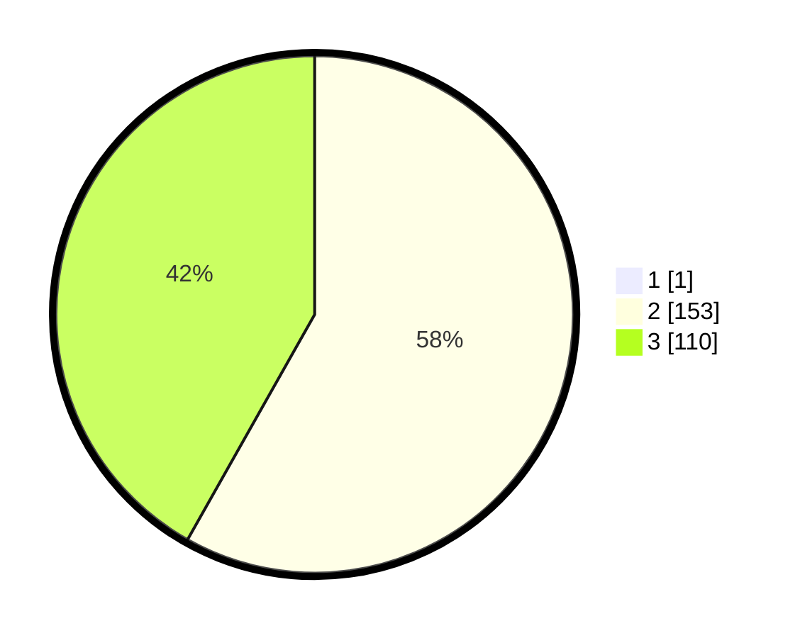

# Hasil

## Grafik

## Tabel

| No. | Nama Paslon    | Suara | Suara (raw) | Persentase |
|:--- |:-------------- | -----:| -----------:| ----------:|
| 1   | ANIES MUHAIMIN | 1     | [1][p-1]    | 0,38       |
| 2   | PRABOWO GIBRAN | 153   | [153][p-2]  | 57,95      |
| 3   | GANJAR MAHFUD  | 110   | [110][p-3]  | 41,67      |

[p-1]: https://github.com/gigit-pemilu/pemilu-2024/blob/main/pilpres/hitung-suara/sub/51-bali/sub/03-badung/sub/03-abiansemal/sub/2004-jagapati/sub/007-tps/sub/paslon-1.txt
[p-2]: https://github.com/gigit-pemilu/pemilu-2024/blob/main/pilpres/hitung-suara/sub/51-bali/sub/03-badung/sub/03-abiansemal/sub/2004-jagapati/sub/007-tps/sub/paslon-2.txt
[p-3]: https://github.com/gigit-pemilu/pemilu-2024/blob/main/pilpres/hitung-suara/sub/51-bali/sub/03-badung/sub/03-abiansemal/sub/2004-jagapati/sub/007-tps/sub/paslon-3.txt

## Foto C Plano

https://sirekap-obj-formc.kpu.go.id/84f0/pemilu/ppwp/51/03/03/20/04/5103032004007-20240214-220306--5a46f9b5-da01-46d5-a9e0-77acfb03ce54.jpg

https://sirekap-obj-formc.kpu.go.id/84f0/pemilu/ppwp/51/03/03/20/04/5103032004007-20240214-202318--b9c2471f-3c5d-48de-9fb3-e2a79986885d.jpg

https://sirekap-obj-formc.kpu.go.id/84f0/pemilu/ppwp/51/03/03/20/04/5103032004007-20240214-202431--ea03c555-e9c2-405f-9a28-f2b8b92f6e61.jpg

## Metadata

| Key        | Value               |
| ---------- | ------------------- |
| Time Stamp | 2024-02-24 22:31:28 |

