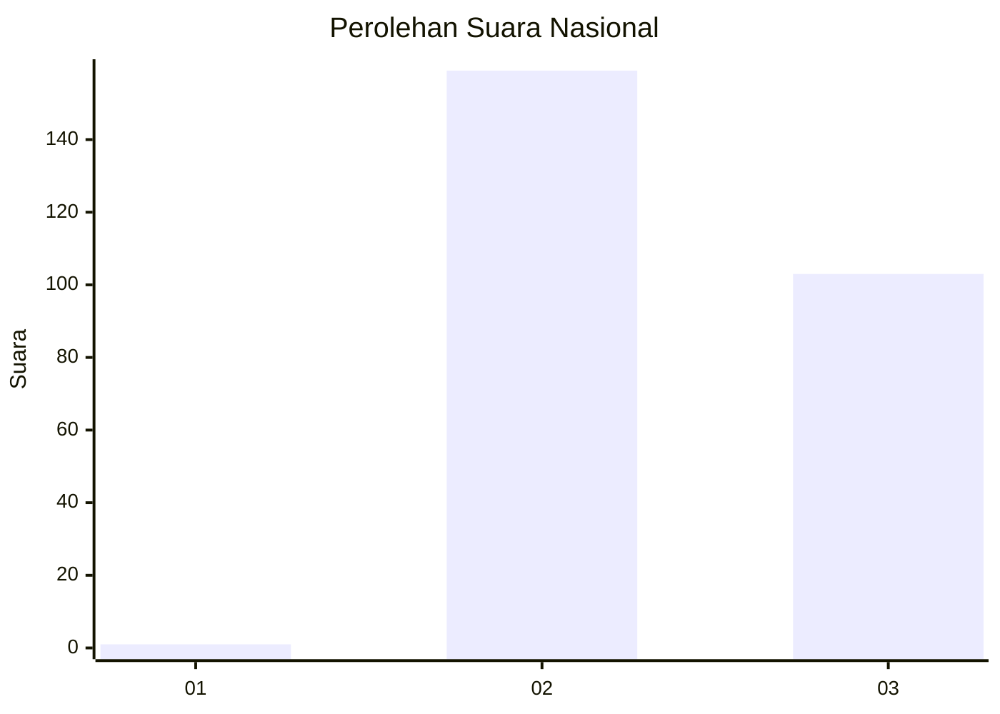
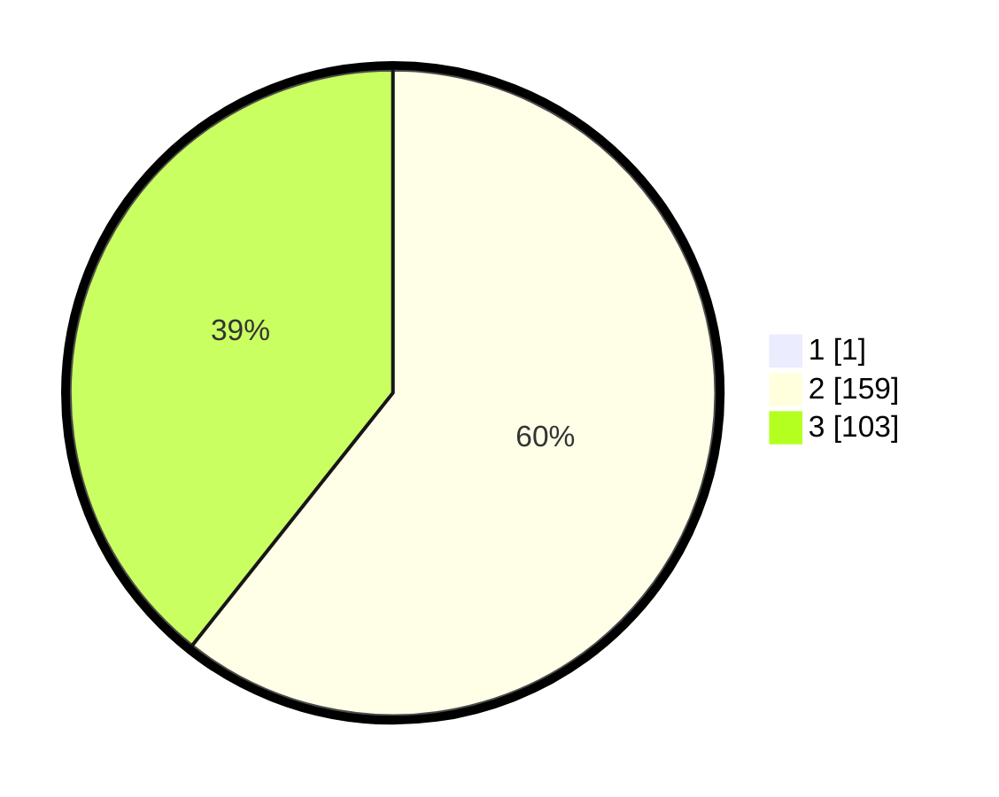

# Hasil

## Grafik

## Tabel

| No. | Nama Paslon    | Suara | Suara (raw) | Persentase |
|:--- |:-------------- | -----:| -----------:| ----------:|
| 1   | ANIES MUHAIMIN | 1     | [1][p-1]    | 0,38       |
| 2   | PRABOWO GIBRAN | 159   | [159][p-2]  | 60,46      |
| 3   | GANJAR MAHFUD  | 103   | [103][p-3]  | 39,16      |

[p-1]: https://github.com/gigit-pemilu/pemilu-2024/blob/main/pilpres/hitung-suara/sub/51-bali/sub/03-badung/sub/03-abiansemal/sub/2004-jagapati/sub/011-tps/sub/paslon-1.txt
[p-2]: https://github.com/gigit-pemilu/pemilu-2024/blob/main/pilpres/hitung-suara/sub/51-bali/sub/03-badung/sub/03-abiansemal/sub/2004-jagapati/sub/011-tps/sub/paslon-2.txt
[p-3]: https://github.com/gigit-pemilu/pemilu-2024/blob/main/pilpres/hitung-suara/sub/51-bali/sub/03-badung/sub/03-abiansemal/sub/2004-jagapati/sub/011-tps/sub/paslon-3.txt

## Foto C Plano

https://sirekap-obj-formc.kpu.go.id/0be2/pemilu/ppwp/51/03/03/20/04/5103032004011-20240214-211718--d524d757-37de-4750-b7ce-21f82aafb104.jpg

https://sirekap-obj-formc.kpu.go.id/0be2/pemilu/ppwp/51/03/03/20/04/5103032004011-20240214-212200--76003f94-f1e5-4518-a691-aa8eea29667e.jpg

https://sirekap-obj-formc.kpu.go.id/0be2/pemilu/ppwp/51/03/03/20/04/5103032004011-20240214-212444--27087985-6ae9-430c-915d-64ff9ba6d9ed.jpg

## Metadata

| Key        | Value               |
| ---------- | ------------------- |
| Time Stamp | 2024-02-24 22:31:28 |

