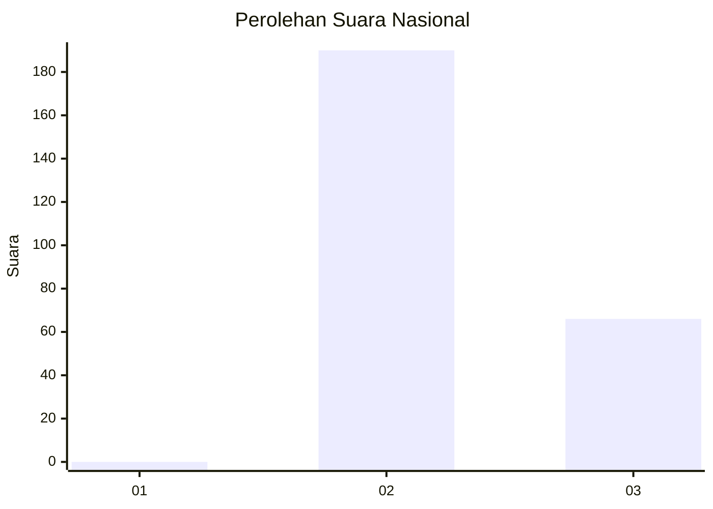
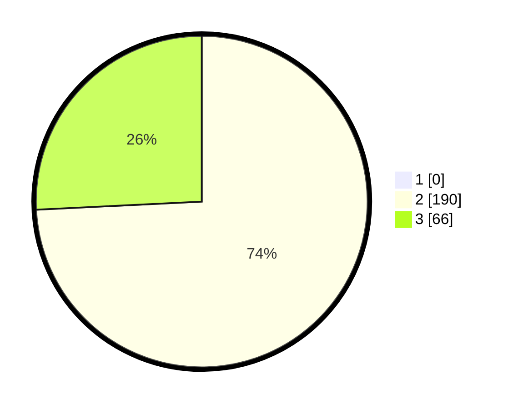

# Hasil

## Grafik

## Tabel

| No. | Nama Paslon    | Suara | Suara (raw) | Persentase |
|:--- |:-------------- | -----:| -----------:| ----------:|
| 1   | ANIES MUHAIMIN | 0     | [0][p-1]    | 0,00       |
| 2   | PRABOWO GIBRAN | 190   | [190][p-2]  | 74,22      |
| 3   | GANJAR MAHFUD  | 66    | [66][p-3]   | 25,78      |

[p-1]: https://github.com/gigit-pemilu/pemilu-2024/blob/main/pilpres/hitung-suara/sub/51-bali/sub/03-badung/sub/03-abiansemal/sub/2005-angantaka/sub/002-tps/sub/paslon-1.txt
[p-2]: https://github.com/gigit-pemilu/pemilu-2024/blob/main/pilpres/hitung-suara/sub/51-bali/sub/03-badung/sub/03-abiansemal/sub/2005-angantaka/sub/002-tps/sub/paslon-2.txt
[p-3]: https://github.com/gigit-pemilu/pemilu-2024/blob/main/pilpres/hitung-suara/sub/51-bali/sub/03-badung/sub/03-abiansemal/sub/2005-angantaka/sub/002-tps/sub/paslon-3.txt

## Foto C Plano

https://sirekap-obj-formc.kpu.go.id/89cd/pemilu/ppwp/51/03/03/20/05/5103032005002-20240214-193021--a5ce8a41-ed00-4591-9359-6f6444f80882.jpg

https://sirekap-obj-formc.kpu.go.id/89cd/pemilu/ppwp/51/03/03/20/05/5103032005002-20240214-193043--f6274235-c2d6-4b46-81a1-932e59f19745.jpg

https://sirekap-obj-formc.kpu.go.id/89cd/pemilu/ppwp/51/03/03/20/05/5103032005002-20240214-193032--5d6bdefa-4751-400e-a3c5-d3f365e713a1.jpg

## Metadata

| Key        | Value               |
| ---------- | ------------------- |
| Time Stamp | 2024-02-21 22:00:00 |

## DATA PEMILIH TETAP

Jumlah pemilih dalam DPT: **269**.
 * L: **127**.
 * P: **142**.

## DATA PENGGUNA HAK PILIH

Jumlah pengguna hak pilih dalam DPT: **263**.
 * L: **123**.
 * P: **140**.

Jumlah pengguna hak pilih dalam DPTb: **0**.
 * L: **0**.
 * P: **0**.

Jumlah pengguna hak pilih dalam DPK: **4**.
 * L: **0**.
 * P: **4**.

Jumlah pengguna hak pilih: **267**.
 * L: **123**.
 * P: **144**.

## JUMLAH SUARA SAH DAN TIDAK SAH

JUMLAH SELURUH SUARA SAH: **256**.

JUMLAH SUARA TIDAK SAH: **11**.

JUMLAH SELURUH SUARA SAH DAN SUARA TIDAK SAH: **267**.

