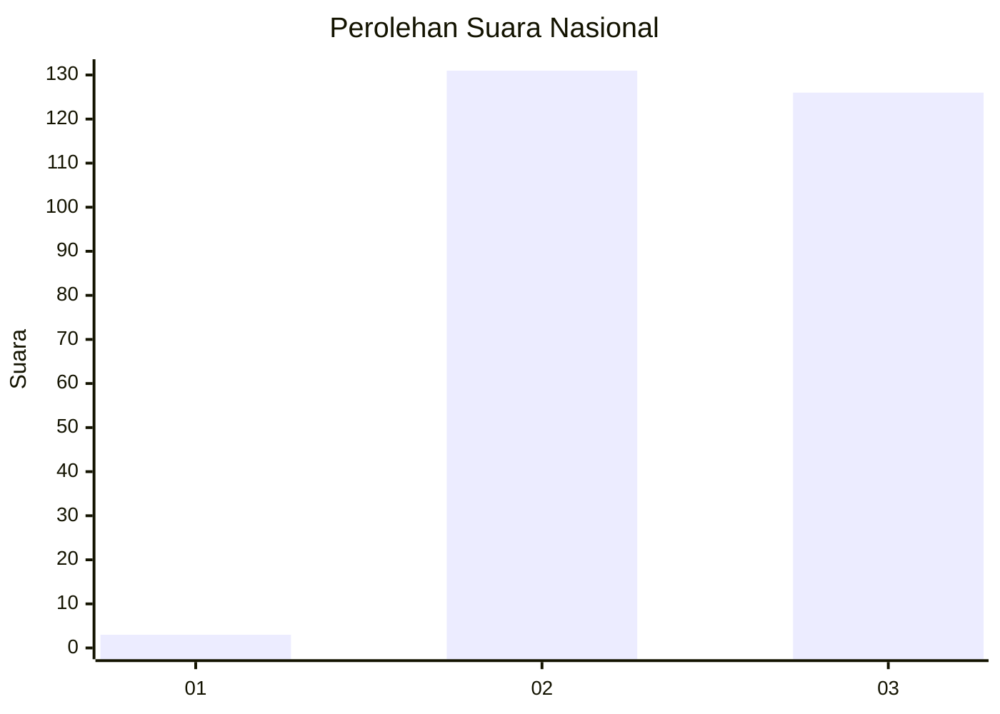
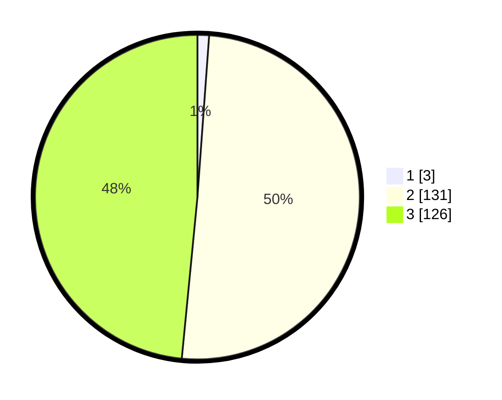

# Hasil

## Grafik

## Tabel

| No. | Nama Paslon    | Suara | Suara (raw) | Persentase |
|:--- |:-------------- | -----:| -----------:| ----------:|
| 1   | ANIES MUHAIMIN | 3     | [3][p-1]    | 1,15       |
| 2   | PRABOWO GIBRAN | 131   | [131][p-2]  | 50,38      |
| 3   | GANJAR MAHFUD  | 126   | [126][p-3]  | 48,46      |

[p-1]: https://github.com/gigit-pemilu/pemilu-2024/blob/main/pilpres/hitung-suara/sub/51-bali/sub/03-badung/sub/03-abiansemal/sub/2005-angantaka/sub/007-tps/sub/paslon-1.txt
[p-2]: https://github.com/gigit-pemilu/pemilu-2024/blob/main/pilpres/hitung-suara/sub/51-bali/sub/03-badung/sub/03-abiansemal/sub/2005-angantaka/sub/007-tps/sub/paslon-2.txt
[p-3]: https://github.com/gigit-pemilu/pemilu-2024/blob/main/pilpres/hitung-suara/sub/51-bali/sub/03-badung/sub/03-abiansemal/sub/2005-angantaka/sub/007-tps/sub/paslon-3.txt

## Foto C Plano

https://sirekap-obj-formc.kpu.go.id/12fa/pemilu/ppwp/51/03/03/20/05/5103032005007-20240216-000400--17cc6563-3fd5-4607-b307-18c45e6ae9c4.jpg

https://sirekap-obj-formc.kpu.go.id/12fa/pemilu/ppwp/51/03/03/20/05/5103032005007-20240216-000402--85f584c0-7915-4ab3-8505-b92a62b6dc18.jpg

https://sirekap-obj-formc.kpu.go.id/12fa/pemilu/ppwp/51/03/03/20/05/5103032005007-20240216-000400--7005f469-d890-4464-a730-45564c21abb3.jpg

## Metadata

| Key        | Value               |
| ---------- | ------------------- |
| Time Stamp | 2024-02-21 14:00:00 |

## DATA PEMILIH TETAP

Jumlah pemilih dalam DPT: **284**.
 * L: **130**.
 * P: **154**.

## DATA PENGGUNA HAK PILIH

Jumlah pengguna hak pilih dalam DPT: **258**.
 * L: **117**.
 * P: **141**.

Jumlah pengguna hak pilih dalam DPTb: **2**.
 * L: **1**.
 * P: **1**.

Jumlah pengguna hak pilih dalam DPK: **7**.
 * L: **2**.
 * P: **5**.

Jumlah pengguna hak pilih: **267**.
 * L: **120**.
 * P: **147**.

## JUMLAH SUARA SAH DAN TIDAK SAH

JUMLAH SELURUH SUARA SAH: **260**.

JUMLAH SUARA TIDAK SAH: **7**.

JUMLAH SELURUH SUARA SAH DAN SUARA TIDAK SAH: **267**.

