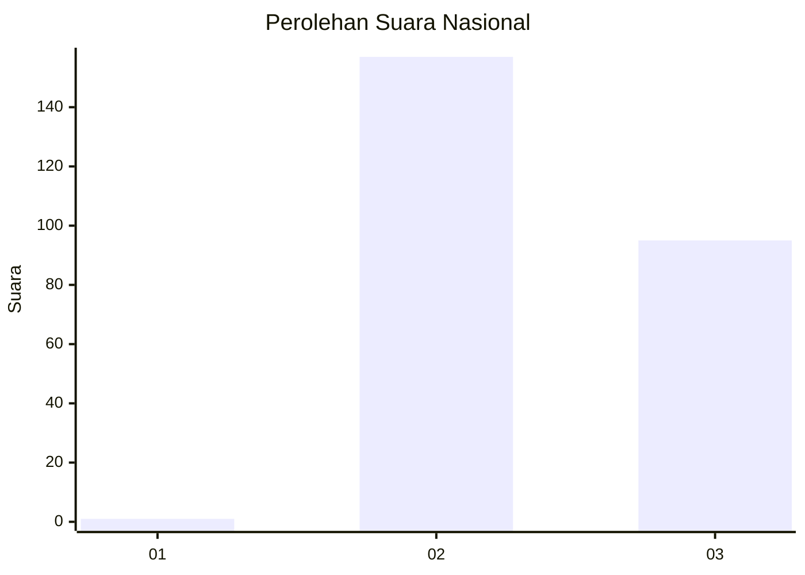
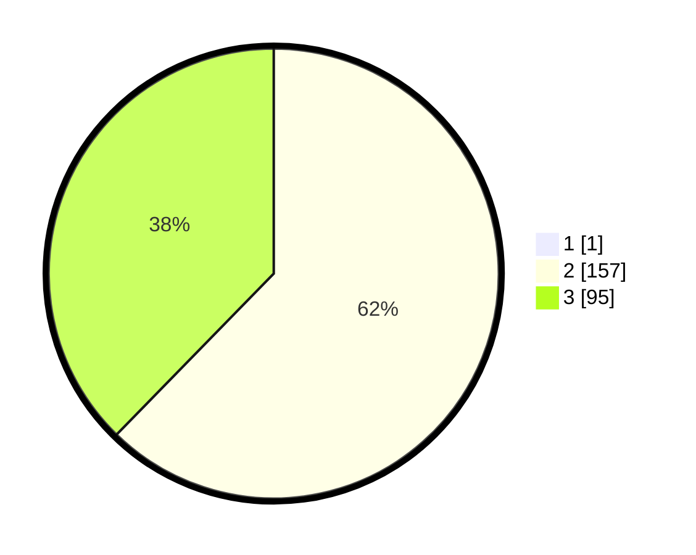

# Hasil

## Grafik

## Tabel

| No. | Nama Paslon    | Suara | Suara (raw) | Persentase |
|:--- |:-------------- | -----:| -----------:| ----------:|
| 1   | ANIES MUHAIMIN | 1     | [1][p-1]    | 0,40       |
| 2   | PRABOWO GIBRAN | 157   | [157][p-2]  | 62,06      |
| 3   | GANJAR MAHFUD  | 95    | [95][p-3]   | 37,55      |

[p-1]: https://github.com/gigit-pemilu/pemilu-2024/blob/main/pilpres/hitung-suara/sub/51-bali/sub/03-badung/sub/03-abiansemal/sub/2005-angantaka/sub/008-tps/sub/paslon-1.txt
[p-2]: https://github.com/gigit-pemilu/pemilu-2024/blob/main/pilpres/hitung-suara/sub/51-bali/sub/03-badung/sub/03-abiansemal/sub/2005-angantaka/sub/008-tps/sub/paslon-2.txt
[p-3]: https://github.com/gigit-pemilu/pemilu-2024/blob/main/pilpres/hitung-suara/sub/51-bali/sub/03-badung/sub/03-abiansemal/sub/2005-angantaka/sub/008-tps/sub/paslon-3.txt

## Foto C Plano

https://sirekap-obj-formc.kpu.go.id/754a/pemilu/ppwp/51/03/03/20/05/5103032005008-20240214-222806--8ba55b14-c6a3-4ba2-9f84-7d88ac76ac19.jpg

https://sirekap-obj-formc.kpu.go.id/754a/pemilu/ppwp/51/03/03/20/05/5103032005008-20240214-222924--b9ef4ded-d2a4-4d04-a72f-67dfce3c680c.jpg

https://sirekap-obj-formc.kpu.go.id/754a/pemilu/ppwp/51/03/03/20/05/5103032005008-20240214-222825--dd98600a-5f2a-4099-b82a-5c615452d177.jpg

## Metadata

| Key        | Value               |
| ---------- | ------------------- |
| Time Stamp | 2024-02-24 22:31:28 |

