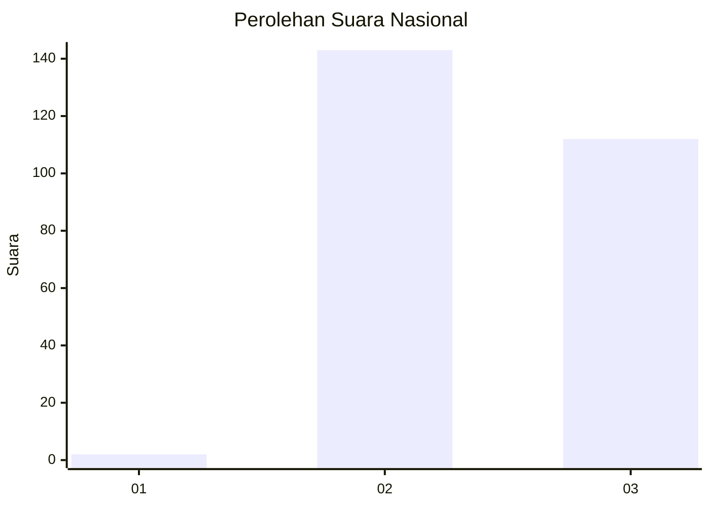
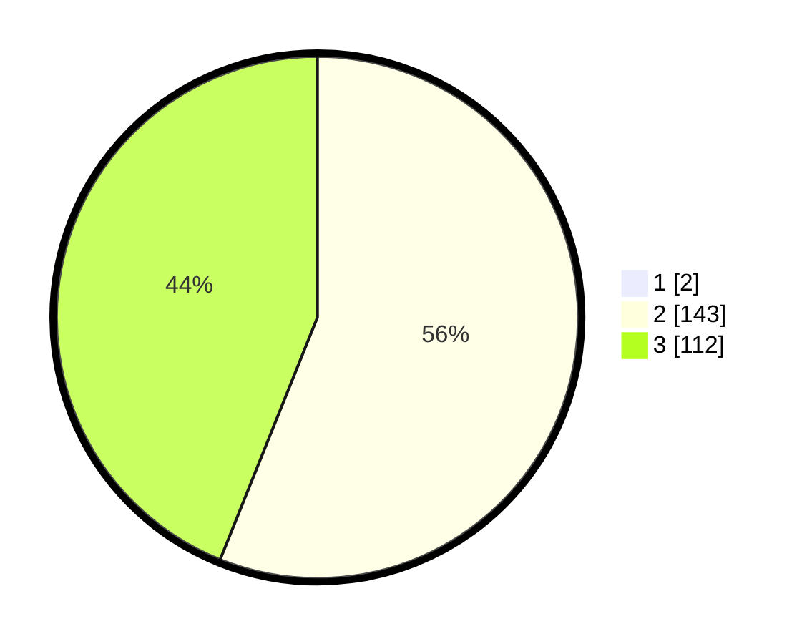

# Hasil

## Grafik

## Tabel

| No. | Nama Paslon    | Suara | Suara (raw) | Persentase |
|:--- |:-------------- | -----:| -----------:| ----------:|
| 1   | ANIES MUHAIMIN | 2     | [2][p-1]    | 0,78       |
| 2   | PRABOWO GIBRAN | 143   | [143][p-2]  | 55,64      |
| 3   | GANJAR MAHFUD  | 112   | [112][p-3]  | 43,58      |

[p-1]: https://github.com/gigit-pemilu/pemilu-2024/blob/main/pilpres/hitung-suara/sub/51-bali/sub/03-badung/sub/03-abiansemal/sub/2005-angantaka/sub/009-tps/sub/paslon-1.txt
[p-2]: https://github.com/gigit-pemilu/pemilu-2024/blob/main/pilpres/hitung-suara/sub/51-bali/sub/03-badung/sub/03-abiansemal/sub/2005-angantaka/sub/009-tps/sub/paslon-2.txt
[p-3]: https://github.com/gigit-pemilu/pemilu-2024/blob/main/pilpres/hitung-suara/sub/51-bali/sub/03-badung/sub/03-abiansemal/sub/2005-angantaka/sub/009-tps/sub/paslon-3.txt

## Foto C Plano

https://sirekap-obj-formc.kpu.go.id/8f5e/pemilu/ppwp/51/03/03/20/05/5103032005009-20240215-175929--39817d5b-db87-4dd5-8674-a0f55eb9beb9.jpg

https://sirekap-obj-formc.kpu.go.id/8f5e/pemilu/ppwp/51/03/03/20/05/5103032005009-20240215-175810--0a003328-3938-4586-9daf-e43083583d3c.jpg

https://sirekap-obj-formc.kpu.go.id/8f5e/pemilu/ppwp/51/03/03/20/05/5103032005009-20240215-175637--64658238-94d0-4e42-8414-fa0850af3a06.jpg

## Metadata

| Key        | Value               |
| ---------- | ------------------- |
| Time Stamp | 2024-02-24 22:31:28 |

