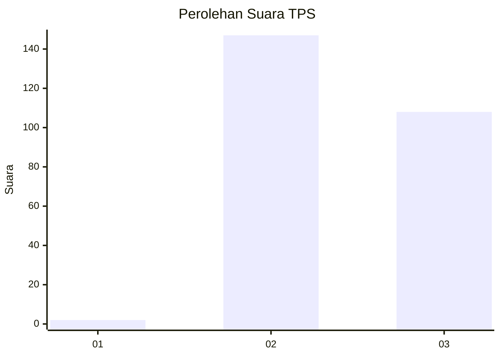
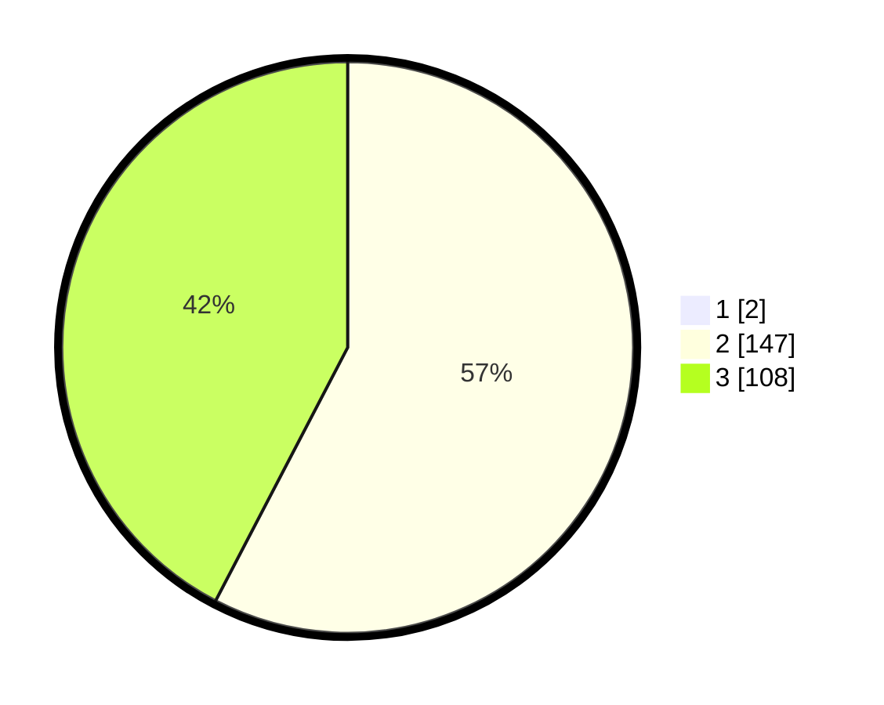

# Hasil

## Grafik

## Tabel

| No. | Nama Paslon    | Suara | Suara (raw) | Persentase |
|:--- |:-------------- | -----:| -----------:| ----------:|
| 1   | ANIES MUHAIMIN | 2     | [2][p-1]    | 0,78       |
| 2   | PRABOWO GIBRAN | 147   | [147][p-2]  | 57,20      |
| 3   | GANJAR MAHFUD  | 108   | [108][p-3]  | 42,02      |

[p-1]: https://github.com/gigit-pemilu/pemilu-2024-51-bali/blob/main/pilpres/hitung-suara/sub/51-bali/sub/03-badung/sub/03-abiansemal/sub/2005-angantaka/sub/010-tps/sub/paslon-1.txt
[p-2]: https://github.com/gigit-pemilu/pemilu-2024-51-bali/blob/main/pilpres/hitung-suara/sub/51-bali/sub/03-badung/sub/03-abiansemal/sub/2005-angantaka/sub/010-tps/sub/paslon-2.txt
[p-3]: https://github.com/gigit-pemilu/pemilu-2024-51-bali/blob/main/pilpres/hitung-suara/sub/51-bali/sub/03-badung/sub/03-abiansemal/sub/2005-angantaka/sub/010-tps/sub/paslon-3.txt

## Foto C Plano

https://sirekap-obj-formc.kpu.go.id/7aec/pemilu/ppwp/51/03/03/20/05/5103032005010-20240214-233134--3fbe91a5-24b8-4af3-b740-b75097987540.jpg

https://sirekap-obj-formc.kpu.go.id/7aec/pemilu/ppwp/51/03/03/20/05/5103032005010-20240214-233055--c3b2e473-40b1-4d31-93a5-38a966ebd41e.jpg

https://sirekap-obj-formc.kpu.go.id/7aec/pemilu/ppwp/51/03/03/20/05/5103032005010-20240214-233030--76632697-dd01-4452-8dc1-5539d2ab7c49.jpg

## Metadata

| Key        | Value               |
| ---------- | ------------------- |
| Time Stamp | 2024-02-24 22:31:28 |

