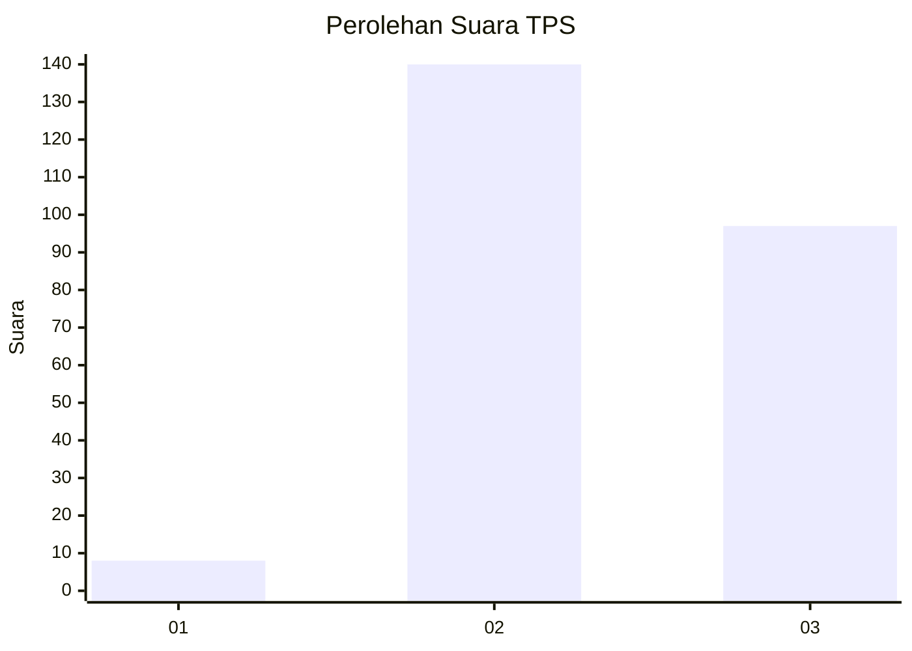
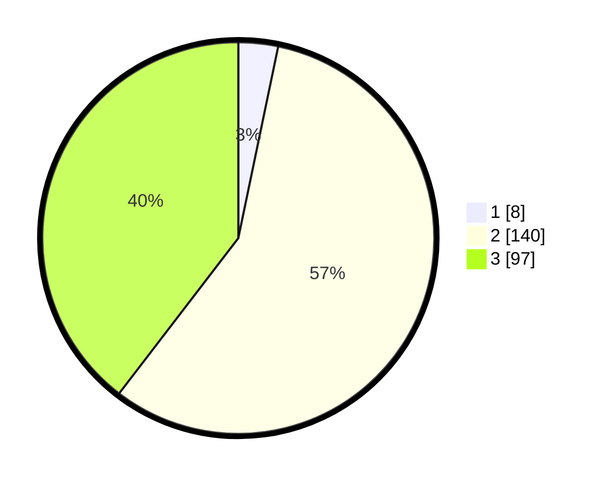

# Hasil

## Grafik

## Tabel

| No. | Nama Paslon    | Suara | Suara (raw) | Persentase |
|:--- |:-------------- | -----:| -----------:| ----------:|
| 1   | ANIES MUHAIMIN | 8     | [8][p-1]    | 3,27       |
| 2   | PRABOWO GIBRAN | 140   | [140][p-2]  | 57,14      |
| 3   | GANJAR MAHFUD  | 97    | [97][p-3]   | 39,59      |

[p-1]: https://github.com/gigit-pemilu/pemilu-2024-51-bali/blob/main/pilpres/hitung-suara/sub/51-bali/sub/03-badung/sub/03-abiansemal/sub/2006-sedang/sub/002-tps/sub/paslon-1.txt
[p-2]: https://github.com/gigit-pemilu/pemilu-2024-51-bali/blob/main/pilpres/hitung-suara/sub/51-bali/sub/03-badung/sub/03-abiansemal/sub/2006-sedang/sub/002-tps/sub/paslon-2.txt
[p-3]: https://github.com/gigit-pemilu/pemilu-2024-51-bali/blob/main/pilpres/hitung-suara/sub/51-bali/sub/03-badung/sub/03-abiansemal/sub/2006-sedang/sub/002-tps/sub/paslon-3.txt

## Foto C Plano

https://sirekap-obj-formc.kpu.go.id/2c7d/pemilu/ppwp/51/03/03/20/06/5103032006002-20240216-013347--89a40331-9b33-4c91-90ea-d9b211511ad7.jpg

https://sirekap-obj-formc.kpu.go.id/2c7d/pemilu/ppwp/51/03/03/20/06/5103032006002-20240216-013353--3ee1e13e-ea13-44fe-942c-84917b5dd3a5.jpg

https://sirekap-obj-formc.kpu.go.id/2c7d/pemilu/ppwp/51/03/03/20/06/5103032006002-20240216-013348--d8006d87-ad4e-462f-876e-f16a48f6f303.jpg

## Metadata

| Key        | Value               |
| ---------- | ------------------- |
| Time Stamp | 2024-02-21 22:00:00 |

## DATA PEMILIH TETAP

Jumlah pemilih dalam DPT: **258**.
 * L: **123**.
 * P: **135**.

## DATA PENGGUNA HAK PILIH

Jumlah pengguna hak pilih dalam DPT: **247**.
 * L: **120**.
 * P: **127**.

Jumlah pengguna hak pilih dalam DPTb: **1**.
 * L: **0**.
 * P: **1**.

Jumlah pengguna hak pilih dalam DPK: **1**.
 * L: **0**.
 * P: **1**.

Jumlah pengguna hak pilih: **249**.
 * L: **120**.
 * P: **129**.

## JUMLAH SUARA SAH DAN TIDAK SAH

JUMLAH SELURUH SUARA SAH: **245**.

JUMLAH SUARA TIDAK SAH: **4**.

JUMLAH SELURUH SUARA SAH DAN SUARA TIDAK SAH: **249**.

